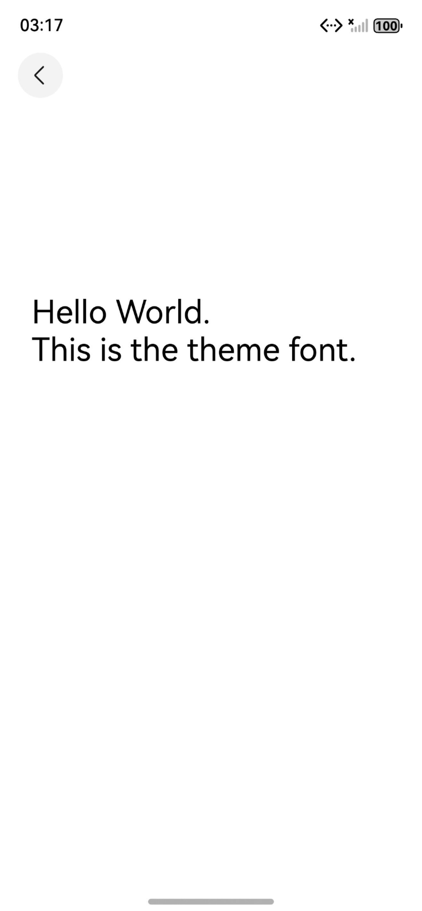
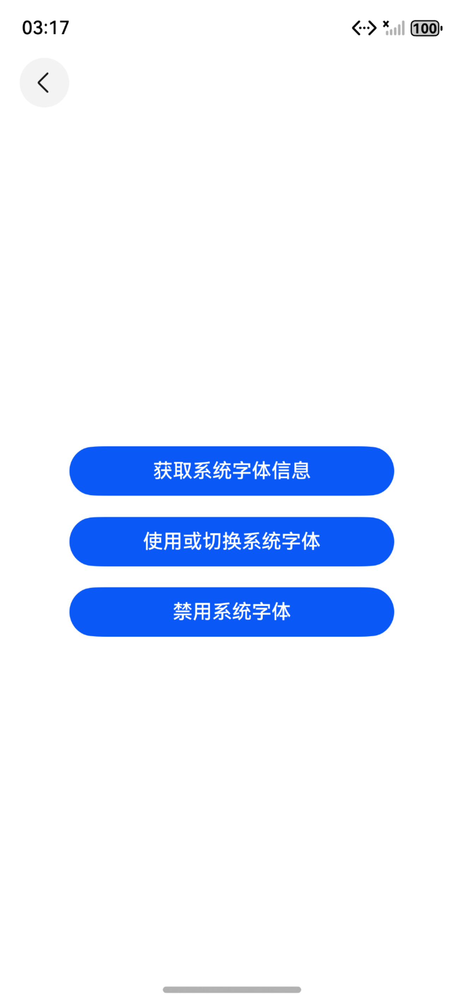
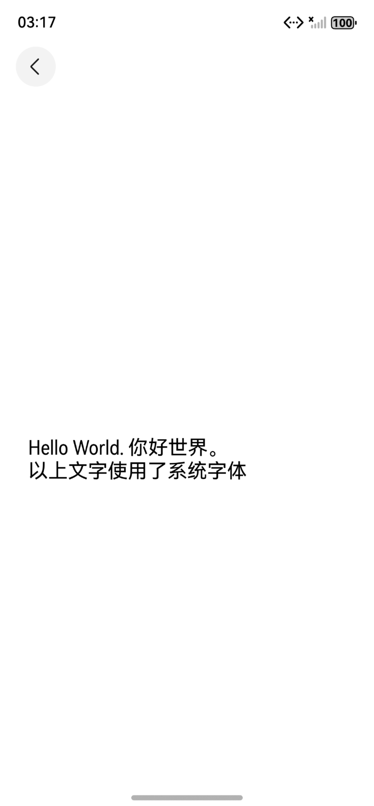
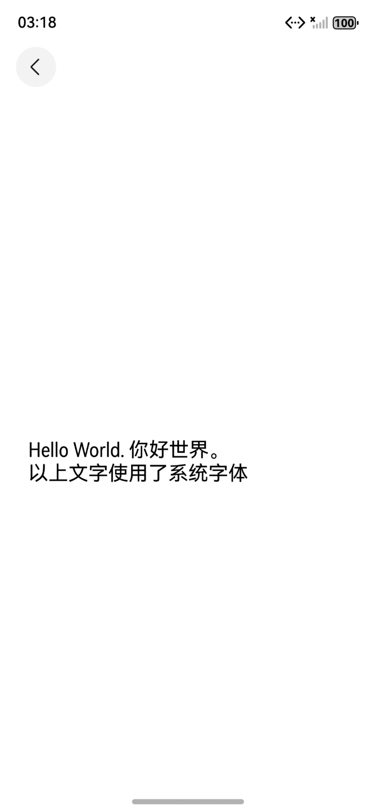

# 主题、自定义和系统字体（C++）

## 介绍

本工程主要实现了对以下指南文档中[主题字体](https://developer.huawei.com/consumer/cn/doc/harmonyos-guides/theme-font-c)示例、[自定义字体](https://developer.huawei.com/consumer/cn/doc/harmonyos-guides/custom-font-c)示例和[系统字体](https://developer.huawei.com/consumer/cn/doc/harmonyos-guides/system-font-c)示例代码片段的工程化，主要目标是实现指南中示例代码需要与sample工程文件同源，以及除基本文字、排版属性之外，针对应用中不同文本的设计，开发者可能需要设置使用不同的绘制样式或能力，以凸显对应文本的独特表现或风格，此时可以结合使用多种绘制样式进行文本的渲染。

## 效果预览

|  |  |  |  |  |  |  |
| ---------------------------------- | ------------------------------ | ------------------------------ | ------------------------------ | -------------------------------- | -------------------------------- | -------------------------------- |

使用说明

1. 该工程可以选择在模拟器和开发板上运行。
2. 点击构建，即可在生成的应用中点击对应的按钮进行图案的绘制。
3. 进入“ArkGraphics2D/TextEngine/NDKThemFontAndCustomFontText/entry/src/ohosTest/ets/test/DrawingAbility.test.ets”文件，可以对本项目进行UI的自动化测试。

## 工程目录

```
NDKThemFontAndCustomFontText
├──entry/src/main
│  ├──cpp                           // C++代码区
│  │  ├──CMakeLists.txt             // CMake配置文件
│  │  ├──hello.cpp                  // Napi模块注册
│  │  ├──common
│  │  │  └──log_common.h            // 日志封装定义文件
│  │  ├──plugin                     // 生命周期管理模块
│  │  │  ├──plugin_manager.cpp
│  │  │  └──plugin_manager.h
│  │  ├──samples                    // samples渲染模块
│  │  │  ├──sample_bitmap.cpp
│  │  │  └──sample_bitmap.h
│  ├──ets                           // ets代码区
│  │  ├──entryability
│  │  │  ├──EntryAbility.ts         // 程序入口类
|  |  |  └──EntryAbility.ets
│  │  └──pages                      // 页面文件
│  │     ├─ Index.ets               // 主界面
│  │     ├─ NavTreePage.ets
│  │     └──NdkPage.ets
|  ├──resources         			// 资源文件目录
```

## 具体实现

1. 利用Native XComponent来获取NativeWindow实例、获取布局/事件信息、注册事件回调并通过Drawing API实现在页面上绘制形状。
2. 通过在IDE中创建Native c++ 工程，在c++代码中定义对外接口，在js侧调用该接口可在页面上绘制出相对应的不同效果的文字。
3. 在XComponent的OnSurfaceCreated回调中获取NativeWindow实例并初始化NativeWindow环境。调用OH_Drawing_FontCollection接口获取全局的字体集对象，调用OH_Drawing_CreateSharedFontCollection接口创建可共享的字体集对象，OH_Drawing_RegisterFont接口在字体管理器中注册自定义字体,OH_Drawing_CreateTextStyle接口创建指向OH_Drawing_TextStyle对象的指针，用于设置文本样式，OH_Drawing_SetTextStyleFontFamilies接口来设置字体类型。OH_Drawing_FontConfigInfo接口获取系统字体配置信息，OH_Drawing_DestroySystemFontConfigInfo释放系统字体配置信息占用的内存。OH_Drawing_DisableFontCollectionSystemFont接口禁用系统字体。


## 相关权限

无。

## 依赖

不涉及。

## 约束和限制

1. 本示例支持标准系统上运行，支持设备：模拟器Mate 70 Pro。
2. 本示例支持API20版本SDK，版本号：6.0.0.47。
3. 本示例已支持DevEco Studio 6.0.2 Beta1 (构建版本：6.0.2.636，构建 2025年12月31日)编译运行。

## 下载

如需单独下载本工程，执行如下命令：

```
git init
git config core.sparsecheckout true
echo code ArkGraphics2D/TextEngine/NDKThemFontAndCustomFontText/ > .git/info/sparse-checkout
git remote add origin https://gitcode.com/HarmonyOS_Samples/guide-snippets.git
git pull origin master
```

