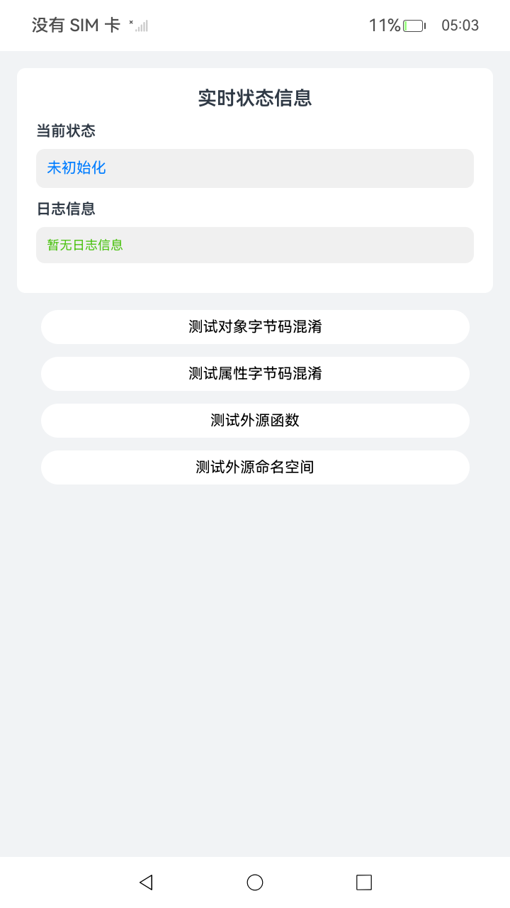

# ArkGuard字节码混淆常见问题

## 介绍

本文主要介绍字节码混淆与源码混淆差异，如何排查功能异常，常规配置问题处理，编译报错处理及运行异常处理。

## 效果预览

| 初始页面                            | 主页面                                        | 测试装饰器页面                                    |
|---------------------------------|--------------------------------------------|--------------------------------------------|
|  |  |  |

## 使用说明

1. 点击“主页面”按钮进入主页面，点击“测试对象字节码混淆”按钮，将创建从@kit.AbilityKit模块引入的Want类对象，在页面上用字符串形式显示该对象的内容。

2. 点击“主页面”按钮进入主页面，点击“测试属性字节码混淆”按钮，将创建从ExportInterface.ts引入的MyInfo类对象，在页面上用字符串形式显示该对象的内容。

3. 点击“主页面”按钮进入主页面，点击“测试外源函数”按钮，将调用异步函数loadAndUseAdd，动态引入ExportUtils.ts中的add函数并调用，返回结果并在页面上显示结果“result = 5”。

4. 点击“主页面”按钮进入主页面，点击“测试外源命名空间”按钮，将调用从ExportNs.ts中引入的NS命名空间中的foo函数。

5. 点击“测试装饰器”按钮进入装饰器页面，将调用从@kit.ArkUI模块引入的PersistenceV2及从Sample2.ets引入的Sample，在页面上显示日志“Page1 add 1 to prop.p1: 0”。

## 工程目录

```
entry/src/main/ets/
└── pages
    └── CallDecorator.ets // 测试装饰器页面。
    └── ExportNs.ts // 导出命名空间示例页面。
    └── ExportInterface.ts // 导出接口示例页面。
    └── ExportCompositeInterface.ts // 导出复合接口示例页面。
    └── Index.ets // 初始页面。
    └── MainPage.ets // 主要测试页面。
    └── Sample.ets // 装饰器代码示例。
    └── Sample1.ets // 自定义对话框示例。
    └── Sample2.ets // 导出装饰器代码示例。
    └── ExportUtils.ts // 导出函数示例页面。
entry/src/ohosTest/
└── ets
    └── test
        └── Ability.test.ets // UI自动化用例。
```

## 具体实现

* 函数调用
    * 调用SDK中Want对象，源码参考：[MainPage.ets](./entry/src/main/ets/pages/MainPage.ets)
    * 调用从./ExportUtils.ts动态导入的add函数，源码参考：[MainPage.ets](./entry/src/main/ets/pages/MainPage.ets)
    * 调用从./ExportNs.ts导入的命名空间方法，源码参考：[MainPage.ets](./entry/src/main/ets/pages/MainPage.ets)
    * 调用从./ExportInterface.ts导入的自定义类型接口，源码参考：[MainPage.ets](./entry/src/main/ets/pages/MainPage.ets)
    * 调用从Sample2.ets导入的Sample实现，源码参考：[CallDecorator.ets](./entry/src/main/ets/pages/CallDecorator.ets)

## 依赖

无。

## 相关权限

无。

## 约束与限制

1. 本示例支持标准系统上运行，支持设备：RK3568。

2. 本示例支持API23版本的SDK，版本号：6.1.0.25。

3. 本示例已支持使用Build Version: 6.0.1.251, built on November 22, 2025。

4. 高等级APL特殊签名说明：无。

## 下载

如需单独下载本工程，执行如下命令：

```git
git init
git config core.sparsecheckout true
echo ArkTS/ArkTSCompilationToolchain/ArkGuardForBytecodeObfuscation/BytecodeObfuscationIssues > .git/info/sparse-checkout
git remote add origin https://gitcode.com/HarmonyOS_Samples/guide-snippets
git pull origin master
```