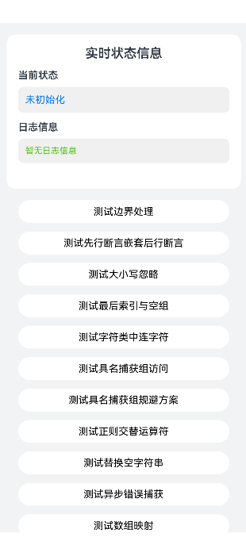

# ArkTS运行时常见问题

## 介绍

本示例主要介绍了ArkTS运行时的几个常见问题：

1.方舟正则运算与预期输出结果不一致场景。

2.Async函数内部异常的处理机制。

3.方舟Array.flatMap()接口常见问题。

## 效果预览

| 首页                                | 状态变量装饰器页                         | 运行时常见问题场景页                                  |
|-----------------------------------|-----------------------------------|-----------------------------------|
|  |  |  |

## 工程目录

```
├───entry/src/main/ets
│   ├───pages
│   │   └───Additional.ets                                   // 额外的页。                               
│   │   └───Index.ets                                        // 首页。
│   │   └───Local.ets                                        // 状态变量装饰器页。
│   │   └───Scene.ets                                        // 运行时常见问题场景页。
│   │   └───TestArray.js                                     // TestArray页。
│   │   └───TestArrayExt.js                                  // TestArrayExt页。
└───entry/src/main/resources                                 // 资源目录。         
```

## 具体实现

* ArkTS运行时常见问题
  * 源码参考：[Index.ets](./entry/src/main/ets/pages/Index.ets)
  * 使用流程：
    * 点击'状态变量装饰器页面'按钮，进入该分页面
    * 可看到调用'Array.flatMap'的结果
    * 返回主页面
    * 点击'运行时常见问题页面'按钮，进入该分页面
    * 点击'测试边界处理'按钮，调用`str.replace`将字符串中的每个单词边界（使用正则表达式`\b`表示）替换为斜杠`/`，展示方舟正则运算对于`\b`处理与预期不一致的问题。
    * 点击'测试先行断言嵌套后行断言'按钮，调用`match`方法使用后行断言`(?<=ab(?=c)cd)`嵌套先行断言`(?=c)`匹配字符串"abcdef"，展示方舟正则运算对于先行断言嵌套在后行断言内部的场景与预期不一致的问题。
    * 点击'测试大小写忽略'按钮，使用带有`ui`标志的正则表达式测试Unicode字符`\u{10400}`与`\u{10428}`的大小写匹配，展示方舟正则运算对于大小写忽略与Unicode case folding处理与预期不一致的问题。
    * 点击'测试最后索引与空组'按钮，使用带有`ug`标志的正则表达式`/()/`匹配surrogate pair字符串，设置`lastIndex`为1后执行`exec`，展示方舟正则运算对于空组在全局Unicode模式下的`lastIndex`处理与预期不一致的问题。
    * 点击'测试字符类中连字符'按钮，使用字符类`[+-\s]`匹配字符串"a-b"中的连字符，展示方舟正则运算对于字符类内部连字符`-`的处理与预期不一致的问题，并演示使用转义后的`\-`作为规避方案。
    * 点击'测试具名捕获组访问'按钮，使用正则表达式`(a)(?<b>b)`匹配字符串"ab"，通过`groups`属性访问具名捕获组`b`的匹配结果，展示方舟正则运算对于具名捕获组获取与预期不一致的问题。
    * 点击'测试具名捕获组规避方案'按钮，使用正则表达式`(a)(?<b>b)`匹配字符串"ab"，通过计算具名捕获组的索引位置（第2个位置）来获取匹配内容，展示规避具名捕获组访问问题的方法。
    * 点击'测试正则交替运算符'按钮，使用正则表达式`/a(?:|x)$/`匹配字符串"ax"，展示方舟正则运算对于空交替分支`|`的处理与预期不一致的问题，并演示使用`(?:x)?`或`(?:x){0,1}`作为规避方案。
    * 点击'测试替换空字符串'按钮，调用`str.replace`将空字符串`""`替换为"abc"，展示方舟字符串`replace`接口对于第一个参数为空字符串的场景与预期不一致的问题，并演示使用正则表达式`/^/`表示字符串起始符作为规避方案。
    * 点击'测试异步错误捕获'按钮，调用异步函数`foo()`抛出错误，并通过`errorManager.on("unhandledRejection")`注册全局错误处理器来捕获异步函数内部的未处理Promise拒绝，展示Async函数内部异常的捕获方式。
    * 点击'测试数组映射'按钮，创建两个数组的Proxy对象，将它们放入数组中后调用`flatMap`方法，展示方舟`Array.flatMap()`接口对于Proxy对象处理与预期不一致的问题，并演示使用`map(x => x).flat()`作为规避方案。
    * 点击'测试Int32Array的map问题'按钮，创建`Int32Array`数组并使用`map`方法对每个元素应用`Math.pow(val, 1) * 100`操作，在触发内联缓存优化后展示方舟对于`Int32Array.map`方法处理与预期不一致的问题。
    * 点击'测试Int32Array转换规避方案'按钮，将`Int32Array`通过`Array.from`转换为普通数组后再使用`map`方法，展示规避`Int32Array.map`问题的方法。
    * 点击'测试parseFloat极小数'按钮，调用`parseFloat("5e-324")`解析极小数值，展示方舟对于`parseFloat`处理极小浮点数与预期不一致的问题。
    * 点击'测试Set配合Array.from'按钮，创建包含两个数组的`Set`集合，使用`Array.from`将`Set`转换为数组并序列化为JSON，展示方舟对于`Set`配合`Array.from`使用时与预期不一致的问题。

## 依赖

不涉及。

## 相关权限

不涉及。

## 约束与限制

1.  本示例支持标准系统上运行，支持设备：RK3568；

2.  本示例支持API23版本的SDK，版本号：6.1.0.25；

3.  本示例已支持使用Build Version: 6.0.1.251, built on November 22, 2025；

4.  高等级APL特殊签名说明：无；

## 下载

如需单独下载本工程，执行如下命令：

 ```git
 git init
 git config core.sparsecheckout true
 echo ArkTS/ArkTSRuntime/ArktsRuntimeFag > .git/info/sparse-checkout
 git remote add origin https://gitcode.com/HarmonyOS_Samples/guide-snippets.git
 git pull origin master
 ```