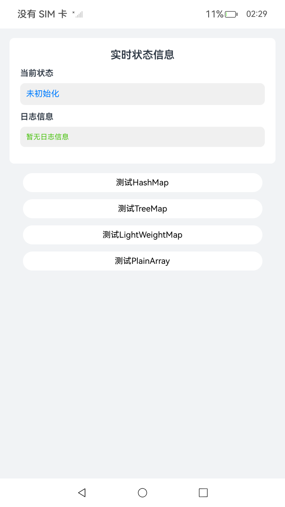

# 非线性容器

## 介绍

非线性容器实现能快速查找的数据结构，其底层通过hash或者红黑树实现，包括HashMap、HashSet、TreeMap、TreeSet、LightWeightMap、LightWeightSet、PlainArray七种。非线性容器中的key及value的类型均满足ECMA标准。
## 效果预览

| 首页                                |
|-----------------------------------|
|  |

## 工程目录

```
├───entry/src/main/ets
│   ├───pages                               
│   │   └───Index.ets                                        // 首页。
└───entry/src/main/resources                                 // 资源目录。         
```

## 具体实现

* 非线性容器
    * 源码参考：[Index.ets](./entry/src/main/ets/pages/Index.ets)
    * 使用流程：
    * 点击'测试HashMap'按钮，可看到非线性容器HashMap的'set'操作结果。
    * 点击'测试TreeMap'按钮，可看到非线性容器HashMap的'set'操作结果。
    * 点击'测试LightWeightMap'按钮，可看到非线性容器HashMap的'set'操作结果。
    * 点击'测试PlainArray'按钮，可看到非线性容器HashMap的'add'操作结果。

## 依赖

不涉及。

## 相关权限

不涉及。

## 约束与限制

1. 本示例支持标准系统上运行，支持设备：RK3568。

2. 本示例支持API23版本的SDK，版本号：6.1.0.25。

3. 本示例已支持使用Build Version: 6.0.1.251, built on November 22, 2025。

4. 高等级APL特殊签名说明：无。

## 下载

如需单独下载本工程，执行如下命令：

 ```git
 git init
 git config core.sparsecheckout true
 echo ArkTS/ArkTsCommonLibrary/ArkTsContainerLibrary/NonlinearContainers > .git/info/sparse-checkout
 git remote add origin https://gitcode.com/HarmonyOS_Samples/guide-snippets.git
 git pull origin master
 ```