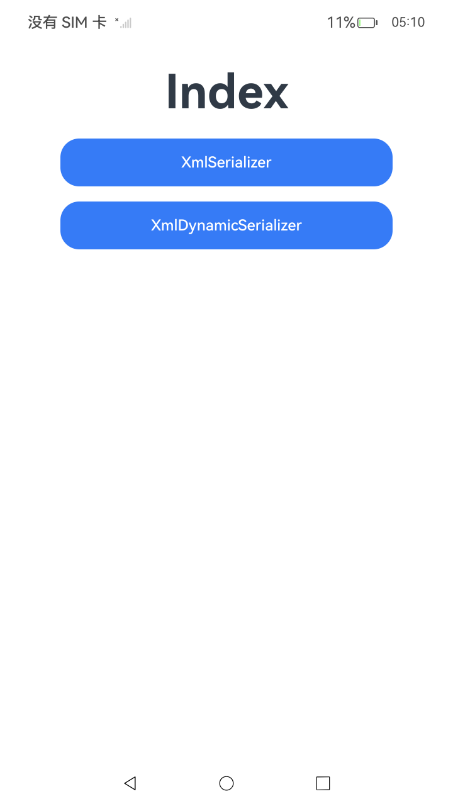
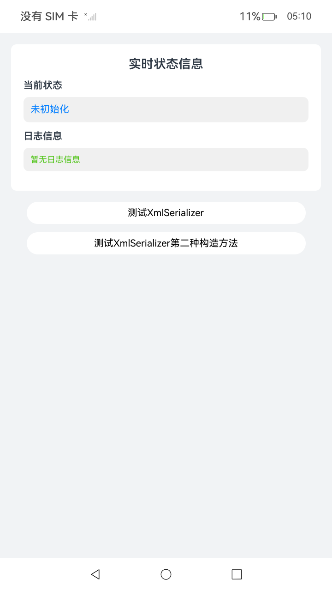
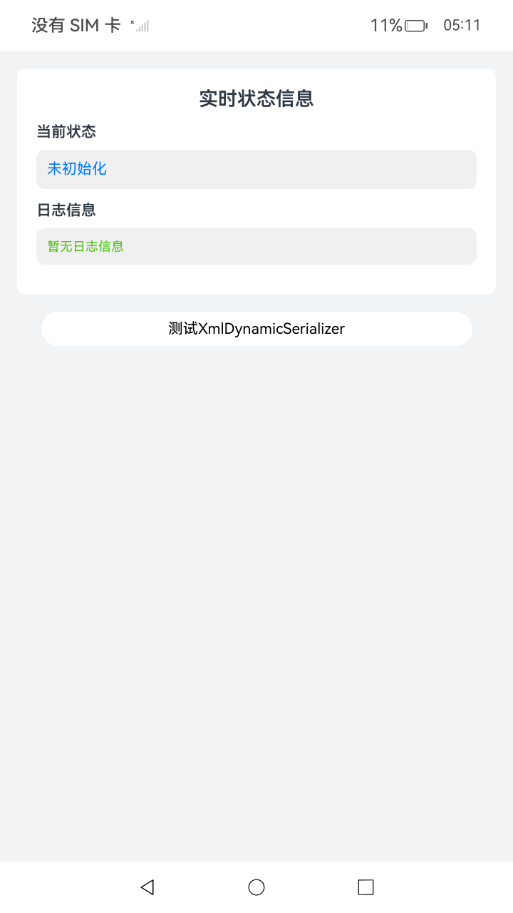

# XML生成

## 介绍

本示例主要介绍了XML生成的两种方式：
* 使用XmlSerializer生成XML
* 使用XmlDynamicSerializer生成XML

## 效果预览

| 首页                                     | 使用XmlSerializer生成XML                         | 使用XmlDynamicSerializer生成XML                                  |
|----------------------------------------|-----------------------------------------------|--------------------------------------------------------------|
|       |   |  |

## 工程目录

```
entry/src/main/ets/
└── pages
    └── Index.ets // 首页。
    └── XmlDynamicSerializer.ets // 使用XmlDynamicSerializer生成XML。
    └── XmlSerializer.ets // 使用XmlSerializer生成XML。  
entry/src/ohosTest/
└── ets
    └── test
        └── XmlDynamicSerializer.test.ets // 使用XmlDynamicSerializer生成XMLUI自动化用例。
        └── XmlSerializer.test.ets // 使用XmlSerializer生成XMLUI自动化用例。
```

## 具体实现

* 首页包含以下两个分页面。
    * 源码参考：[Index.ets](./entry/src/main/ets/pages/Index.ets)
    * 使用XmlDynamicSerializer生成XML
        * 源码参考：[XmlDynamicSerializer.ets](./entry/src/main/ets/pages/XmlDynamicSerializer.ets)
        * 使用流程：
            * 1、点击进入分页面
            * 2、测试XmlDynamicSerializer
              点击"测试XmlDynamicSerializer"按钮，应用将演示如何使用XmlDynamicSerializer动态生成XML文档。该类会自动管理缓冲区大小，无需手动指定缓冲区容量。代码演示创建一个包含书店信息的XML文档结构，包括bookstore根元素、book子元素及其属性（category="COOKING"），以及嵌套的title（带lang="en"属性）、author和year标签。通过setDeclaration()设置XML声明，使用startElement()和endElement()构建元素层次结构，setAttributes()添加属性，setText()设置标签内容。最后通过getOutput()方法获取生成的ArrayBuffer，并使用TextDecoder解码为XML字符串。日志区域会显示完整的XML文档内容，展示动态序列化的便捷性。当前状态更新为"测试XmlDynamicSerializer完成"。
    * 使用XmlSerializer生成XML
        * 源码参考：[XmlSerializer.ets](./entry/src/main/ets/pages/XmlSerializer.ets)
        * 使用流程：
            * 1、点击进入分页面
            * 2、测试XmlSerializer
              点击"测试XmlSerializer"按钮，应用将演示如何使用XmlSerializer基于ArrayBuffer生成XML文档。首先创建一个2048字节的ArrayBuffer作为缓冲区，然后构造XmlSerializer对象。通过一系列方法调用构建XML结构：setDeclaration()写入XML声明，startElement()写入元素开始标记，setAttributes()写入属性及其值，setText()写入标签内容，endElement()写入结束标记。代码演示创建与第一种方式相同的书店XML文档。生成完成后，使用Uint8Array读取ArrayBuffer数据，通过util模块的TextDecoder类解码为字符串。日志区域会显示生成的完整XML文档，展示基于固定缓冲区的序列化方式。当前状态更新为"测试XmlSerializer完成"。
            * 3、测试XmlSerializer第二种构造方法
              点击"测试XmlSerializer第二种构造方法"按钮，应用将演示XmlSerializer的另一种构造方式——基于DataView对象。首先创建ArrayBuffer，然后基于该ArrayBuffer创建DataView对象，最后使用DataView构造XmlSerializer实例。这种方式提供了对缓冲区更灵活的视图控制能力。生成XML的方法调用流程与第一种方式完全相同，同样创建包含书店信息的XML文档结构。日志区域会显示生成的XML内容，验证两种构造方式的等效性。当前状态更新为"测试XmlSerializer第二种构造方法完成"。

## 依赖

不涉及。

## 相关权限

不涉及。

## 约束与限制

1.  本示例支持标准系统上运行，支持设备：RK3568。

2.  本示例支持API23版本的SDK，版本号：6.1.0.25。

3.  本示例已支持使用Build Version: 6.0.1.251, built on November 22, 2025。

4.  高等级APL特殊签名说明：无。

## 下载

如需单独下载本工程，执行如下命令：

 ```git
 git init
 git config core.sparsecheckout true
 echo ArkTS/ArkTsCommonLibrary/XmlGenerationParsingAndConversion/XMLGeneration > .git/info/sparse-checkout
 git remote add origin https://gitcode.com/HarmonyOS_Samples/guide-snippets.git
 git pull origin master
 ```