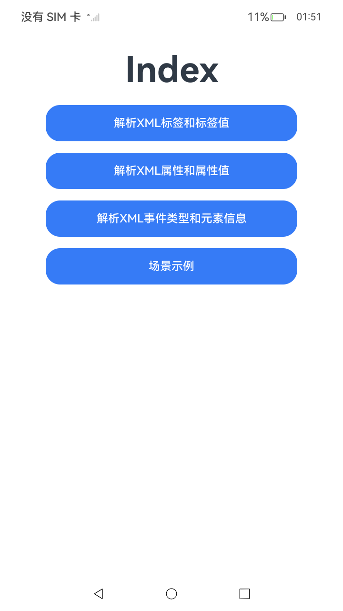

# XML解析

## 介绍

本示例主要介绍了XML解析所包含的三类操作和场景示例的使用：
* 解析XML标签和标签值
* 解析XML属性和属性值
* 解析XML事件类型和元素信息
* 场景示例

## 效果预览

| 首页                                     | 解析XML标签和标签值                         | 场景示例 |
|----------------------------------------|-----------------------------------------------|--|
|       |   ||

## 工程目录

```
entry/src/main/ets/
└── pages
    └── Index.ets // 首页。
    └── ExampleScenario.ets // 场景示例。
    └── ParsingAttributesAndValues.ets // 解析XML属性和属性值。
    └── ParsingEventTypesAndElementInformation.ets // 解析XML事件类型和元素信息。
    └── ParsingTagsAndValues.ets // 解析XML标签和标签值。    
entry/src/ohosTest/
└── ets
    └── test
        └── ExampleScenario.test.ets // 场景示例UI自动化用例。
        └── ParsingAttributesAndValues.test.ets // 解析XML属性和属性值UI自动化用例。
        └── ParsingEventTypesAndElementInformation.test.ets // 解析XML事件类型和元素信息UI自动化用例。
        └── ParsingTagsAndValues.test.ets // 解析XML标签和标签值UI自动化用例。
```

## 具体实现

* 首页包含以下四个分页面。
    * 源码参考：[Index.ets](./entry/src/main/ets/pages/Index.ets)
    * 场景示例
        * 源码参考：[ExampleScenario.ets](./entry/src/main/ets/pages/ExampleScenario.ets)
        * 使用流程：
            * 1、点击进入分页面
            * 2、测试场景示例
              点击"测试场景示例"按钮，应用将演示XML解析的综合场景。解析一个包含书籍信息的XML文档，该文档包含category属性、title标签（带lang属性）和author标签。通过三个回调函数（tagValueCallbackFunction、attributeValueCallbackFunction、tokenValueCallbackFunction）分别处理标签值、属性值和事件类型信息。日志区域会实时显示解析过程中的事件类型和元素深度信息，展示XML解析器的完整工作流程。当前状态更新为"测试场景示例完成"。
    * 解析XML属性和属性值
        * 源码参考：[ParsingAttributesAndValues.ets](./entry/src/main/ets/pages/ParsingAttributesAndValues.ets)
        * 使用流程：
            * 1、点击进入分页面
            * 2、测试解析XML属性和属性值
              点击"测试解析XML属性和属性值"按钮，应用将演示如何解析XML元素的属性信息。解析包含note标签的XML文档，该标签具有importance="high"和logged="true"两个属性。通过attributeValueCallbackFunction回调函数，应用会遍历并提取所有属性名称和对应的属性值。日志区域会显示解析到的属性信息（importance high logged true），展示XML属性解析的基本用法。当前状态更新为"测试解析XML属性和属性值完成"。
    * 解析XML事件类型和元素信息
        * 源码参考：[ParsingEventTypesAndElementInformation.ets](./entry/src/main/ets/pages/ParsingEventTypesAndElementInformation.ets)
        * 使用流程：
            * 1、点击进入分页面
            * 2、测试解析XML事件类型和元素信息
              点击"测试解析XML事件类型和元素信息"按钮，应用将演示如何获取XML解析过程中的事件类型和元素结构信息。通过tokenValueCallbackFunction回调函数，应用能够捕获解析器触发的各种事件类型（如START_DOCUMENT、START_TAG、END_TAG等），并通过ParseInfo对象的getDepth()方法获取当前元素在XML文档树中的深度层级。日志区域会显示每个解析事件的类型和对应的深度值，帮助理解XML文档的层次结构。当前状态更新为"测试解析XML事件类型和元素信息完成"。
    * 解析XML标签和标签值
        * 源码参考：[ParsingTagsAndValues.ets](./entry/src/main/ets/pages/ParsingTagsAndValues.ets)
        * 使用流程：
            * 1、点击进入分页面
            * 2、测试解析XML标签和标签值
              点击"测试解析XML标签和标签值"按钮，应用将演示如何解析XML元素的标签名称和标签内容。解析包含note、title和lens标签的XML文档，通过tagValueCallbackFunction回调函数，应用能够获取每个标签的名称（name参数）和标签内的文本内容（value参数）。代码中展示了条件判断逻辑，对特定标签和值进行处理和输出。日志区域会显示解析到的标签值（Play、Work），展示XmlPullParser基于ArrayBuffer或DataView构造对象的两种方式。当前状态更新为"测试解析XML标签和标签值完成"。

## 依赖

不涉及。

## 相关权限

不涉及。

### 约束与限制

1.  本示例支持标准系统上运行，支持设备：RK3568。

2.  本示例支持API23版本的SDK，版本号：6.1.0.25。

3.  本示例已支持使用Build Version: 6.0.1.251, built on November 22, 2025。

4.  高等级APL特殊签名说明：无。

## 下载

如需单独下载本工程，执行如下命令：

 ```git
 git init
 git config core.sparsecheckout true
 echo ArkTS/ArkTsCommonLibrary/XmlGenerationParsingAndConversion/XmlParsing > .git/info/sparse-checkout
 git remote add origin https://gitcode.com/HarmonyOS_Samples/guide-snippets.git
 git pull origin master
 ```