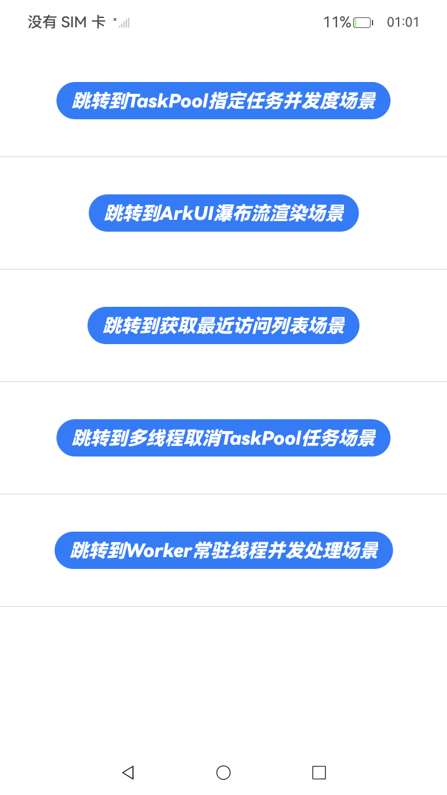
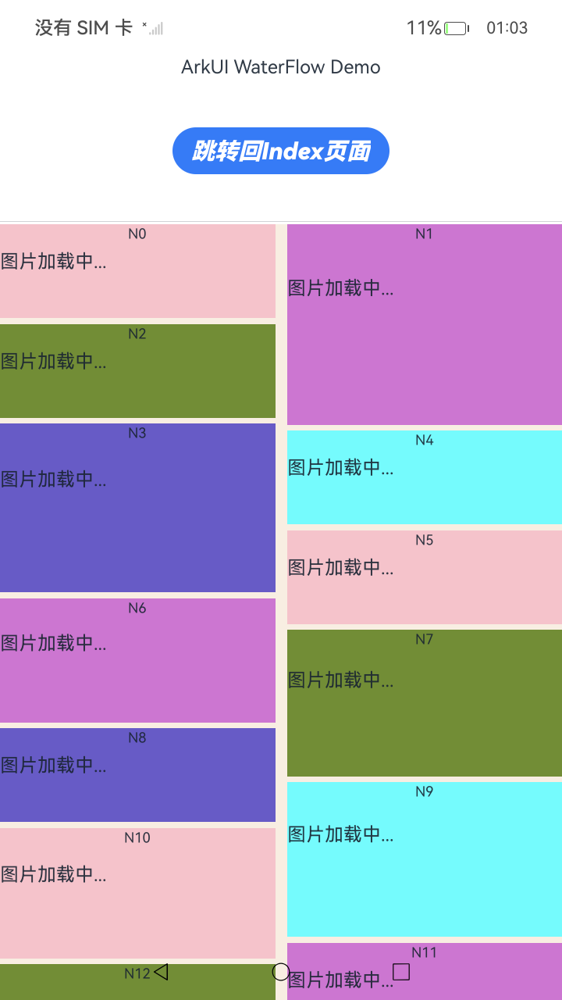

# 应用多线程开发实践案例

### 介绍

此Sample为开发指南中**应用多线程开发实践案例。
涉及场景如下：
* **TaskPool指定任务并发度场景**
* **ArkUI瀑布流渲染场景**
* **获取最近访问列表场景**
* **多线程取消TaskPool任务场景**
* **Worker常驻线程通过TaskPool进行多任务并发处理**

### 效果预览

| index页面                           | TaskPool指定任务并发度场景                       | ArkUI瀑布流渲染场景                   |
|-----------------------------------|-----------------------------------------|-------------------------------------------|
|  |  |  |

使用说明：

1.安装应用，弹出菜单后，根据需要点击按钮跳转到不同功能的界面。

2.从菜单页面，点击“跳转到TaskPool指定任务并发度场景”按钮，进入TaskPool指定任务并发度页面，点击“触发采集任务”按钮触发采集任务，
页面弹出“asyncRunner task finished”信息，触发成功。

3.从菜单页面，点击“跳转到ArkUI瀑布流渲染场景”按钮，进入ArkUI瀑布流渲染页面，页面以瀑布流布局的方式排列。

4.从菜单页面，点击“跳转到获取最近访问列表场景”按钮，进入跳转到获取最近访问列表页面，页面自上而下显示的排布顺序即为最近访问的图书序列，
点击“third”按钮访问第三本书，然后点击“返回”按钮查看最近访问的图书序列，“third”在最上面。

5.从菜单页面，点击“跳转到多线程取消TaskPool任务场景”按钮进入跳转到多线程取消TaskPool任务页面，点击“CancelTaskpool”按钮
取消TaskPool任务场景，页面弹出“Taskpool canceled!”信息，取消成功。

6.从菜单页面，点击“跳转到Worker常驻线程并发处理场景”按钮，进入跳转到Worker常驻线程并发处理页面，点击“在主线程中创建Worker线程并发送消息”按钮
创建Worker线程并发送消息，页面弹出“主线程收到最终结果: -331”信息，即为创建成功。

### 工程目录

```
**MultithreadingApps**
entry/src/main/ets/
├── utils
│   └── Logger.ets (logger日志类)
│   └── LruCache.ets (SendableClass类)
│   └── Mock.ets (模拟查询数据库)
│   └── MyButton.ets (自定义Button按钮类)
│   └── Sendable.ets (SendableTest类)
│   └── WaterFlowDataSource.ets (WaterFlowDataSource类)
└── pages
    └── Book1.ets (Book1)
    └── Book2.ets (Book2)
    └── Book3.ets (Book3)
    └── Book4.ets (Book4)
    └── GetRecentList.ets (获取最近访问列表场景)
    └── Index.ets (菜单页面)
    └── TaskpoolAsyncLevel.ets (TaskPool指定任务并发度场景)
    └── TaskpoolCancel.ets (多线程取消TaskPool任务场景)
    └── TaskpoolWaterFlow.ets (ArkUI瀑布流渲染场景)
    └── workerAndTaskpool.ets (Worker常驻线程并发处理场景)
entry/src/ohosTest/ets/
└── test
    ├── MultithreadingApps.test.test.ets (UI测试代码)
    └── List.test.ets (测试套件列表)
```

### 具体实现

+ TaskPool指定任务并发度场景，源码参考[TaskpoolAsyncLevel.ets](./entry/src/main/ets/pages/TaskpoolAsyncLevel.ets)。
+ ArkUI瀑布流渲染场景，源码参考[TaskpoolWaterFlow.ets](./entry/src/main/ets/pages/TaskpoolWaterFlow.ets)。
+ 获取最近访问列表场景，源码参考[GetRecentList.ets](./entry/src/main/ets/pages/GetRecentList.ets)。
+ 多线程取消TaskPool任务场景，源码参考[TaskpoolCancel.ets](./entry/src/main/ets/pages/TaskpoolCancel.ets)。
+ Worker常驻线程通过TaskPool进行多任务并发处理，源码参考[workerAndTaskpool.ets](./entry/src/main/ets/pages/workerAndTaskpool.ets)。

### 相关权限
无。

### 依赖

不涉及。

### 约束与限制

1.  本示例支持标准系统上运行，支持设备：RK3568；

2.  本示例支持API23版本的SDK，版本号：6.1.0.25；

3.  本示例已支持使用Build Version: 6.0.1.251, built on November 22, 2025；

4.  高等级APL特殊签名说明：无；·

### 下载

如需单独下载本工程，执行如下命令：

```git
git init
git config core.sparsecheckout true
echo ArkTS/ArkTsConcurrent/ApplicationMultithreadingDevelopment/PracticalCasesSecond/ > .git/info/sparse-checkout
git remote add origin OpenHarmony/applications_app_samples
git pull origin master
```