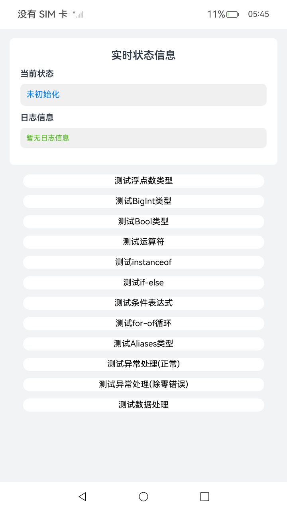

# ArkTS语言介绍

### 介绍

本工程主要展示了ArkTS的核心功能、语法的使用示例。

### 效果预览

| 首页                                                      | 基本知识页面                                                                    | 函数页面                                                       |
|---------------------------------------------------------|---------------------------------------------------------------------------|------------------------------------------------------------|
|  |  |  |

### 使用说明

1. 运行Index主界面。
2. 页面中呈现四个按钮，点击之后可分别进入到对应的分页面。
3. 运行测试用例ArkTsLanguage.test.ets文件对页面代码进行测试可以全部通过。

### 工程目录

```
entry/src/
 ├── main
 │   ├── ets
 │   │   └── pages
 │   │       ├── NameAnno.d.ets                   // 在.d.ets文件中导出注解
 │   │       ├── MyAnno.ets                       // 在ets文件中导出注解
 │   │       ├── Annotation.ets                   // 注解语法使用
 │   │       ├── Author.ets                       // MyAnno.ets文件导入的内容
 │   │       ├── BasicKnowledge.ets               // 基本知识语法使用
 │   │       ├── Calc.ets                         // ModuleAndKeyword.ets文件导入的内容
 │   │       ├── Class.ets                        // 类的语法使用
 │   │       ├── Function.ets                     // 函数的语法使用
 │   │       ├── GenericTypesAndFunctions.ets     // 泛型类型和函数的语法使用
 │   │       ├── Index.ets                        // 首页
 │   │       ├── Interface.ets                    // 接口的语法使用
 │   │       ├── ModuleAndKeyword.ets             // 模块和关键字的语法使用
 │   │       ├── NullSafety.ets                   // 空安全的语法使用
 │   │       ├── Say.ets                          // ModuleAndKeyword.ets文件导入的内容
 │   │       └── Utils.ets                        // ModuleAndKeyword.ets文件导入的内容
 ├── ohosTest
 │   ├── ets
 │   │   └── test
 │   │       ├── Ability.test.ets
 │   │       ├── ArkTsLanguage.test.ets           // 自动化测试代码
 │   │       └── List.test
```

### 相关权限

不涉及。

### 依赖

不涉及。

### 约束与限制

1.  本示例支持标准系统上运行，支持设备：RK3568；

2.  本示例支持API23版本的SDK，版本号：6.1.0.25；

3.  本示例已支持使用Build Version: 6.0.1.251, built on November 22, 2025；

4.  高等级APL特殊签名说明：无；

### 下载

如需单独下载本工程，执行如下命令：

```
git init
git config core.sparsecheckout true
echo ArkTS/Start/LearningArkTs/IntroductionToArkTs > .git/info/sparse-checkout
git remote add origin https://gitcode.com/HarmonyOS_Samples/guide-snippets.git
git pull origin master
```
