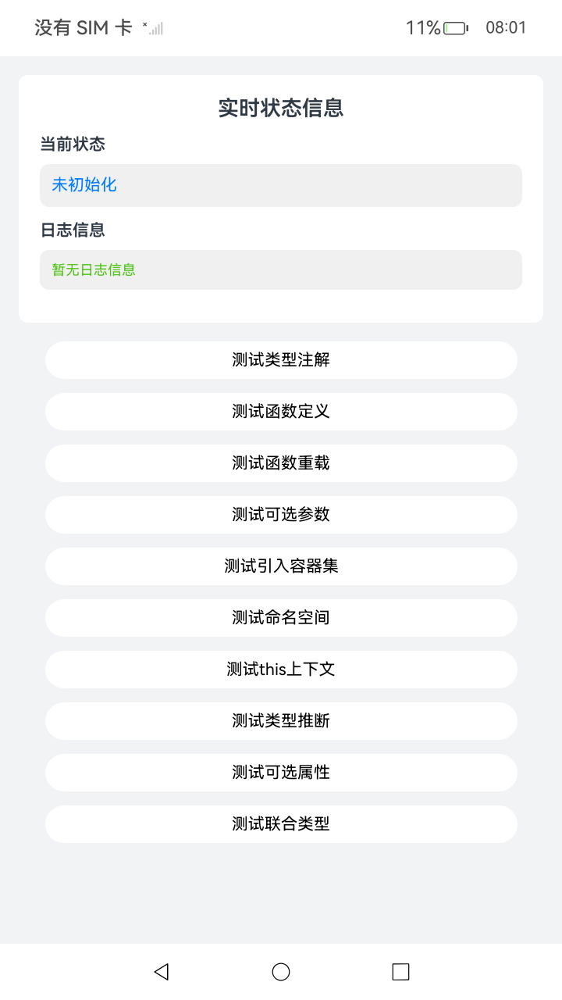

# 从Swift到ArkTS的迁移指导

## 介绍

本示例主要介绍了Swift开发者梳理在转向ArkTS开发过程中会遇到的误解和陷阱。

## 效果预览

| 首页                                | 
|-----------------------------------|
|  |

## 工程目录

```
entry/src/main/ets/
└── pages
    └── Index.ets                 // 首页。
entry/src/ohosTest/
└── ets
    └── test
        └── SwiftToArkTs.test.ets // UI自动化用例。  
```

## 具体实现

* 从Swift到ArkTS的迁移指导
    * 源码参考：[Index.ets](./entry/src/main/ets/pages/Index.ets)
    * 使用流程：
        * 1、启动应用
          打开应用后，界面将显示"实时状态信息"面板，包含"当前状态"和"日志信息"两个区域。初始状态显示"未初始化"，日志信息显示"暂无日志信息"。
        * 2、测试类型注解功能
          点击"测试类型注解"按钮，应用将演示ArkTS的类型注解和类型推断功能（类似Swift）。日志区域会显示变量age、program和version的值，展示显式类型注解和类型推断的使用方式。当前状态更新为"测试类型注解完成"。
        * 3、测试函数定义功能
          点击"测试函数定义"按钮，应用将展示常规函数定义（与Swift类似）和箭头函数的使用（类似Swift的闭包语法）。日志区域会显示add函数和multiply函数的计算结果，当前状态更新为"测试函数定义完成"。
        * 4、测试函数重载功能
          点击"测试函数重载"按钮，应用将演示函数重载特性，展示同一个函数名如何接受不同类型的参数。通过foo函数调用，验证函数重载机制的正确性。日志区域会显示执行成功信息，当前状态更新为"测试函数重载完成"。
        * 5、测试可选参数功能
          点击"测试可选参数"按钮，应用将演示可选参数的使用方式。通过foo2('hello')和foo2()两次调用，展示参数可传可不传的特性。日志区域会显示两次调用均成功执行，当前状态更新为"测试可选参数完成"。
        * 6、测试引入容器集功能
          点击"测试引入容器集"按钮，应用将演示如何从@kit.ArkTS引入collections模块，并创建Array实例。日志区域会显示创建的Array元素数量，展示ArkTS标准库容器集的使用方法。当前状态更新为"测试引入容器集完成"。
        * 7、测试命名空间功能
          点击"测试命名空间"按钮，应用将展示命名空间的声明和使用方式。通过Models命名空间创建User类实例，日志区域会显示创建的User对象的name属性值。当前状态更新为"测试命名空间完成"。
        * 8、测试this上下文功能
          点击"测试this上下文"按钮，应用将演示this上下文绑定问题及解决方案。通过bind方法正确绑定this上下文，避免程序崩溃。展示在ArkTS中处理函数上下文的正确方法。日志区域会显示执行成功信息，当前状态更新为"测试this上下文完成"。
        * 9、测试类型推断功能
          点击"测试类型推断"按钮，应用将演示编译器的自动类型推断能力。无需显式声明类型，编译器会自动推断变量num为number类型。日志区域会显示变量num的值和推断出的类型，当前状态更新为"测试类型推断完成"。
        * 10、测试可选属性功能
          点击"测试可选属性"按钮，应用将演示接口中可选属性的使用。定义Person接口时，age属性标记为可选（age?），创建对象时可以不提供该属性。日志区域会显示person对象的name和age属性值（age为undefined），展示可选属性的特性。当前状态更新为"测试可选属性完成"。
        * 11、测试联合类型功能
          点击"测试联合类型"按钮，应用将演示联合类型的使用方式。变量value声明为string | number类型，可以先赋值为字符串'hello'，再赋值为数字123。日志区域会显示最终的value值，展示ArkTS的灵活类型系统。当前状态更新为"测试联合类型完成"。

## 依赖

不涉及。

## 相关权限

不涉及。

## 约束与限制

1.  本示例支持标准系统上运行，支持设备：RK3568；

2.  本示例支持API20版本SDK，版本号： 6.0.0.43；

3.  本示例已支持使Build Version: 6.0.0.43, built on August 24, 2025；

4.  高等级APL特殊签名说明：无；

## 下载

如需单独下载本工程，执行如下命令：

 ```git
 git init
 git config core.sparsecheckout true
 echo ArkTS/Start/LearningArkTS/MigrationFromOtherLanguagesToArkTS/MigratingFromSwiftToArkTS > .git/info/sparse-checkout
 git remote add origin https://gitcode.com/HarmonyOS_Samples/guide-snippets.git
 git pull origin master
 ```