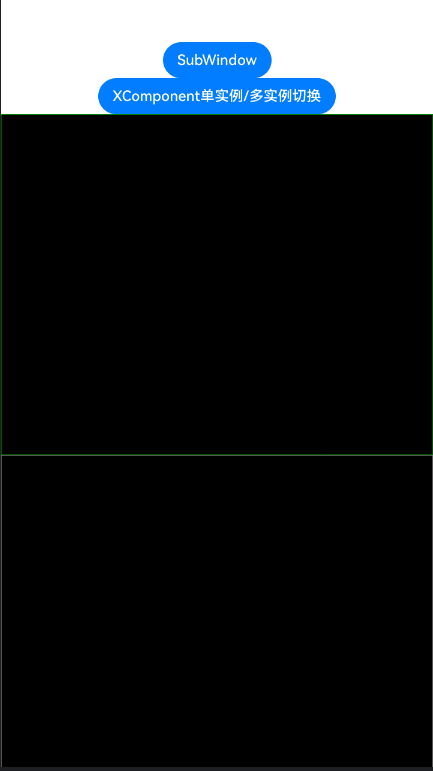

# AccessibilityCAPI示例

### 介绍

本示例[通过XComponent接入无障碍](https://developer.huawei.com/consumer/cn/doc/harmonyos-guides/ndk-accessibility-xcomponent)中各场景的开发示例，展示在工程中，帮助开发者更好地理解Accessibility CAPI接口并合理使用。该工程中展示的接口详细描述可查如下链接：

[native_interface_accessibility.h](https://gitcode.com/openharmony/docs/blob/master/zh-cn/application-dev/reference/apis-arkui/capi-native-interface-accessibility-h.md)。

### 效果预览

| 首页                                 |
|------------------------------------|
|  |
|  |

### 使用说明

1. 通过开启屏幕朗读后使用单指滑动点击双击等操作，可以验证无障碍C-API接口的基本功能。

### 工程目录
```
├──entry/src/main
│  ├──cpp                               // C++代码区
│  │  ├──CMakeLists.txt                 // CMake配置文件
│  │  ├──napi_init.cpp                  // Napi模块注册
│  │  ├──common
│  │  │  └──common.h                    // 常量定义文件
|  |  ├──fakenode                       // 渲染模块
|  |  |  ├──fake_node.cpp
|  |  |  └──fake_node.h
│  │  ├──manager            
|  |  |  ├──AccessibilityManager.cpp    // Accessibility CAPI接口示例
|  |  |  ├──AccessibilityManager.h
│  │  │  ├──plugin_manager.cpp
│  │  │  ├──plugin_manager.h
|  |  |  ├──xcomponent_manager.cpp
|  |  |  └──xcomponent_manager.h
|  |  ├──types						//定义接口文件
│  │  │  ├──libnativerender
│  │  │  │  ├──Index.d.ts
│  │  │  │  ├──oh-package.json5
│  ├──ets                           // ets代码区
│  │  ├──entryability
│  │  │  └──EntryAbility.ts         // 程序入口类
│  │  └──pages                      // 页面文件
│  │     └──Index.ets               // 主界面
|  ├──resources         			// 资源文件目录
├──entry/src/ohosTest/
├──ets
|   |---index.test.ets                       // 示例代码测试代码
```

### 相关权限

不涉及。

### 依赖

不涉及。

### 约束与限制

1. 本示例仅支持标准系统上运行, 支持设备：华为手机。

2. HarmonyOS系统：HarmonyOS 5.0.5 Release及以上。

3. DevEco Studio版本：6.0.0 Release及以上。

4. HarmonyOS SDK版本：HarmonyOS 6.0.0 Release SDK及以上。

### 下载

如需单独下载本工程，执行如下命令：

````
git init
git config core.sparsecheckout true
echo ArkUISample/AccessibilityCapi > .git/info/sparse-checkout
git remote add origin https://gitcode.com/harmonyos_samples/guide-snippets.git
git pull origin master
````