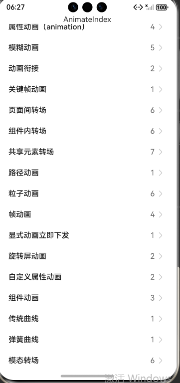

# ArkUI使用动效组件指南文档示例

### 介绍

本示例通过使用[ArkUI指南文档](https://gitcode.com/openharmony/docs/tree/master/zh-cn/application-dev/ui)中各场景的开发示例，展示在工程中，帮助开发者更好地理解ArkUI提供的组件及组件属性并合理使用。该工程中展示的代码详细描述可查如下链接：
1. [显示动画（animateTo）](https://gitcode.com/openharmony/docs/blob/master/zh-cn/application-dev/reference/apis-arkui/arkui-ts/ts-explicit-animation.md)。
2. [属性动画（animation）](https://gitcode.com/openharmony/docs/blob/master/zh-cn/application-dev/reference/apis-arkui/arkui-ts/ts-animatorproperty.md)。
3. [动画衔接](https://gitcode.com/openharmony/docs/blob/master/zh-cn/application-dev/ui/arkts-animation-smoothing.md)。
4. [关键帧动画](https://gitcode.com/openharmony/docs/blob/master/zh-cn/application-dev/reference/apis-arkui/arkui-ts/ts-keyframeAnimateTo.md)。
5. [页面间转场](https://gitcode.com/openharmony/docs/blob/master/zh-cn/application-dev/reference/apis-arkui/arkui-ts/ts-page-transition-animation.md)。
6. [组件内转场](https://gitcode.com/openharmony/docs/blob/master/zh-cn/application-dev/reference/apis-arkui/arkui-ts/ts-transition-animation-component.md)。
7. [共享元素转场](https://gitcode.com/openharmony/docs/blob/master/zh-cn/application-dev/ui/arkts-shared-element-transition.md)。
8. [路径动画](https://gitcode.com/openharmony/docs/blob/master/zh-cn/application-dev/reference/apis-arkui/arkui-ts/ts-motion-path-animation.md)。
9. [粒子动画](https://gitcode.com/openharmony/docs/blob/master/zh-cn/application-dev/reference/apis-arkui/arkui-ts/ts-particle-animation.md)。
10. [帧动画](https://gitcode.com/openharmony/docs/blob/master/zh-cn/application-dev/ui/arkts-animator.md)。
11. [显式动画立即下发](https://gitcode.com/openharmony/docs/blob/master/zh-cn/application-dev/reference/apis-arkui/arkui-ts/ts-explicit-animatetoimmediately.md)。
12. [旋转屏动画](https://gitcode.com/openharmony/docs/blob/master/zh-cn/application-dev/ui/arkts-rotation-transition-animation.md)。
13. [模糊动画](https://gitcode.com/openharmony/docs/blob/master/zh-cn/application-dev/ui/arkts-blur-effect.md)。
14. [自定义属性动画](https://gitcode.com/openharmony/docs/blob/master/zh-cn/application-dev/ui/arkts-custom-attribute-animation.md)。
15. [组件动画](https://gitcode.com/openharmony/docs/blob/master/zh-cn/application-dev/ui/arkts-component-animation.md)。
16. [传统曲线](https://gitcode.com/openharmony/docs/blob/master/zh-cn/application-dev/ui/arkts-traditional-curve.md)。
17. [弹簧曲线](https://gitcode.com/openharmony/docs/blob/master/zh-cn/application-dev/ui/arkts-spring-curve.md)。
18. [模态转场](https://gitcode.com/openharmony/docs/blob/master/zh-cn/application-dev/ui/arkts-modal-transition.md)。
19. [实现属性动画](https://gitcode.com/openharmony/docs/blob/master/zh-cn/application-dev/ui/arkts-attribute-animation-apis.md)。


### 效果预览
| 首页                                 |
|------------------------------------|
|  |

### 使用说明

1. 在主界面，可以点击对应卡片，选择需要参考的组件示例。

2. 在组件目录选择详细的示例参考。

3. 进入示例界面，查看参考示例。

4. 通过自动测试框架可进行测试及维护。

### 工程目录
```
entry/src/main/ets/
|---entryability
|---pages
|   |---animatableProperty           // 自定义属性动画
|   |   |---template1         
|   |   |   |---Index.ets           // 示例1（改变Text组件宽度）
|   |   |---template2    
|   |   |   |---Index.ets                // 示例2（改变图形形状）
|   |---animateTo                       // 显示动画（animateTo） 
|   |   |---template1         
|   |   |   |---Index.ets           // 示例1（在组件出现时创建动画）
|   |   |---template2    
|   |   |   |---Index.ets                // 示例2（动画执行结束后组件消失）
|   |   |---template3                    
|   |   |   |---Index.ets            // 示例3（在状态管理V2中使用animateTo）
|   |---animateToImmediately                      // 显式动画立即下发
|   |   |---template1
|   |   |   |---Index.ets
|   |---animation                             // 实现属性动画
|   |   |---template1
|   |   |   |---Index.ets
|   |   |---template2                   
|   |   |   |---Index.ets          // 示例2（使用animateTo产生属性动画）
|   |   |---template3             
|   |   |   |---Index.ets        // 示例3（使用animation产生属性动画）
|   |   |---template4         
|   |   |   |---Index.ets         // 示例4（使用keyframeAnimateTo产生属性动画）
|   |---animationBlur                             // 属性动画（animation）
|   |   |---template1
|   |   |   |---Index.ets           // 示例1（使用backdropBlur为组件添加背景模糊）
|   |   |---template2                   
|   |   |   |---Index.ets          // 示例2（使用blur为组件添加内容模糊）
|   |   |---template3             
|   |   |   |---Index.ets        // 示例3（使用backgroundBlurStyle为组件添加背景模糊效果）
|   |   |---template4         
|   |   |   |---Index.ets         // 示例4（使用foregroundBlurStyle为组件添加内容模糊效果）
|   |   |---template5         
|   |   |   |---Index.ets         // 示例5（使用motionBlur为组件添加运动模糊效果）
|   |---animator              // 帧动画
|   |   |---template1        // 示例1（基于ArkTS扩展的声明式开发范式）
|   |   |   |---Index.ets
|   |   |---template2          // 示例2（位移动画示例）
|   |   |   |---Index.ets
|   |   |---template3           // 示例3（使用帧动画实现小球抛物运动）
|   |   |   |---Index.ets
|   |   |---template4           // 示例4（使用帧动画实现小球抛物运动）
|   |   |   |---Index.ets
|   |---cohesion                  // 动画衔接
|   |   |---template1
|   |   |   |---Index.ets
|   |   |---template2
|   |   |   |---Index.ets
|   |---component                 // 组件动画
|   |   |---template1
|   |   |   |---Index.ets           // 示例1（使用组件默认动画）
|   |   |---template2
|   |   |   |---Index.ets           // 示例2（Scroll组件滑动动效）
|   |   |---template3
|   |   |   |---Index.ets           // 示例3（List组件动态替换动效）
|   |---compTransition                 // 组件内转场
|   |   |---template1     
|   |   |   |---Index.ets            // 示例1（使用同一接口实现图片出现消失）
|   |   |---template2       
|   |   |   |---Index.ets       // 示例2（使用不同接口实现图片出现消失）
|   |   |---template3       
|   |   |   |---Index.ets       // 示例3（设置父子组件为transition）
|   |   |---template4      
|   |   |   |---Index.ets        // 示例4（出现/消失转场）
|   |   |---template5       
|   |   |   |---Index.ets    // 示例5（多个组件渐次出现消失）
|   |   |---template6
|   |   |   |---Index.ets    // 示例6（旋转转场效果出现/消失）
|   |---keyframeAnimateTo                      // 关键帧动画
|   |   |---template1
|   |   |   |---Index.ets     
|   |---motionPath                   // 路径动画
|   |   |---template1
|   |   |   |---Index.ets          
|   |---pageTransition                       // 页面间转场
|   |   |---template1      
|   |   |   |---Index.ets         // 示例1（设置退入场动画）
|   |   |---template2      
|   |   |   |---Index.ets      // 示例2（设置退入场平移效果）
|   |   |---template3    
|   |   |   |---Index.ets     // 示例3（不推荐)（利用pushUrl跳转能力）
|   |   |---template4     
|   |   |   |---Index.ets         // 示例4（不推荐)（type为None的页面转场）
|   |   |---template5    
|   |   |   |---Index.ets     // 示例5（不推荐)（type配置为RouteType.None）
|   |   |---template6     
|   |   |   |---Index.ets         // 示例6（不推荐)（type配置为RouteType.Push或RouteType.Pop）
|   |---particle                          // 粒子动画
|   |   |---template1       
|   |   |   |---Index.ets      // 示例1（圆形初始化粒子）
|   |   |---template2      
|   |   |   |---Index.ets     // 示例2（图片初始化粒子）
|   |   |---template3     
|   |   |   |---Index.ets     // 示例3（粒子扰动场的干扰下运动轨迹发生变化）
|   |   |---template4         
|   |   |   |---Index.ets         // 示例4（调整粒子发射器位置）  
|   |   |---template5     
|   |   |   |---Index.ets          // 示例5（环形发射器创建）
|   |   |---template6       
|   |   |   |---Index.ets        // 示例6（环形发射器更新）
|   |---rotation                          // 旋转屏动画
|   |   |---template1
|   |   |   |---Index.ets       
|   |   |---template2
|   |   |   |---Index.ets       
|   |---shareTransition                        // 共享元素转场
|   |   |---template1
|   |   |   |---Index.ets           //示例1（共享元素转场）
|   |   |---template2
|   |   |   |---Index.ets           //示例2（不新建容器并直接变化原容器）
|   |   |---template3
|   |   |   |---Index.ets           //示例3（新建容器并跨容器迁移组件-结合Stack使用）
|   |   |---template4
|   |   |   |---Index.ets           //示例4（新建容器并跨容器迁移组件-结合Navigation使用）
|   |   |---template5
|   |   |   |---Index.ets           //示例5（新建容器并跨容器迁移组件-结合BindSheet使用）
|   |   |---template6
|   |   |   |---IfElseGeometryTransition.ets           //示例6（使用geometryTransition共享元素转场-geometryTransition的简单使用）
|   |   |---template7
|   |   |   |---Index.ets           //示例7（使用geometryTransition共享元素转场-geometryTransition结合模态转场使用）
|   |---traditionalCurve                   // 传统曲线
|   |   |---template1
|   |   |   |---CurveDemo.ets
|   |---springCurve                   // 弹簧曲线
|   |   |---template1
|   |   |   |---SpringCurve.ets
|   |---modalTransition                          // 模态转场
|   |   |---template1       
|   |   |   |---BindContentCoverDemo.ets       // 示例1（使用bindContentCover构建全屏模态转场效果）
|   |   |---template2      
|   |   |   |---BindSheetDemo.ets       // 示例2（使用bindSheet构建半模态转场效果）
|   |   |---template3     
|   |   |   |---BindMenuDemo.ets       // 示例3（使用bindMenu实现菜单弹出效果）
|   |   |---template4         
|   |   |   |---BindContextMenuDemo.ets       // 示例4（使用bindContextMenu实现菜单弹出效果） 
|   |   |---template5     
|   |   |   |---BindPopupDemo.ets       // 示例5（使用bindPopup实现气泡弹窗效果）
|   |   |---template6       
|   |   |   |---ModalTransitionWithIf.ets       // 示例6（使用if实现模态转场）

|---pages
|   |---Index.ets                       // 应用主页面
entry/src/ohosTest/
|---ets
|   |---test
|   |   |---AnimatableProperty.test.ets             // 自定义属性动画示例代码测试代码
|   |   |---AnimateTo.test.ets                      // 显示动画（animateTo）示例代码测试代码
|   |   |---AnimateToImmediately.test.ets                     // 显式动画立即下发示例代码测试代码
|   |   |---Animation.test.ets                            // 属性动画（animation）示例代码测试代码
|   |   |---Animator.test.ets             // 帧动画示例代码测试代码
|   |   |---Cohesion.test.ets                 // 动画衔接示例代码测试代码
|   |   |---Component.test.ets                 // 组件动画示例代码测试代码
|   |   |---ComponentTransition.test.ets                // 组件内转场示例代码测试代码
|   |   |---KeyFrameAnimateTo.test.ets                     // 关键帧动画示例代码测试代码
|   |   |---MotionPath.test.ets                  // 路径动画示例代码测试代码
|   |   |---PageTransition.test.ets                      // 页面间转场示例代码测试代码
|   |   |---Particle.test.ets                         // 粒子动画示例代码测试代码
|   |   |---Rotation.test.ets                         // 旋转屏动画示例代码测试代码
|   |   |---ShareTransition.test.ets                       // 共享元素转场示例代码测试代码
|   |   |---TraditionalCurve.test.ets                  // 传统曲线示例代码测试代码
|   |   |---SpringCurve.test.ets                  // 弹簧曲线示例代码测试代码
|   |   |---ModalTransition.test.ets                       // 模态转场示例代码测试代码
```

### 具体实现
1. 显示动画（animateTo）：提供全局animateTo显式动画接口来指定由于闭包代码导致的状态变化插入过渡动效。源码参考：[animateTo/template1/Index.ets](https://gitcode.com/openharmony/applications_app_samples/blob/master/code/DocsSample/ArkUISample/Animation/entry/src/main/ets/pages/animateTo/template1/Index.ets)
   * 提供全局animateTo显式动画接口来指定由于闭包代码导致的状态变化插入过渡动效。
   * 同属性动画，布局类改变宽高的动画，内容都是直接到终点状态，例如文字、Canvas的内容等，如果要内容跟随宽高变化，可以使用renderFit属性配置。
2. 属性动画 (animation)：组件的某些通用属性变化时，可以通过属性动画实现渐变过渡效果，提升用户体验。源码参考：[animation/template1/Index.ets](https://gitcode.com/openharmony/applications_app_samples/blob/master/code/DocsSample/ArkUISample/Animation/entry/src/main/ets/pages/animation/template1/Index.ets)
   * 支持的属性包括width、height、backgroundColor、opacity、scale、rotate、translate等。布局类改变宽高的动画，内容都是直接到终点状态，例如文字、Canvas的内容等，如果要内容跟随宽高变化，可以使用renderFit属性配置。
3. 动画衔接：使用animation接口作用的属性值，即可产生动画。源码参考：[cohesion/template1/Index.ets](https://gitcode.com/openharmony/applications_app_samples/blob/master/code/DocsSample/ArkUISample/SupportingAgingFriendly/entry/src/main/ets/pages/cohesion/template1/Index.ets)
   * 对于桌面翻页类从跟手到离手触发动画的场景，离手后动画的初始速度应承继手势速度，避免由于速度不接续导致停顿感的产生。
   * 系统已提供动画与动画、手势与动画之间的衔接能力，保证各类场景下动画平稳光滑地过渡的同时，尽可能降低开发难度。
   * 开发者仅需在animateTo动画闭包中改变属性值或者改变animation接口作用的属性值，即可产生动画。
4. 关键帧动画：在UIContext中提供keyframeAnimateTo接口来指定若干个关键帧状态，实现分段的动画。源码参考：[keyframeAnimateTo/template1/Index.ets](https://gitcode.com/openharmony/applications_app_samples/blob/master/code/DocsSample/ArkUISample/Animation/entry/src/main/ets/pages/keyframeAnimateTo/template1/Index.ets)
   * 在UIContext中提供keyframeAnimateTo接口来指定若干个关键帧状态，实现分段的动画。
   * 同属性动画，布局类改变宽高的动画，内容都是直接到终点状态，例如文字、Canvas的内容等，如果要内容跟随宽高变化，可以使用renderFit属性配置。
5. 页面间转场：当路由(router)进行切换时，可以通过在pageTransition函数中自定义页面入场和页面退场的转场动效。源码参考：[pageTransition/template1/Index.ets](https://gitcode.com/openharmony/applications_app_samples/blob/master/code/DocsSample/ArkUISample/Animation/entry/src/main/ets/pages/pageTransition/template1/Index.ets)
   * 当路由(router)进行切换时，可以通过在pageTransition函数中自定义页面入场和页面退场的转场动效。
   * 设置PageTransitionOptions参数（如duration、curve、delay等），结合CommonTransition的slide（滑入滑出方向）、translate（平移）、scale（缩放）、opacity（透明度）等方法定义动画效果。
   * 可以通过onEnter/onExit回调逐帧处理转场进度（progress从0到1）；
6. 组件内转场：主要通过transition属性配置转场参数，在组件插入和删除时显示过渡动效。源码参考：[compTransition/template1/Index.ets](https://gitcode.com/openharmony/applications_app_samples/blob/master/code/DocsSample/ArkUISample/Animation/entry/src/main/ets/pages/compTransition/template1/Index.ets)
   * 通过transition属性配置转场参数，在组件插入和删除时显示过渡动效。
7. 共享元素转场 (一镜到底)：共享元素转场是一种界面切换时对相同或者相似的两个元素做的一种位置和大小匹配的过渡动画效果，也称一镜到底动效。源码参考：[shareTransition/template1/Index.ets](https://gitcode.com/openharmony/applications_app_samples/blob/master/code/DocsSample/ArkUISample/SupportingAgingFriendly/entry/src/main/ets/pages/shareTransition/template1/Index.ets)
   * 不新建容器并直接变化原容器。通过在已有容器上增删组件触发transition，搭配组件属性动画实现一镜到底效果。
   * 新建容器并跨容器迁移组件。利用Stack内后定义组件在最上方的特性控制组件在跨节点迁移后位z序最高。
   * 新建容器并跨容器迁移组件。利用Navigation的自定义导航转场动画能力实现一镜到底动效。共享元素转场期间，组件由消失页面迁移至出现页面。
   * 新建容器并跨容器迁移组件。实现半模态转场（bindSheet）的同时，组件从初始界面做一镜到底动画到半模态页面的效果，可以使用这样的设计思路。将SheetOptions中的mode设置为SheetMode.EMBEDDED，该模式下新起的页面可以覆盖在半模态弹窗上，页面返回后该半模态依旧存在，半模态面板内容不丢失。在半模态转场的同时设置一全模态转场（bindContentCover）页面无转场出现，该页面仅有需要做共享元素转场的组件，通过属性动画，展示组件从初始界面至半模态页面的一镜到底动效，并在动画结束时关闭页面，并将该组件迁移至半模态页面。
   * 使用geometryTransition共享元素转场。geometryTransition用于组件内隐式共享元素转场，在视图状态切换过程中提供丝滑的上下文继承过渡体验。
   * geometryTransition的使用方式为对需要添加一镜到底动效的两个组件使用geometryTransition接口绑定同一id，这样在其中一个组件消失同时另一个组件创建出现的时候，系统会对二者添加一镜到底动效。
   * geometryTransition绑定两个对象的实现方式使得geometryTransition区别于其他方法，最适合用于两个不同对象之间完成一镜到底。
8. 路径动画：设置组件进行位移动画时的运动路径。源码参考：[motionPath/template1/Index.ets](https://gitcode.com/openharmony/applications_app_samples/blob/master/code/DocsSample/ArkUISample/Animation/entry/src/main/ets/pages/motionPath/template1/Index.ets)
   * 可通过motionPath设置组件进行位移动画时的运动路径。
9. 粒子动画：粒子动画是在一定范围内随机生成的大量粒子产生运动而组成的动画。源码参考：[particle/template1/Index.ets](https://gitcode.com/openharmony/applications_app_samples/blob/master/code/DocsSample/ArkUISample/Animation/entry/src/main/ets/pages/particle/template1/Index.ets)
   * 动画元素是一个个粒子，这些粒子可以是圆点、图片。
   * 通过对粒子在颜色、透明度、大小、速度、加速度、自旋角度等维度变化做动画，来营造一种氛围感。
10. 帧动画：通过向应用提供onFrame逐帧回调，帧动画使开发者能够在应用的每一帧设置属性值，从而实现组件属性值变化的自然过渡，营造出动画效果。源码参考：[animator/template1/Index.ets](https://gitcode.com/openharmony/applications_app_samples/blob/master/code/DocsSample/ArkUISample/Animation/entry/src/main/ets/pages/animator/template1/Index.ets)
   * 使用帧动画ohos.animator开发者可每帧修改UI侧属性值，UI侧属性实时更新。
   * 在属性动画UI侧只计算动画最终状态，动画过程为渲染值在改变，UI侧一直为动画最终状态，不感知实时渲染值。
   * 帧动画在动画过程中即可实时响应，而属性动画按最终状态响应。
11. 显式动画立即下发：animateToImmediately接口用来提供显式动画立即下发功能。同时加载多个属性动画的情况下，使用该接口可以立即执行闭包代码中状态变化导致的过渡动效。源码参考：[animateToImmediately/template1/Index.ets](https://gitcode.com/openharmony/applications_app_samples/blob/master/code/DocsSample/ArkUISample/Animation/entry/src/main/ets/pages/animateToImmediately/template1/Index.ets)
   * 与animateTo相比，animateToImmediately能即时将生成的动画指令发送至渲染层执行，无需等待vsync信号，从而在视觉效果上实现部分动画的优先呈现。
   * 当应用的主线程存在耗时操作，且需提前更新部分用户界面时，此接口可有效缩短应用的响应延迟。
   * animateToImmediately仅支持渲染层上的属性动画提前执行，而无法使UI侧的逐帧属性动画提前。
12. 旋转屏动画：旋转屏动画主要分为两类：布局切换的旋转屏动画和透明度变化的旋转屏动画，旨在实现屏幕显示方向变化时的自然过渡。源码参考：[rotation/template1/Index.ets](https://gitcode.com/openharmony/applications_app_samples/blob/master/code/DocsSample/ArkUISample/Animation/entry/src/main/ets/pages/rotation/template1/Index.ets)
   * 布局切换时的旋转屏动画，是在屏幕显示方向改变时，为窗口与应用视图同步旋转而设计的大小和位置过渡动画。
   * 这种布局切换的旋转屏动画是系统默认的，便于开发者实现。当屏幕显示方向变化时，系统会生成窗口旋转动画，并自动调整窗口大小以匹配旋转后的尺寸。
   * 在此过程中，窗口会通知对应的应用，要求其根据新的窗口大小重新布局，产生与窗口旋转动画参数相同的布局动画。
   * 透明度变化的旋转屏动画在屏幕显示方向变化时启用，当窗口进行旋转动画时，为旋转过程中新增或删除的组件添加默认透明度转场，以实现组件的优雅出现和消失。
   * 此功能通过监听窗口旋转事件，在事件中切换组件的视图效果，如果消失视图的根节点和新出现视图的根节点未设置转场效果，会为其自动添加默认透明度转场（即TransitionEffect.OPACITY），展现出透明度的渐隐和渐显效果。
13. 模糊动画：使用backdropBlur为组件添加背景模糊。源码参考：[animationBlur/template1/blurEffectsExample.ets](https://gitcode.com/openharmony/applications_app_samples/blob/master/code/DocsSample/ArkUISample/SupportingAgingFriendly/entry/src/main/ets/pages/animationBlur/template1/blurEffectsExample.ets)
   * 模糊和阴影效果可以让物体看起来更加立体，使得动画更加生动。
   * 提供了丰富的效果接口，开发者可快速打造出精致、个性化的效果。
   * 常用的模糊、阴影和色彩效果。
14. 自定义属性动画：数值类型可动画属性功能封装在AnimatablePropertyModule，源码参考：[Index.ets](https://gitcode.com/openharmony/applications_app_samples/blob/master/code/DocsSample/ArkUISample/Animation/entry/src/main/ets/pages/AnimatableProperty/template1/Index.ets)
   * 自定义可动画属性接口：使用@AnimatableExtend装饰器为 Text 组件封装animatableWidth方法，内部调用系统width属性接口，源码参考上述AnimatablePropertyExample中对应方法。
   * 动画触发与使用：在AnimatablePropertyExample组件中，通过@State修饰的textWidth变量控制宽度值，为animatableWidth绑定animation配置动画参数，在 Button 的onClick事件中修改textWidth触发动画，实现 Text 组件宽度的动画效果。
      自定义类型可动画属性功能封装在AnimatedShapeModule，源码参考：[Index.ets](https://gitcode.com/openharmony/applications_app_samples/blob/master/code/DocsSample/ArkUISample/Animation/entry/src/main/ets/pages/AnimatableProperty/template2/Index.ets)
   * 自定义可动画数据类型：实现PointClass和PointVector类，分别继承数组并实现AnimatableArithmetic接口的add、subtract、multiply、equals等方法，支持动画框架对自定义点集合类型的计算，源码参考上述AnimatedShape中对应类的实现。
   * 自定义可动画属性接口：使用@AnimatableExtend装饰器为 Polyline 组件封装animatablePoints方法，内部调用系统points属性接口，源码参考上述AnimatedShape中对应方法。
   * 动画触发与使用：在AnimatedShape组件中，通过@State修饰的polyline1Vec等变量控制图形点集合，为animatablePoints绑定animation配置动画参数，在 Polyline 的onClick事件中切换点集合变量触发动画，实现 Polyline 图形形状的动画效果。
15. 组件动画：组件默认动画功能封装在ComponentDefaultAnimationModule，源码参考：[Index.ets](https://gitcode.com/openharmony/applications_app_samples/blob/master/code/DocsSample/ArkUISample/Animation/entry/src/main/ets/pages/component/template1/Index.ets)
   * 默认动画特性：ArkUI 部分基础组件（如 Checkbox、Button、List 等）内置了状态切换或交互反馈动画。例如 Checkbox 的勾选 / 取消动效、Button 的点击高亮反馈、List 的滑动过渡效果，这些动画无需开发者手动编写逻辑，能直观提示用户操作状态（如选中、点击生效）。
   * 使用方式：直接声明组件并配置基础属性（如 Checkbox 的shape、size、select状态），当组件状态发生变更时（如通过交互修改select值），默认动画会自动触发，简化了基础交互场景的动效实现。
   * 适用场景：适用于需要快速实现标准化交互反馈的场景，无需关注动画细节即可让界面具备基础生动性，减少开发工作量。
      Scroll 组件定制化动效封装在TaskSwitchModule，源码参考：[Index.ets](https://gitcode.com/openharmony/applications_app_samples/blob/master/code/DocsSample/ArkUISample/Animation/entry/src/main/ets/pages/component/template2/Index.ets)
   * 动效定制逻辑：通过Scroller和PanGesture手势监控滑动距离，结合WindowManager获取屏幕尺寸，动态计算子组件的仿射属性。例如根据滑动进度调整卡片的scale（中间卡片放大、边缘卡片正常）、translate（位移偏移）和zIndex（层级叠加），实现滑动时的立体层次感。
   * 动画参数配置：为子组件绑定animation，设置不同曲线（如Curve.Smooth用于缩放过渡、curves.springMotion()用于位移弹性效果），确保滑动过程中动效自然流畅。
   * 边界与校准处理：在手势结束回调中，通过计算滑动速度和偏移量，校准卡片最终位置（如左滑 / 右滑到极限时锁定位置，未满足切换距离时自动回位），保证交互体验一致性。
   * 触发方式：支持滑动手势直接触发动效，也可通过点击 “Move to first/last” 按钮切换首尾位置，按钮点击会同步更新偏移量并触发动画。
      List 组件定制化动效封装在ListAutoSortModule，源码参考：[Index.ets](https://gitcode.com/openharmony/applications_app_samples/blob/master/code/DocsSample/ArkUISample/Animation/entry/src/main/ets/pages/component/template3/Index.ets)
   * 动效核心实现：通过DragSortCtrl类管理列表项数据与视觉属性，该类封装了列表项移动逻辑（itemMove方法）和偏移量计算（onMove方法）。结合animateTo和createAnimator创建弹簧动画（使用interpolatingSpring曲线），在逐帧回调中更新translate属性，实现 Item 移动时的弹性过渡。
   * 交互触发机制：为 ListItem 配置swipeAction，滑动 Item 后显示 “To TOP” 按钮，点击按钮时启动动画；通过attributeModifier动态应用ListItemModify中的偏移量，让列表项在移动过程中实时更新位置。
   * 列表分组适配：支持将列表项分为多个ListItemGroup，动效会自动适配分组内的 Item 排列逻辑，确保移动时不破坏分组结构，保持界面布局合理性。
   * 动画控制细节：通过listScroll.closeAllSwipeActions确保滑动操作完成后再启动动画，避免交互冲突；动画结束后自动更新列表数据顺序，实现视觉与数据的同步。
16. 传统曲线：传统曲线基于数学公式，创造形状符合开发者预期的动画曲线。源码参考：[traditionalCurve/template1/Index.ets](https://gitcode.com/openharmony/applications_app_samples/blob/master/code/DocsSample/ArkUISample/SupportingAgingFriendly/entry/src/main/ets/pages/traditionalCurve/template1/Index.ets)
   * 以三阶贝塞尔曲线为代表，通过调整曲线控制点，可以改变曲线形状，从而带来缓入、缓出等动画效果。
   * 对于同一条传统曲线，由于不具备物理含义，其形状不会因为用户行为发生任何改变，缺少物理动画的自然感和生动感。
   * 建议优先采用物理曲线创建动画，将传统曲线作为辅助用于极少数必要场景中。
17. 弹簧曲线：使用animation接口作用的属性值，即可产生动画。源码参考：[springCurve/template1/Index.ets](https://gitcode.com/openharmony/applications_app_samples/blob/master/code/DocsSample/ArkUISample/SupportingAgingFriendly/entry/src/main/ets/pages/springCurve/template1/Index.ets)
   * 阻尼弹簧曲线（以下简称弹簧曲线）对应的阻尼弹簧系统中，偏离平衡位置的物体一方面受到弹簧形变产生的反向作用力，被迫发生振动。
   * 另一方面，阻尼的存在为物体振动提供阻力。
   * 除阻尼为0的特殊情况，物体在振动过程中振幅不断减小，且最终趋于0，其轨迹对应的动画曲线自然连续。
18. 模态转场：模态转场是新的界面覆盖在旧的界面上，旧的界面不消失的一种转场方式。源码参考：[modalTransition/template1/Index.ets](https://gitcode.com/openharmony/applications_app_samples/blob/master/code/DocsSample/ArkUISample/Animation/entry/src/main/ets/pages/modalTransition/template1/BindContentCoverDemo.ets)
   * bindContentCover接口用于为组件绑定全屏模态页面，在组件出现和消失时可通过设置转场参数ModalTransition添加过渡动效。
   * bindSheet属性可为组件绑定半模态页面，在组件出现时可通过设置自定义或默认的内置高度确定半模态大小。构建半模态转场动效的步骤基本与使用bindContentCover构建全屏模态转场动效相同。
   * bindMenu属性为组件绑定弹出式菜单，通过点击触发。
   * bindContextMenu属性为组件绑定弹出式菜单，通过长按或右键点击触发。
   * bindPopup属性可为组件绑定弹窗，并设置弹窗，交互逻辑和显示状态。
   * 使用if语句实现模态转场。模态转场接口需要绑定到其他组件上，通过监听状态变量变化调起态界面。同时，也可以通过if语句，通过新增或删除组件实现模态转场效果。
19. 实现属性动画：通过可动画属性改变引起UI上产生的连续视觉效果，即为属性动画。源码参考：[animation/template1//Index.ets](code/DocsSample/ArkUISample/Animation/entry/src/main/ets/pages/animation/template1/Index.ets)
   * 属性动画是最基础易懂的动画，ArkUI提供三种动画接口animateTo、animation和keyframeAnimateTo驱动组件属性按照动画曲线等动画参数进行连续的变化，产生属性动画。


### 相关权限

不涉及。

### 依赖

不涉及。

### 约束与限制

1. 本示例仅支持标准系统上运行, 支持设备：华为手机。

2. HarmonyOS系统：HarmonyOS 5.0.5 Release及以上。

3. DevEco Studio版本：6.0.0 Release及以上。

4. HarmonyOS SDK版本：HarmonyOS 6.0.0 Release SDK及以上。

### 下载

如需单独下载本工程，执行如下命令：

````
git init
git config core.sparsecheckout true
echo ArkUISample/Animation > .git/info/sparse-checkout
git remote add origin https://gitcode.com/harmonyos_samples/guide-snippets.git
git pull origin master
````