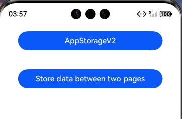
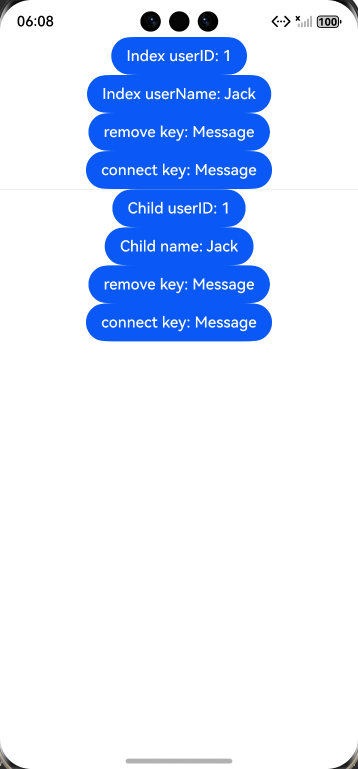

# AppStorageV2: 应用全局UI状态存储

### 介绍

本示例通过使用[ArkUI指南文档](https://gitcode.com/openharmony/docs/tree/master/zh-cn/application-dev/ui)中各场景的开发示例，展示在工程中，帮助开发者更好地理解ArkUI提供的组件及组件属性并合理使用。该工程中展示的代码详细描述可查如下链接：

1. [AppStorageV2: 应用全局UI状态存储](https://gitcode.com/openharmony/docs/blob/master/zh-cn/application-dev/ui/state-management/arkts-new-appstoragev2.md)指南文档中示例代码片段的工程化，主要目标是实现指南中示例代码需要与sample工程文件同源。
   
### 效果预览
| AppStorageV2应用按钮                           | 使用AppStorageV2                               | 在两个页面之间存储数据                                  |
|-----------------------------------------------|----------------------------------------------|----------------------------------------------|
||  |  |

使用说明
1. 点击AppStorageV2，查看存储全局UI状态状态变量。

### 工程目录
```
/src
├── /main
│   ├── /ets
│   │   ├── /entryability
│   │   ├── /pages                       //通过状态管理V2版本实现ViewModel
│   │   │   ├── AppStorageV2.ets         //使用AppStorageV2
│   │   │   ├── PageOne.ets              //在PageOne和PageTwo两个页面之间存储数据Sample
│   │   │   ├── PageTwo.ets 
│   │   │   ├── Sample.ets               //Sample数据页面               
│   │   │   └── Index.ets                //重构后的主页面
│   │   ├── /settingability
│   └── /resources
│       ├── ...
├─── ... 
```

### 具体实现

一、AppStorageV2: 应用全局UI状态存储
1. 使用AppStorageV2，AppStorageV2使用connect接口即可实现对AppStorageV2中数据的修改和同步，如果修改的数据被@Trace装饰，该数据的修改会同步更新UI。
2. 在两个页面之间存储数据，先定义Sample数据页面，然后在Page1和Page2之间实现数据存储。

### 相关权限
不涉及。

### 依赖
不涉及。

### 约束与限制

1. 本示例仅支持标准系统上运行, 支持设备：华为手机。

2. HarmonyOS系统：HarmonyOS 5.0.5 Release及以上。

3. DevEco Studio版本：6.0.0 Release及以上。

4. HarmonyOS SDK版本：HarmonyOS 6.0.0 Release SDK及以上。

### 下载
如需单独下载本工程，执行如下命令：
```
git init
git config core.sparsecheckout true
echo ArkUISample/AppStorageV2 > .git/info/sparse-checkout
git remote add origin https://gitcode.com/harmonyos_samples/guide-snippets.git
git pull origin master
```