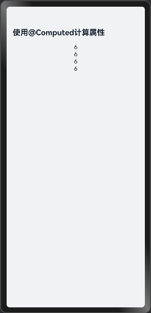

# @Computed装饰器：计算属性

### 介绍

本示例通过使用[ArkUI指南文档](https://gitcode.com/openharmony/docs/tree/master/zh-cn/application-dev/ui)中各场景的开发示例，展示在工程中，帮助开发者更好地理解ArkUI提供的组件及组件属性并合理使用。该工程中展示的代码详细描述可查如下链接：

1. [@Computed装饰器：计算属性](https://gitcode.com/openharmony/docs/blob/master/zh-cn/application-dev/ui/state-management/arkts-new-computed.md)

### 效果预览


| CustomComponentUse页面  | ObservedV2ClassUser界面    | ComputingPropertyResolution界面 | ComputedInitParam界面 | ComputedProperty界面         |
|-------------------------|-----------------------------|-----------------------------|-----------------------------|-----------------------------|
|  |  |  |  |  |


### 使用说明

执行测试用例会先打开相应界面，然后会将界面上的按钮点击一遍，演示初始化同步数据源。

### 工程目录
```
entry/src/
├── main
│   ├── ets
│   │   ├── entryability
│   │   ├── entrybackupability
│   │   └── pages
│   │       ├── Index.ets
│   │       └── ComputedInitParam.ets
│   │       └── ComputedProperty.ets
│   │       └── ComputingPropertyResolution.ets
│   │       └── CustomComponentUse.ets
│   │       └── ObservedV2ClassUser.ets
│   ├── module.json5
│   └── resources
└── ohosTest
    └── ets
        └── test
            ├── Ability.test.ets
            └── index.test.ets
            └── List.test.ets

```

### 具体实现

1. @ComponentV2中@Computed装饰getter方法，避免UI重复计算，依赖状态变化仅重算一次；

2. @ObservedV2类中@Computed依赖@Trace变量，异步初始化，依赖变化自动重算；

3. @Computed计算结果可初始化子组件@Param，依赖变化时自动同步

### 相关权限

不涉及。

### 依赖

不涉及。

### 约束与限制

1. 本示例仅支持标准系统上运行, 支持设备：华为手机。

2. HarmonyOS系统：HarmonyOS 5.0.5 Release及以上。

3. DevEco Studio版本：6.0.0 Release及以上。

4. HarmonyOS SDK版本：HarmonyOS 6.0.0 Release SDK及以上。

### 下载

如需单独下载本工程，执行如下命令：

```
git init
git config core.sparsecheckout true
echo ArkUISample/ArktsNewComputed/ > .git/info/sparse-checkout
git remote add origin https://gitcode.com/harmonyos_samples/guide-snippets.git
git pull origin master
```