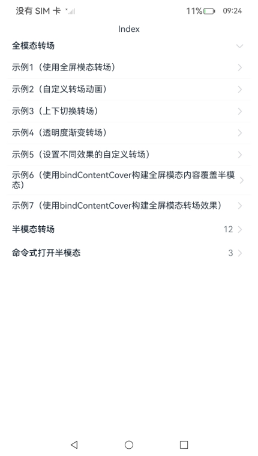

# ArkUI使用模态组件指南文档示例

### 介绍

本示例通过使用[ArkUI指南文档](https://gitcode.com/openharmony/docs/tree/master/zh-cn/application-dev/ui)中各场景的开发示例，展示在工程中，帮助开发者更好地理解ArkUI提供的组件及组件属性并合理使用。该工程中展示的代码详细描述可查如下链接：

1. [全模态转场](https://gitcode.com/openharmony/docs/blob/master/zh-cn/application-dev/reference/apis-arkui/arkui-ts/ts-universal-attributes-modal-transition.md)。
2. [半模态转场](https://gitcode.com/openharmony/docs/blob/master/zh-cn/application-dev/reference/apis-arkui/arkui-ts/ts-universal-attributes-sheet-transition.md)。
3. [命令式打开半模态](https://gitcode.com/openharmony/docs/blob/master/zh-cn/application-dev/reference/apis-arkui/js-apis-arkui-UIContext.md#openbindsheet12)。
4. [模态转场](https://gitcode.com/openharmony/docs/blob/master/zh-cn/application-dev/ui/arkts-modal-transition.md)。
5. [绑定全模态页面](https://gitcode.com/openharmony/docs/blob/master/zh-cn/application-dev/ui/arkts-contentcover-page.md)。

### 效果预览

| 首页                                 |
|------------------------------------|
|  |

### 使用说明

1. 在主界面，可以点击对应卡片，选择需要参考的组件示例。

2. 在组件目录选择详细的示例参考。

3. 进入示例界面，查看参考示例。

4. 通过自动测试框架可进行测试及维护。

### 工程目录
```
entry/src/main/ets/
|---entryability
|---pages
|   |---bindContentCover                       // 全模态转场 
|   |   |---template1
|   |   |   |---ModalTransitionExample.ets
|   |   |---template2
|   |   |   |---ModalTransitionExample2.ets
|   |   |---template3
|   |   |   |---ModalTransitionExample3.ets
|   |   |---template4
|   |   |   |---ModalTransitionExample4.ets
|   |   |---template5
|   |   |   |---ModalTransitionExample5.ets
|   |   |---template6
|   |   |   |---BindContentCoverDemo.ets
|   |   |---template7
|   |   |   |---BindContentCoverDemo.ets
|   |---bindSheet                      // 半模态转场
|   |   |---template1
|   |   |   |---SheetTransitionExample1.ets
|   |   |---template2
|   |   |   |---SheetTransitionExample2.ets
|   |   |---template3
|   |   |   |---SheetTransitionExample3.ets
|   |   |---template4
|   |   |   |---bindSheetExample4.ets
|   |   |---template5
|   |   |   |---bindSheetExample5.ets
|   |   |---template6
|   |   |   |---ListenKeyboardHeightChange.ets
|   |   |---template7
|   |   |   |---SheetTransitionExample7.ets
|   |   |---template8
|   |   |   |---SheetSideExample8.ets
|   |   |---template9
|   |   |   |---BindSheetDemo9.ets
|   |   |---template10
|   |   |   |---SheetDemo.ets
|   |   |---template11
|   |   |   |---OnWillDismiss_Dismiss.ets
|   |   |---template12
|   |   |   |---SheetTransitionExample.ets
|   |---bindSheetCmd                             // 命令式打开半模态
|   |   |---template1
|   |   |   |---UIContextBindSheet.ets
|   |   |---template2
|   |   |   |---UIContextBindSheet.ets
|   |   |---template3
|   |   |   |---UIContextBindSheet.ets
|---pages
|   |---Index.ets                       // 应用主页面
entry/src/ohosTest/
|---ets
|   |---test
|   |   |---BindContentCover.test.ets                      // 全模态转场示例代码测试代码
|   |   |---BindSheet.test.ets                     // 半模态转场示例代码测试代码
|   |   |---OpenSheet.test.ets                            // 命令式打开半模态示例代码测试代码

```

### 具体实现

1. 绑定半模态页面：

    * 基础半模态页面（带生命周期监听）。源码参考[SheetDemo.ets](https://gitcode.com/openharmony/applications_app_samples/blob/master/code/DocsSample/ArkUISample/BindSheet/entry/src/main/ets/pages/bindSheet/template10/SheetDemo.ets)

    * 嵌套滚动 + 二次确认关闭（防误关）。源码参考[OnWillDismiss_Dismiss.ets](https://gitcode.com/openharmony/applications_app_samples/blob/master/code/DocsSample/ArkUISample/BindSheet/entry/src/main/ets/pages/bindSheet/template11/OnWillDismiss_Dismiss.ets)

    * 避让中轴。源码参考[SheetTransitionExample.ets](https://gitcode.com/openharmony/applications_app_samples/blob/master/code/DocsSample/ArkUISample/BindSheet/entry/src/main/ets/pages/bindSheet/template12/SheetTransitionExample.ets)


### 相关权限

不涉及。

### 依赖

不涉及。

### 约束与限制

1. 本示例仅支持标准系统上运行, 支持设备：华为手机。

2. HarmonyOS系统：HarmonyOS 5.0.5 Release及以上。

3. DevEco Studio版本：6.0.0 Release及以上。

4. HarmonyOS SDK版本：HarmonyOS 6.0.0 Release SDK及以上。

### 下载

如需单独下载本工程，执行如下命令：

````
git init
git config core.sparsecheckout true
echo code/DocsSample/ArkUIDocSample/BindSheet > .git/info/sparse-checkout
git remote add origin https://gitcode.com/harmonyos_samples/guide-snippets.git
git pull origin master
````