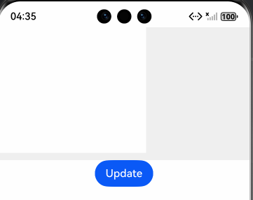
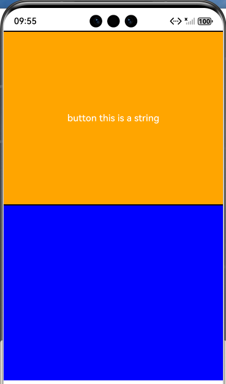
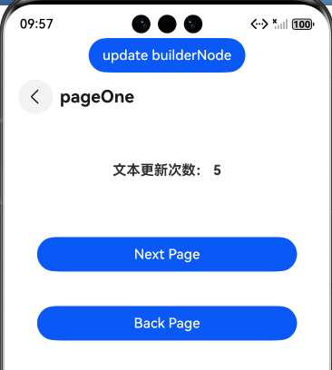

# ArkUI使用滚动类指南文档示例

### 介绍

本示例通过使用[ArkUI指南文档](https://gitcode.com/openharmony/docs/tree/master/zh-cn/application-dev/ui)中各场景的开发示例，展示在工程中，帮助开发者更好地理解ArkUI提供的组件及组件属性并合理使用。该工程中展示的代码详细描述可查如下链接：

1. [自定义声明式节点 (BuilderNode)](https://gitcode.com/openharmony/docs/blob/master/zh-cn/application-dev/ui/arkts-user-defined-arktsNode-builderNode.md)。

### 效果预览

| EnvironmentCallbackPage   | postTouchEvent            | inheritFreezeOptionsPage                 |
|---------------------------|---------------------------|---------------------------|
|  |  |  |

### 使用说明

1. 通过运行EnvironmentCallbackPage.test.ets测试用例，页面当中的留白区域变宽。
2. 通过运行postTouchEvent.test.ets测试用例，使页面从Index页面跳到postTouchEvent页面，页面的下区域颜色由粉色变为蓝色。
3. 通过运行inheritFreezeOptionsPage.test.ets测试用例，使页面从Index页面跳到inheritFreezeOptionsPage页面，各页面能正常跳转且文本更新次数后面的数字随着按钮的点击大小逐步增加。

### 工程目录
```
entry/src/main/ets/
|---Common
|   |---CommonIndex.ets                                   // 创建NodeController
|---entryability
|---pages
|   |---ArkWebPage.ets                             //BuilderNode结合ArkWeb组件实现预渲染页面  
|   |---BuilderProxyNode01.ets                            //BuilderProxyNode导致树结构发生变化 
|   |---BuilderProxyNode02.ets                                 //修复BuilderProxyNode导致树结构发生变化  
|   |---BuilderProxyNode03.ets                                 //修复BuilderProxyNode导致树结构发生变化  
|   |---EnvironmentCallbackPage.ets                                 //通过系统环境变化更新节点
|   |---FrameNode.ets                               //创建组件树
|   |---index.ets                                   //主页面
|   |---InheritFreezeOptionsPage.ets                                 //设置BuilderNode继承冻结能力
|   |---inheritFreezeRouterPage1.ets 
|   |---inheritFreezeRouterPage2.ets                                     
|   |---IsDisposedPage.ets                             //查询当前BuilderNode是否解除引用 
|   |---LocalStoragePage.ets                             //BuilderNode中使用LocalStorage  
|   |---NavigationPage.ets                            
|   |---PostTouchEvent.ets                            //注入触摸事件 
|   |---RenderNode.ets                                 //BuilderNode与RenderNode结合使用  
|   |---RepeatPage.ets          
|   |---RepeatTabPage.ets                               
|   |---ReusablePage01.ets                                 //调用reuse和recycle接口实现节点复用能力
|   |---ReusablePage02.ets                               //使用@Reusable装饰器
|   |---RouterPage1.ets                                 //跨页面复用
|   |---RouterPage2.ets                             //跨页面复用 
|   |---RouterPage3.ets                             //跨页面复用 
|   |---TabContentPage.ets                          
|   |---WrappedBuilder.ets                           //更新组件树 
entry/src/ohosTest/
|---ets
|   |---ArkWebPage.test.ets                             // 页面对应测试代码  
|   |---BuilderProxyNode01.test.ets                       // 页面对应测试代码 
|   |---BuilderProxyNode02.test.ets                        // 页面对应测试代码  
|   |---EnvironmentCallbackPage.test.ets                        // 页面对应测试代码
|   |---FrameNode.test.ets                               // 页面对应测试代码
|   |---InheritFreezeOptionsPage.test.ets                         // 页面对应测试代码
|   |---inheritFreezeRouterPage.test.ets                         // 页面对应测试代码
|   |---IsDisposedPage.test.ets                             // 页面对应测试代码 
|   |---LocalStoragePage.test.ets                             // 页面对应测试代码  
|   |---NavigationPage.test.ets                             // 页面对应测试代码  
|   |---PostTouchEvent.test.ets                            // 页面对应测试代码 
|   |---RenderNode.test.ets                                 // 页面对应测试代码 
|   |---RepeatPage.test.ets                                 // 页面对应测试代码 
|   |---RepeatTabPage.test.ets                                 // 页面对应测试代码 
|   |---ReusablePage01.test.ets                                 // 页面对应测试代码
|   |---ReusablePage02.test.ets                               // 页面对应测试代码
|   |---RouterPage.test.ets                                 // 页面对应测试代码
|   |---TabContentPage.test.ets                                 // 页面对应测试代码
|   |---WrappedBuilder.test.ets                           // 页面对应测试代码 
```
### 具体实现

一、BuilderNode与NodeController结合实现组件挂载（基础场景）
1. 定义全局@Builder（如buildText）：封装需渲染的组件树（如Text、Column），支持传入Params参数；
2. 实现NodeController（如TextNodeController）：在makeNode方法中创建BuilderNode实例，调用builderNode.build(wrapBuilder(@Builder), Params)绑定样式与参数，通过getFrameNode()获取根FrameNode并返回；
3. 处理BuilderNode生命周期：可选调用dispose()解除后端实体节点引用，避免内存泄漏。

二、BuilderNode组件更新（支持主动更新与系统环境响应）
1. 主动更新：在NodeController中定义update方法，内部调用builderNode.update(新Params)，触发组件树重新渲染；
2. 系统环境更新：调用builderNode.updateConfiguration()，监听系统配置变化（如主题、屏幕旋转），触发组件全量更新；
3. 状态绑定：@Builder中引用的自定义组件，需通过@Prop/@ObjectLink绑定状态，确保更新时子组件同步刷新。

三、BuilderNode注入触摸事件（postTouchEvent实现事件转发）
1. 定义支持触摸的@Builder（如ButtonBuilder）：在@Builder中封装带TapGesture的组件（如Button），处理触摸反馈；
2. NodeController扩展：在NodeController中定义postTouchEvent方法，内部调用builderNode.postTouchEvent(touchEvent)，转发触摸事件；
3. 事件转发逻辑：接收触摸事件后，通过postTouchEvent注入BuilderNode对应的组件树，返回值标识事件是否被成功识别。

四、BuilderNode结合ArkWeb实现组件预渲染（优化加载效率）
1. 预渲染初始化：在EntryAbility的onWindowStageCreate中，调用createNWeb创建预渲染的BuilderNode，传入UIContext和Web地址，通过WebController调用onActive开启渲染，onFirstMeaningfulPaint后调用onInactive停止预渲染；
2. NodeController管理：myNodeController中通过initWeb方法创建BuilderNode，绑定带ArkWeb的@Builder（webBuilder），makeNode返回预渲染的FrameNode；
3. 预渲染复用：通过Map存储NodeController和WebController，页面调用getNWeb获取预渲染控制器。

### 相关权限

不涉及。

### 依赖

不涉及。

### 约束与限制

1. 本示例仅支持标准系统上运行, 支持设备：华为手机。

2. HarmonyOS系统：HarmonyOS 5.0.5 Release及以上。

3. DevEco Studio版本：6.0.0 Release及以上。

4. HarmonyOS SDK版本：HarmonyOS 6.0.0 Release SDK及以上。

### 下载

如需单独下载本工程，执行如下命令：

````
git init
git config core.sparsecheckout true
echo ArkUISample/BuilderNode > .git/info/sparse-checkout
git remote add origin https://gitcode.com/harmonyos_samples/guide-snippets.git
git pull origin master
````