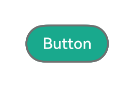
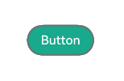
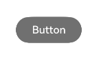

# 属性修改器 (AttributeModifier)指南文档示例

### 介绍

本示例通过使用[ArkUI指南文档](https://gitcode.com/openharmony/docs/blob/master/zh-cn/application-dev/ui/)中各场景的开发示例，展示在工程中，帮助开发者更好地理解ArkUI提供的组件及组件属性并合理使用。该工程中展示的代码详细描述可查如下链接：

1. [属性修改器 (AttributeModifier)](https://gitcode.com/openharmony/docs/blob/master/zh-cn/application-dev/ui/arkts-user-defined-extension-attributeModifier.md)。

### 效果预览

| 按钮1                       | 按钮2                       | 按钮3                       | 按钮4                                 |
|---------------------------|---------------------------|---------------------------|-------------------------------------|
|  |  |  |  |

### 使用说明

1. 通过运行Button1.test.ets测试用例，使页面从Index页面跳到Button1页面，按钮颜色由灰色变成绿色。

2. 通过运行Button2.test.ets测试用例，使页面从Index页面跳到Button2页面，按钮颜色由灰色变成绿色。

3. 通过运行Button3.test.ets测试用例，使页面从Index页面跳到Button3页面，按钮颜色由蓝色变成灰色且按钮宽度变短，之后按钮恢复原样。

4. 通过运行Button4.test.ets测试用例，使页面从Index页面跳到Button4页面，按钮颜色由绿色变成蓝色且边框颜色变成橙色，之后按钮恢复原样。

### 工程目录
```
entry/src/main/ets/
|---Common
|   |---ButtonModifier01.ets                   //定义ButtonModifier
|   |---ButtonModifier02.ets                   //定义ButtonModifier
|   |---ButtonModifier03.ets                   //定义ButtonModifier
|   |---ButtonModifier04.ets                   //定义ButtonModifier
|---entryability
|---pages
|   |---Button1.ets                         // 按钮主题切换与多态样式       
|   |---Button2.ets                         // 按钮主题切换与多态样式  
|   |---Button3.ets                         // 按钮主题切换与多态样式  
|   |---Button4.ets                         // 按钮主题切换与多态样式                     
entry/src/ohosTest/ets
|---test
|   |---Button1.test.ets                       // 对应页面测试代码
|   |---Button2.test.ets                       // 对应页面测试代码
|   |---Button3.test.ets                       // 对应页面测试代码
|   |---Button4.test.ets                       // 对应页面测试代码
```
### 具体实现
一、使用AttributeModifier实现按钮主题切换与多态样式：
1. 定义ButtonThemeModifier类，实现AttributeModifier<ButtonAttribute>接口，声明isDarkTheme成员变量（控制主题），通过构造函数初始化默认主题；
2. 实现applyNormalAttribute方法：根据isDarkTheme值，分别设置深色主题（#333333背景、#FFFFFF字体）和浅色主题（#FFFFFF背景、#333333字体），同时配置圆角、内边距；
3. 实现applyPressedAttribute方法：覆盖正常态样式，深色主题按压时设#111111背景，浅色主题按压时设#F5F5F5背景，优化交互反馈。

二、在页面中调用该接口：
1. 在ThemeButtonDemo.ets中，用@State修饰ButtonThemeModifier实例（初始浅色主题）；
2. Button组件通过.attributeModifier(this.themeModifier)绑定样式；
3. 点击Button时，修改this.themeModifier.isDarkTheme的值，触发UI刷新切换主题；
4. 文本组件显示当前主题状态，辅助用户感知切换效果。

三、使用AttributeModifier实现文本按内容长度动态调整样式：
1. 定义AdaptiveTextModifier类，实现AttributeModifier<TextAttribute>接口，声明content（文本内容）和baseFontSize（基础字体大小）成员变量，构造函数传入初始值；
2. 在applyNormalAttribute方法中，通过this.content.length判断文本长度：
      （1）长度>20：设字体大小baseFontSize-4、#FF4444颜色、maxWidth=200，添加文本溢出省略；
      （2）长度10~20：设默认字体大小、#FF9900颜色、maxWidth=150；
      （3）长度≤10：设字体大小baseFontSize+2、#00C853颜色、加粗样式。

五、使用AttributeModifier实现输入框多状态样式控制：
1. 定义InputStateModifier类，实现AttributeModifier<TextInputAttribute>接口，声明isDisabled（禁用状态）和hasError（错误状态）成员变量；
2. 实现applyNormalAttribute方法：
      （1）若isDisabled为true：设#F5F5F5背景、#DDDDDD边框、#AAAAAA字体，标记禁用态；
      （2）若hasError为true：设#FF4444边框（宽度2）、#FF4444字体，标记错误态；
      （3）正常状态：设#CCCCCC边框（宽度1）、#333333字体，基础样式配置宽高和内边距；
3. 实现applyFocusedAttribute方法：非禁用状态下，设#2196F3边框（宽度2）、#F0F7FF背景，突出聚焦态。

六、使用AttributeModifier实现列表项多态交互样式：
1. 定义ListItemInteractionModifier类，实现AttributeModifier<ListItemAttribute>接口，声明isSelected（选中状态）成员变量；
2. 实现applyNormalAttribute方法：根据isSelected值，设选中态#E3F2FD背景、未选中态#FFFFFF背景，统一配置宽高和内边距；
3. 实现applySelectedAttribute方法：覆盖正常态，设#BBDEFB背景、左侧4px宽#2196F3边框，明确选中标识；
4. 实现applyPressedAttribute方法：覆盖选中/正常态，设#90CAF9背景，增强按压反馈。

### 相关权限

不涉及。

### 依赖

不涉及。

### 约束与限制

1. 本示例仅支持标准系统上运行, 支持设备：华为手机。

2. HarmonyOS系统：HarmonyOS 5.0.5 Release及以上。

3. DevEco Studio版本：6.0.0 Release及以上。

4. HarmonyOS SDK版本：HarmonyOS 6.0.0 Release SDK及以上。

### 下载

如需单独下载本工程，执行如下命令：

````
git init
git config core.sparsecheckout true
echo ArkUISample/ButtonAttribute > .git/info/sparse-checkout
git remote add origin https://gitcode.com/harmonyos_samples/guide-snippets.git
git pull origin master
````