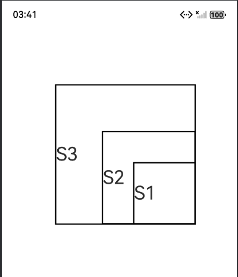

# 自定义组件的自定义布局

### 介绍

本示例展示了在一个Stage模型中，开发基于ArkTS UI的自定义组件的自定义布局，具体可参考[自定义组件的自定义布局](https://gitcode.com/openharmony/docs/blob/master/zh-cn/application-dev/ui/state-management/arkts-page-custom-components-layout.md)。

### 效果预览

|  | 

使用说明

1. 在应用内点击“添加卡片到桌面”按钮，拉起卡片管理页面；

### 工程目录

给出项目中关键的目录结构并描述它们的作用，示例如下：

```
entry/src/main/ets/
|---pages
|   |---Index.ets                          // 主页面

```

### 具体实现

* 第一步：计算各子组件的大小。通过onMeasureSize：组件每次布局时触发，计算子组件的尺寸，其执行时间先于onPlaceChildren；
* 第二步：放置各子组件的位置。通过onPlaceChildren：组件每次布局时触发，设置子组件的起始位置；


### 相关权限

不涉及。

### 依赖

不涉及。

### 约束与限制

1. 本示例仅支持标准系统上运行, 支持设备：华为手机。

2. HarmonyOS系统：HarmonyOS 5.0.5 Release及以上。

3. DevEco Studio版本：6.0.0 Release及以上。

4. HarmonyOS SDK版本：HarmonyOS 6.0.0 Release SDK及以上。

### 下载

如需单独下载本工程，执行如下命令：

```
git init
git config core.sparsecheckout true
echo ArkUISample/ComponentsLayout > .git/info/sparse-checkout
git remote add origin https://gitcode.com/harmonyos_samples/guide-snippets.git
git pull origin master
```