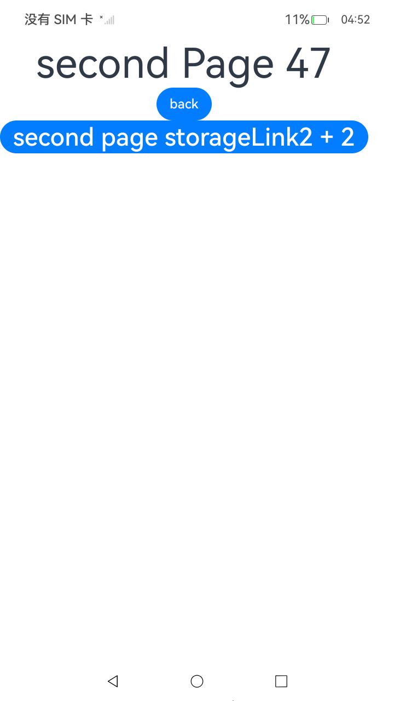
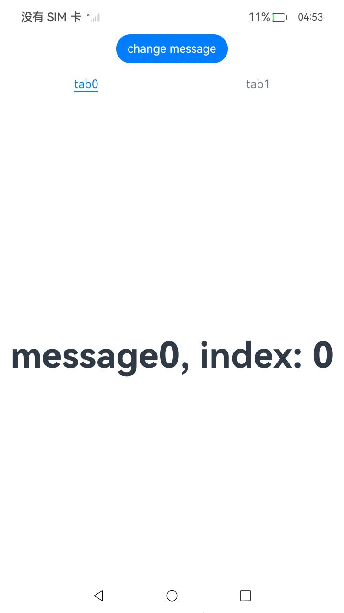
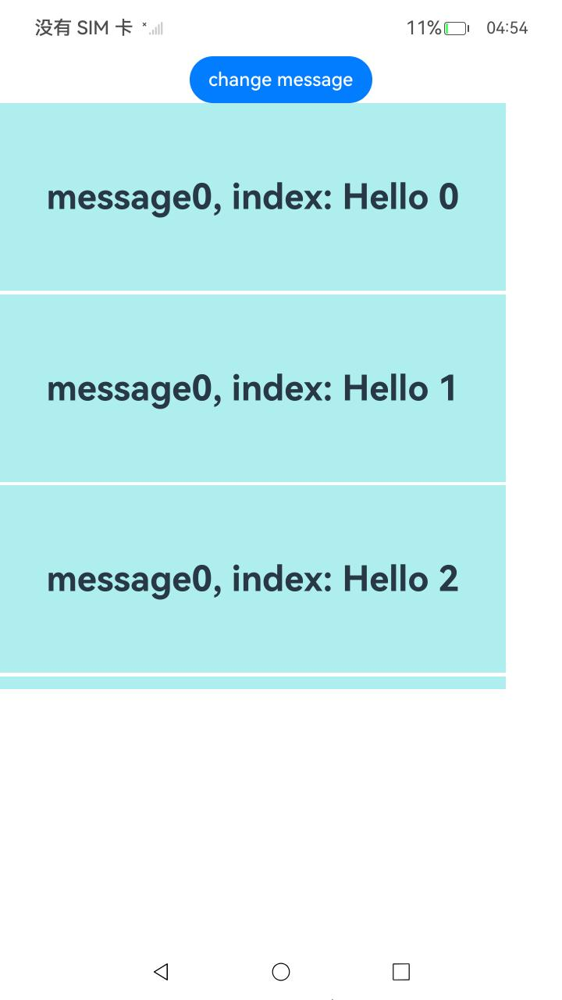
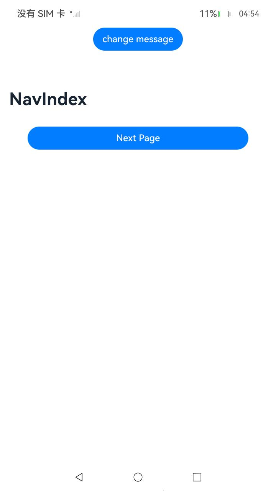
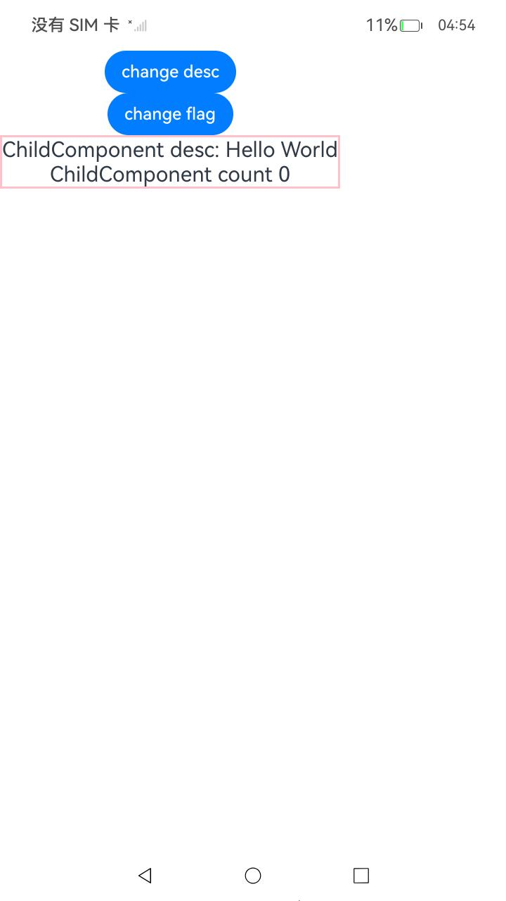
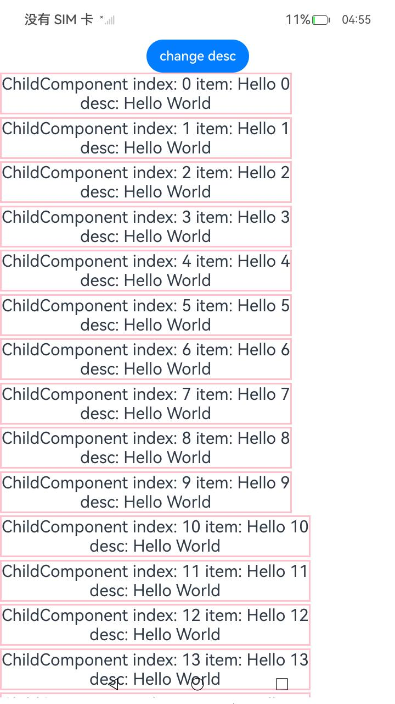
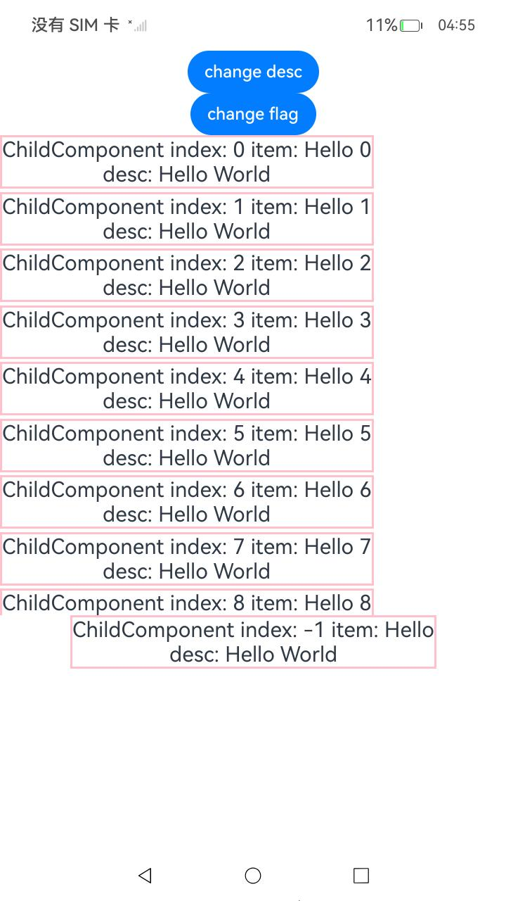
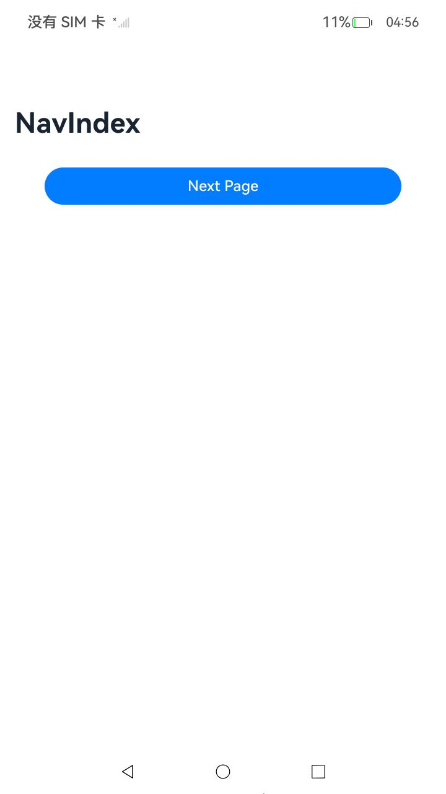

# ArkUI使用自定义组件冻结功能指南文档示例

### 介绍

本示例通过使用[ArkUI指南文档](https://gitcode.com/openharmony/docs/tree/master/zh-cn/application-dev/ui)中各场景的开发示例，展示在工程中，帮助开发者更好地理解ArkUI提供的组件及组件属性并合理使用。该工程中展示的代码详细描述可查如下链接:

1. [自定义组件冻结功能（V1）](https://gitcode.com/openharmony/docs/blob/master/zh-cn/application-dev/ui/state-management/arkts-custom-components-freeze.md)

### 效果预览
| 页面1页面2跳转 | 页面2返回上一页 | TabContent创建 | LazyForEach中缓存的自定义组件进行冻结 | NavigationContentMsgStack会被设置成非激活态 |
|----------------|----------------|----------------|-------------------------------------|-------------------------------------------|
|  |  |  |  |  |

| 组件复用、if和组件冻结混用场景 | LazyForEach、组件复用和组件冻结混用场景 | LazyForEach、if、组件复用和组件冻结混用场景 | Navigation和TabContent的混用 | 页面和LazyForEach |
|----------------|----------------|----------------|----------------|----------------|
|  |  |  |  |  |

### 使用说明

1. 在主界面，可以点击对应按钮，选择需要参考的代码示例

2. 在组件目录选择详细的示例参考

3. 进入示例界面，查看参考示例

4. 通过自动测试框架可进行测试及维护


### 工程目录

```
CustomComponentsFreeze
├─ AppScope
│  ├─ app.json5
│  └─ resources
│     └─ base
│        ├─ element
│        │  └─ string.json
│        └─ media
│           ├─ background.png
│           ├─ foreground.png
│           └─ layered_image.json
├─ code-linter.json5
├─ entry
│  ├─ hvigorfile.ts
│  ├─ obfuscation-rules.txt
│  ├─ oh-package.json5
│  └─ src
│     ├─ main
│     │  ├─ ets
│     │  │  ├─ entryability
│     │  │  │  └─ EntryAbility.ets
│     │  │  ├─ entrybackupability
│     │  │  │  └─ EntryBackupAbility.ets
│     │  │  ├─ model
│     │  │  │  └─ routerModle.ets
│     │  │  ├─ pages
│     │  │  │  └─ Index.ets              // 启动页
│     │  │  └─ View
│     │  │     ├─ ComponentMixing.ets    // Navigation和TabContent的混用   
│     │  │     ├─ ComponentMixing1.ets   // 页面和LazyForEach
│     │  │     ├─ ComponentReuse.ets     // 组件复用、if和组件冻结混用场景
│     │  │     ├─ ComponentReuse1.ets    // LazyForEach、组件复用和组件冻结混用场景  
│     │  │     ├─ ComponentReuse2.ets    // LazyForEach、if、组件复用和组件冻结混用场景
│     │  │     ├─ Constraints.ets        // 限制条件
│     │  │     ├─ LazyforEachTest.ets    // LazyForEach中缓存的自定义组件进行冻结
│     │  │     ├─ MyNavigationTestStack.ets // NavigationContentMsgStack会被设置成非激活态，将不再响应状态变量的变化，也不会触发组件刷新
│     │  │     ├─ Page1.ets             // 页面1页面2跳转
│     │  │     ├─ Page2.ets             // 页面2返回上一页
│     │  │     └─ TabContentTest.ets    // TabContent创建
│     │  ├─ module.json5
│     │  └─ resources
│     │     ├─ base
│     │     │  ├─ element
│     │     │  │  ├─ color.json
│     │     │  │  ├─ float.json
│     │     │  │  └─ string.json
│     │     │  ├─ media
│     │     │  │  ├─ background.png
│     │     │  │  ├─ foreground.png
│     │     │  │  ├─ layered_image.json
│     │     │  │  └─ startIcon.png
│     │     │  └─ profile
│     │     │     ├─ backup_config.json
│     │     │     └─ main_pages.json
│     │     ├─ dark
│     │     │  └─ element
│     │     │     └─ color.json
│     │     └─ rawfile
│     ├─ mock
│     │  └─ mock-config.json5
│     ├─ ohosTest
│     │  ├─ ets
│     │  │  └─ test
│     │  │     ├─ Ability.test.ets
│     │  │     ├─ index.test.ets
│     │  │     └─ List.test.ets
│     │  └─ module.json5
│     └─ test
│        ├─ List.test.ets
│        └─ LocalUnit.test.ets
├─ hvigor
│  └─ hvigor-config.json5
├─ hvigorfile.ts
├─ oh-package-lock.json5
├─ oh-package.json5
├─ ohosTest.md
├─ README_zh.md
└─ screenshots   // 截图
   └─ device
      ├─ image1.jpeg
      ├─ image10.jpeg
      ├─ image11.jpeg
      ├─ image2.jpeg
      ├─ image3.jpeg
      ├─ image4.jpeg
      ├─ image5.jpeg
      ├─ image6.jpeg
      ├─ image7.jpeg
      ├─ image8.jpeg
      └─ image9.jpeg

```

### 具体实现

核心作用:优化复杂UI性能，冻结非激活状态组件的刷新能力
1. 工作机制:
   启用后仅激活状态组件响应状态变化
   非激活组件不触发UI刷新，减少不必要的渲染
   重新激活时自动刷新，确保UI正确性
   启用方式:在@Component装饰器中设置freezeWhenInactive:true
2. 适用场景与激活状态
   主要场景:
   页面路由:仅栈顶页面为激活状态
   TabContent:仅当前显示的Tab为激活状态
   LazyForEach:仅当前显示的列表项为激活状态
   Navigation:仅当前显示的NavDestination为激活状态
   激活状态定义:
   激活:用户可见的组件
   非激活:不可见的缓存组件或后台页面组件
   混用场景:API18+支持父组件激活时仅解冻屏上子组件
3. 关键使用方式
   页面路由场景:在@Entry组件上启用，实现页面切换时的冻结
   TabContent场景:在TabContent内的子组件上启用，实现Tab切换时的冻结
   LazyForEach场景:在列表项组件上启用，减少长列表刷新负担
   组件复用场景:结合@Reusable使用，优化复用池中的组件刷新
4. 限制条件与注意事项
   不支持场景:使用BuilderNode动态挂载的组件无法被冻结
   重要注意:
   激活状态≠可见性，由框架自动管理
   非激活组件的状态变化会在重新激活时一次性刷新
   API11开始支持，API18开始支持混用场景优化
   性能监控:建议使用hiTraceMeter跟踪刷新次数，验证优化效果

### 相关权限

不涉及。

### 依赖

不涉及。

### 约束与限制

1. 本示例仅支持标准系统上运行, 支持设备：华为手机。

2. HarmonyOS系统：HarmonyOS 5.0.5 Release及以上。

3. DevEco Studio版本：6.0.0 Release及以上。

4. HarmonyOS SDK版本：HarmonyOS 6.0.0 Release SDK及以上。

### 下载

如需单独下载本工程，执行如下命令:

````
git init
git config core.sparsecheckout true
echo code/DocsSample/ArkUIDocSample/CustomComponentsFreeze > .git/info/sparse-checkout
git remote add origin https://gitcode.com/harmonyos_samples/guide-snippets.git
git pull origin master
````