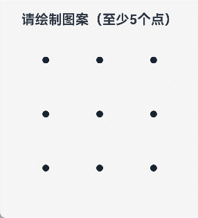

# CustomPatternLock自定义图案密码锁 

### 效果图预览



### 介绍

本示例通过[Canvas](https://gitcode.com/openharmony/docs/blob/master/zh-cn/application-dev/reference/apis-arkui/arkui-ts/ts-components-canvas-canvas.md)组件实现了类似[PatternLock](https://gitcode.com/openharmony/docs/blob/master/zh-cn/application-dev/reference/apis-arkui/arkui-ts/ts-basic-components-patternlock.md) 组件的图案密码锁功能，并在[PatternLock](https://gitcode.com/openharmony/docs/blob/master/zh-cn/application-dev/reference/apis-arkui/arkui-ts/ts-basic-components-patternlock.md)组件基础上进行了功能扩展。

通过[Canvas](https://gitcode.com/openharmony/docs/blob/master/zh-cn/application-dev/reference/apis-arkui/arkui-ts/ts-components-canvas-canvas.md)的绘图能力，实现了九宫格图案密码锁的交互逻辑、视觉反馈和密码验证功能，支持自定义样式、波纹效果、密码验证等特性。

### 使用说明

1. 启动应用后，页面显示基于[Canvas](https://gitcode.com/openharmony/docs/blob/master/zh-cn/application-dev/reference/apis-arkui/arkui-ts/ts-components-canvas-canvas.md)实现的自定义图案密码锁组件。
2. 在[Canvas](https://gitcode.com/openharmony/docs/blob/master/zh-cn/application-dev/reference/apis-arkui/arkui-ts/ts-components-canvas-canvas.md)图案锁密码区域滑动手指，连接至少5个圆点绘制图案。
3. 松开手指后，系统自动验证密码：
   - 密码正确：显示蓝色反馈，提示"密码正确！"
   - 密码错误：显示红色反馈，提示"密码错误！"并显示输入的图案序列
   - 少于5个点：提示"至少需要连接5个点！"
4. 验证完成后，图案锁自动重置，可继续尝试。

**默认密码：** 连接圆点 0 -> 1 → 2 → 5 → 8（圆点编号从左上角开始，从0到8）

### 实现思路

#### 核心技术栈

- **Canvas组件**：使用[Canvas](https://gitcode.com/openharmony/docs/blob/master/zh-cn/application-dev/reference/apis-arkui/arkui-ts/ts-components-canvas-canvas.md)提供的绘图API实现九宫格、圆点、连线等视觉元素的绘制。
- **Drawing库**：使用[`@kit.ArkGraphics2D`](https://gitcode.com/openharmony/docs/blob/master/zh-cn/application-dev/reference/apis-arkgraphics2d/Readme-CN.md)的[drawing](https://gitcode.com/openharmony/docs/blob/master/zh-cn/application-dev/reference/apis-arkgraphics2d/arkts-apis-graphics-drawing.md)模块进行底层图形绘制。
- **触摸事件**：监听[onTouch](https://gitcode.com/openharmony/docs/blob/master/zh-cn/application-dev/reference/apis-arkui/arkui-ts/ts-universal-events-touch.md#ontouch)事件，处理手指滑动轨迹，实时计算触摸点与圆点的距离，判断是否选中。

#### 主要实现功能

本示例实现了以下功能特性，与原生[PatternLock](https://gitcode.com/openharmony/docs/blob/master/zh-cn/application-dev/reference/apis-arkui/arkui-ts/ts-basic-components-patternlock.md)组件对标：

| 功能特性 | 说明 | 实现文件 |
|---------|------|---------|
| 控制器 | 提供CustomPatternLockController控制器，支持外部调用reset()、setChallengeResult()等方法 | CustomPatternLock.ets:53-78 |
| 触摸交互 | 监听触摸事件，实时跟踪手指轨迹 | CustomPatternLock.ets:275-317 |
| 自动连接中间点 | 支持跳过未选中的中间点（skipUnselectedPoint） | CustomPatternLock.ets:350-359 |
| 九宫格绘制 | 绘制3×3九宫格圆点布局 | CustomPatternLock.ets:422-458 |
| 激活圆点背景圆环绘制 | 绘制激活圆点背景圆环 | CustomPatternLock.ets:461-487 |
| 圆点连线 | 绘制已选中圆点之间的连接路径 | CustomPatternLock.ets:490-543 |
| 波纹绘制 | 绘制波纹 | CustomPatternLock.ets:546-587 |
| 激活圆点背景圆环半径动画效果 | 选中圆点时显示背景圆环半径动画 | CustomPatternLock.ets:590-628 |
| 波纹动画效果 | 选中圆点时显示扩散波纹动画 | CustomPatternLock.ets:631-673 |
| 密码正确和密码错误效果绘制 | 绘制密码输入完成后校验结果对应显示效果 | CustomPatternLock.ets:676-686|
| 密码错误动画效果 | 校验结果为错误时显示错误动画 | CustomPatternLock.ets:689-714 |
| 事件回调 | onPatternComplete、onDotConnect事件回调 | CustomPatternLock.ets:717-733 |
| 状态重置 | 重置状态 | CustomPatternLock.ets:738-746 |
| 密码验证 | 提供正确/错误验证结果 | Index.ets:77-98 |

#### 核心类与接口

**CustomPatternLock组件**（entry/src/main/ets/pages/CustomPatternLock.ets）

这是基于[Canvas](https://gitcode.com/openharmony/docs/blob/master/zh-cn/application-dev/reference/apis-arkui/arkui-ts/ts-components-canvas-canvas.md)实现的自定义图案密码锁组件，支持以下属性和方法：

**属性列表：**

| 属性名 | 类型 | 默认值 | 说明 |
|--------|------|--------|------|
| sideLength | number | 288（vp） | 组件宽高 |
| circleRadius | number | 6（vp） | 圆点半径 |
| regularColor | number \| string | '#FF182431' | 未选中圆点颜色 |
| selectedColor | number \| string | '#FF182431' | 已选中圆点颜色 |
| activeColor | number \| string | '#FF182431' | 激活圆点颜色 |
| pathColor | number \| string | '#33182431' | 连接线颜色 |
| pathStrokeWidth | number | 12（vp） | 连接线宽度 |
| autoReset | boolean | true | 是否自动重置 |
| skipUnselectedPoint | boolean | false | 是否跳过未选中的中间点 |
| activateCircleStyle | CustomCircleStyleOptions | { color：'#33182431', radius: 11（vp）, enableWaveEffect: true, enableForeground: false } | 激活圆点背景样式配置 |
| selectedDot | number[] | [] | 初始状态默认被选中圆点 |

**CustomCircleStyleOptions类：**

```typescript
class CustomCircleStyleOptions {
  public color?: number | string;    // 激活圆点背景圆环颜色
  public radius?: number;            // 激活圆点背景圆环半径
  public enableWaveEffect?: boolean; // 是否启用波纹效果
  public enableForeground?: boolean; // 背景圆环是否显示在前景
}
```

**事件回调：**

| 事件名 | 参数 | 说明 |
|--------|------|------|
| onPatternComplete | (input: number[]) => void | 密码输入完成回调，返回被选中圆点的索引数组 |
| onDotConnect | (index: number) => void | 圆点被连接时触发，返回被连接圆点索引 |

**控制器方法：**

| 方法名 | 参数 | 说明 |
|--------|------|------|
| reset() | - | 重置图案锁状态 |
| setChallengeResult() | result: CustomPatternLockChallengeResult | 设置验证结果（CORRECT 或 WRONG） |

#### 技术实现细节

1. **坐标转换**：[Canvas](https://gitcode.com/openharmony/docs/blob/master/zh-cn/application-dev/reference/apis-arkui/arkui-ts/ts-components-canvas-canvas.md)绘图使用像素单位为px，组件属性使用像素单位为vp，可通过[`vp2px`](https://gitcode.com/openharmony/docs/blob/master/zh-cn/application-dev/reference/apis-arkui/arkts-apis-uicontext-uicontext.md#vp2px12)进行转换。

2. **触摸判定**：计算触摸点与圆点中心的距离，当距离小于激活圆点背景圆环半径时判定为选中。

3. **中间点自动连接**：当跨越两个格子连接时，自动计算并连接中间点（可通过skipUnselectedPoint属性禁用）。

4. **背景圆环半径动画**：使用[`setInterval`](https://gitcode.com/openharmony/docs/blob/master/zh-cn/application-dev/reference/common/js-apis-timer.md#setinterval)定时器驱动背景圆环半径动画，背景圆环半径从未选中圆点半径逐渐变为设置的激活圆点背景圆环半径。

5. **波纹动画**：使用[`setInterval`](https://gitcode.com/openharmony/docs/blob/master/zh-cn/application-dev/reference/common/js-apis-timer.md#setinterval)定时器驱动波纹扩散动画，波纹透明度从150逐渐降为0，半径扩散至5倍大小。

6. **密码错误动画**：使用[`setInterval`](https://gitcode.com/openharmony/docs/blob/master/zh-cn/application-dev/reference/common/js-apis-timer.md#setinterval)定时器驱动密码错误动画，激活圆点与圆点连线的透明度从100%逐渐降为50%，在逐渐升为100%，执行该过程两次，实现闪烁效果。

7. **绘制分层**：根据`enableForeground`属性决定激活圆点背景圆环的绘制顺序，支持遮盖或不遮盖宫格圆点。

### 目录结构

```
entry/src/main
├── ets
│   ├── entryability
│   │   └── EntryAbility.ets              // 应用入口
│   ├── entrybackupability
│   │   └── EntryBackupAbility.ets        // 备份能力
│   └── pages
│       ├── Index.ets                      // 主页面，展示对比效果
│       └── CustomPatternLock.ets          // 自定义Canvas图案锁组件
├── resources
│   └── base
│       ├── element
│       ├── media
│       └── profile
└── module.json5                           // 模块配置文件
```

### 相关权限

不涉及。

### 依赖

- @ohos/hypium: 1.0.24（测试框架）
- @ohos/hamock: 1.0.0（Mock 框架）

### 参考资料

- [Canvas组件参考文档](https://gitcode.com/openharmony/docs/blob/master/zh-cn/application-dev/reference/apis-arkui/arkui-ts/ts-components-canvas-canvas.md)
- [PatternLock组件参考文档](https://gitcode.com/openharmony/docs/blob/master/zh-cn/application-dev/reference/apis-arkui/arkui-ts/ts-basic-components-patternlock.md)

### 约束与限制

1. 本示例仅支持标准系统上运行，支持设备：华为手机。

2. HarmonyOS系统：HarmonyOS 6.0.0 Release及以上。

3. DevEco Studio版本：6.0.0 Release及以上。

4. HarmonyOS SDK版本：HarmonyOS 6.0.0 Release SDK及以上。

### 下载

如需单独下载本工程，执行如下命令：

```bash
git init
git config core.sparsecheckout true
echo ArkUISample/CustomPatternLock > .git/info/sparse-checkout
git remote add origin https://gitcode.com/harmonyos_samples/guide-snippets.git
git pull origin master
```