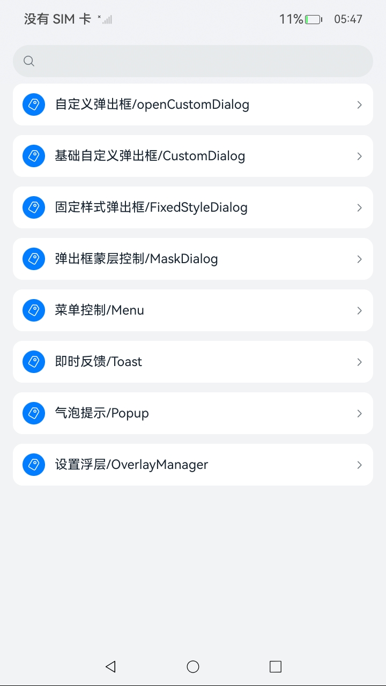
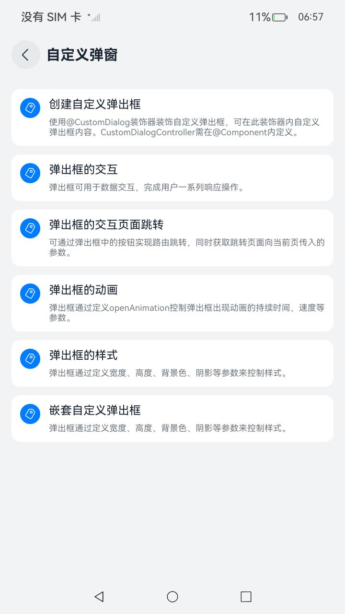
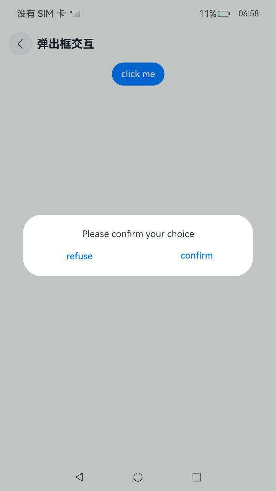
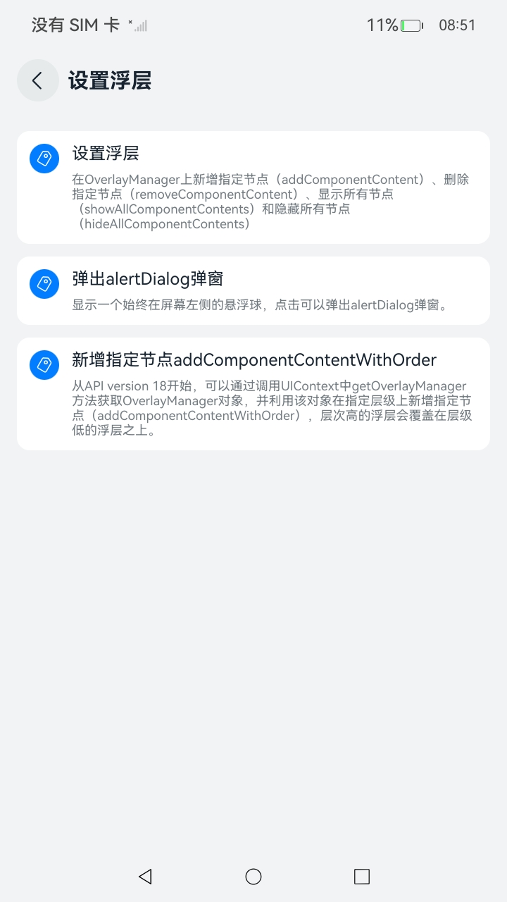

# ArkUI使用弹窗指南文档示例

### 介绍

本示例通过使用[ArkUI指南文档](https://gitCode.com/openharmony/docs/tree/master/zh-cn/application-dev/ui)中各场景的开发示例，展示在工程中，帮助开发者更好地理解ArkUI提供的组件及组件属性并合理使用。该工程中展示的代码详细描述可查如下链接：

1. [不依赖UI组件的全局自定义弹出框 (openCustomDialog)](https://gitcode.com/openharmony/docs/blob/master/zh-cn/application-dev/ui/arkts-uicontext-custom-dialog.md)。
2. [基础自定义弹出框 (CustomDialog)](https://gitcode.com/openharmony/docs/blob/master/zh-cn/application-dev/ui/arkts-common-components-custom-dialog.md)。
3. [固定样式弹出框](https://gitcode.com/openharmony/docs/blob/master/zh-cn/application-dev/ui/arkts-fixes-style-dialog.md)。
4. [菜单控制（Menu)](https://gitcode.com/openharmony/docs/blob/master/zh-cn/application-dev/ui/arkts-popup-and-menu-components-menu.md)。
5. [气泡提示 (Popup)](https://gitcode.com/openharmony/docs/blob/master/zh-cn/application-dev/ui/arkts-popup-and-menu-components-popup.md)。
6. [即时反馈 (Toast)](https://gitcode.com/openharmony/docs/blob/master/zh-cn/application-dev/ui/arkts-create-toast.md)。
7. [设置浮层 (OverlayManager)](https://gitcode.com/openharmony/docs/blob/master/zh-cn/application-dev/ui/arkts-create-overlaymanager.md)。
8. [弹出框蒙层控制](https://gitcode.com/openharmony/docs/blob/master/zh-cn/application-dev/ui/arkts-dialog-mask.md)。
9. [页面级弹出框](https://gitcode.com/openharmony/docs/blob/master/zh-cn/application-dev/ui/arkts-embedded-dialog.md)。
10. [弹出框层级管理](https://gitcode.com/openharmony/docs/blob/master/zh-cn/application-dev/ui/arkts-dialog-levelorder.md)。
11. [弹出框控制器](https://gitcode.com/openharmony/docs/blob/master/zh-cn/application-dev/ui/arkts-dialog-controller.md)。
12. [不依赖UI组件的全局菜单 (openMenu)](https://gitcode.com/openharmony/docs/blob/master/zh-cn/application-dev/ui/arkts-popup-and-menu-components-uicontext-menu.md)。
13. [弹出框焦点策略](https://gitcode.com/openharmony/docs/blob/master/zh-cn/application-dev/ui/arkts-dialog-focusable.md)。
14. [不依赖UI组件的全局气泡提示 (openPopup)](https://gitcode.com/openharmony/docs/blob/master/zh-cn/application-dev/ui/arkts-popup-and-menu-components-uicontext-popup.md)。

### 效果预览

| 首页                                | 弹窗类组件目录                        | 自定义弹窗示例                       |         设置浮层                           |
|------------------------------------|------------------------------------|------------------------------------|------------------------------------|
|  |  |  |  |

### 使用说明

1. 在主界面，可以点击对应卡片，选择需要参考的组件示例。

2. 在组件目录选择详细的示例参考。

3. 进入示例界面，查看参考示例。

4. 通过自动测试框架可进行测试及维护。

### 工程目录
```
entry/src/main/ets/
|---entryability
|---pages
|   |---customdialog                          //自定义弹出框     
|   |       |---CreateCustomDialog.ets
|   |       |---CreateCustomDialogNew.ets
|   |       |---DialogAnimation.ets
|   |       |---DialogAnimationNew.ets
|   |       |---DialogAvoidSoftKeyboard.ets
|   |       |---DialogInteraction.ets
|   |       |---DialogInteraction1.ets
|   |       |---DialogInteractionUseConstructor.ets
|   |       |---DialogInteractionUseButton.ets
|   |       |---DialogStyle.ets
|   |       |---DialogStyleNew.ets
|   |       |---DialogWithPhysicalBack.ets
|   |       |---GetDialogStatus.ets
|   |       |---Index.ets
|   |       |---IndexNew.ets
|   |       |---NestDialog.ets
|   |       |---NestDialogNew.ets
│   │       |---dialogboxfocuspolicy
│   │       |      |--- DialogFocusStrategy.ets
│   │       |---dialogboxlayermanagement
│   │       │      |--- DialogBoxLayer.ets
│   │       |---dialogcontroller
│   │       │      |--- DialogController.ets
│   │       |---pageleveldialogbox
│   │       │      |--- Next.ets
│   │       │      |--- PageLevelDialogBox.ets
|   |---fixedstyledialog                      //固定样式弹出框
|   |       |---ActionSheet.ets
|   |       |---AlertDialog.ets
|   |       |---CalendarPickerDialog.ets
|   |       |---DatePickerDialog.ets
|   |       |---DatePickerCustomDialog.ets
|   |       |---Index.ets
|   |       |---ShowActionMenu.ets
|   |       |---ShowDialog.ets
|   |       |---TextPickerDialog.ets
|   |       |---TimePickerDialog.ets
|   |---maskdialog                             //弹出框蒙层控制
|   |       |---CustomDialogAnimation.ets
|   |       |---CustomDialogControl.ets
|   |       |---Index.ets
|   |---Menu                                  //菜单
|   |       |---BindComponentMenu.ets         //基于绑定组件指定位置弹出菜单
|   |       |---BuilderCustomMenu.ets         //使用@Builder自定义菜单内容
|   |       |---CreateDefaultMenu.ets         //创建默认样式的菜单
|   |       |---CreateMenu.ets
|   |       |---EventTransSubWindowMenu.ets   //控制子窗菜单的事件透传
|   |       |---Index.ets
|   |       |---PopVibrateMenu.ets            //菜单弹出时振动效果
|   |       |---SupportAvoidCentralAxisMenu.ets   //菜单支持避让中轴
|   |       |---globalmenusindependentofuicomponents
|   |              |---GlobalOpenMenu.ets
|   |---opencustomdialog                      //不依赖UI组件的全局自定义弹出框
|   |       |---Index.ets
|   |       |---openCustomDialog.ets
|   |       |---CustomDialogComponentWithTransition.ets
|   |       |---CustomDialogWithKeyboardAvoidDistance.ets
|   |       |---OpenDialogAndUpdate.ets
|   |---OverlayManager                        //设置浮层
|   |       |---Index.ets
|   |       |---OverlayManagerAlertDialog.ets
|   |       |---OverlayManagerComponent.ets
|   |       |---OverlayManagerWithOrder.ets
|   |---popup                                 //气泡提示
|   |       |---ButtonPopup.ets
|   |       |---CustomPopup.ets
|   |       |---Index.ets
|   |       |---PopupAnimation.ets
|   |       |---PopupAvoidSoftKeyboard.ets    //气泡避让软键盘示例
|   |       |---PopupPolymorphicEffect.ets    //设置气泡内的多态效果示例
|   |       |---PopupStateChange.ets
|   |       |---PopupStyle.ets
|   |       |---PopupSupportedAvoidAxis.ets   //气泡支持避让中轴示例
|   |       |---TextPrompts.ets
|   |---Toast                                 //即使反馈
|   |       |---CreateToast.ets
|   |       |---DefaultAndTopToast.ets
|   |       |---Index.ets
|   |       |---OpenCloseToast.ets                           
|---pages
|   |---Index.ets                       // 应用主页面
|   |---Index2.ets                      // 弹窗跳转页面
|   |---Second.ets                      // 返回跳转页面
entry/src/ohosTest/
|---ets
|   |---index.test.ets                       // 示例代码测试代码
```
## 具体实现

1. 不依赖UI组件的全局自定义弹出框 (openCustomDialog)

    * 推荐使用UIContext中获取到的PromptAction对象提供的openCustomDialog接口在相对应用复杂的场景来实现自定义弹出框，相较于CustomDialogController优势点在于页面解耦，支持动态刷新。

    * 弹出框（openCustomDialog）默认为模态弹窗且有蒙层，不可与蒙层下方控件进行交互（不支持点击和手势等向下透传）。

    * 可以通过配置promptAction.BaseDialogOptions类型中的isModal属性来实现模态和非模态弹窗，详细说明可参考[弹窗的种类](https://gitcode.com/openharmony/docs/blob/master/zh-cn/application-dev/ui/arkts-dialog-overview.md#弹窗的种类)。

    * 当isModal为true时，弹出框为模态弹窗，且弹窗周围的蒙层区不支持透传。isModal为false时，弹出框为非模态弹窗，且弹窗周围的蒙层区可以透传。因此如果需要同时允许弹出框的交互和弹出框外页面的交互行为，需要将弹出框设置为非模态。

2. 基础自定义弹出框 (CustomDialog)

    * CustomDialog是自定义弹出框，可用于广告、中奖、警告、软件更新等与用户交互响应操作。

    * 开发者可以通过CustomDialogController类显示自定义弹出框。具体用法请参考[自定义弹出框](https://gitcode.com/openharmony/docs/blob/master/zh-cn/application-dev/reference/apis-arkui/arkui-ts/ts-methods-custom-dialog-box.md)。

    * 默认为模态弹窗且有蒙层，不可与蒙层下方控件进行交互（不支持点击和手势等向下透传）。

    * 可以通过配置CustomDialogControllerOptions中的isModal属性来实现模态和非模态弹窗，详细说明可参考[弹窗的种类](https://gitcode.com/openharmony/docs/blob/master/zh-cn/application-dev/ui/arkts-dialog-overview.md#弹窗的种类)。

3. 固定样式弹出框

    * 操作菜单通过UIContext中的getPromptAction方法获取到PromptAction对象，再通过该对象调用showActionMenu接口实现，支持在回调或开发者自定义类中使用。代码参考[ShowActionMenu.ets](https://gitcode.com/openharmony/applications_app_samples/blob/master/code/DocsSample/ArkUISample/DialogProject/entry/src/main/ets/pages/fixedstyledialog/ShowActionMenu.ets)。

    * 对话框通过UIContext中的getPromptAction方法获取到PromptAction对象，再通过该对象调用showDialog接口实现，支持在回调或开发者自定义类中使用。代码参考[ShowDialog.ets](https://gitcode.com/openharmony/applications_app_samples/blob/master/code/DocsSample/ArkUISample/DialogProject/entry/src/main/ets/pages/fixedstyledialog/ShowDialog.ets)。

    * 日历选择器弹窗提供日历视图，包含年、月和星期信息，通过CalendarPickerDialog接口实现。开发者可调用show函数，定义并弹出日历选择器弹窗。代码参考[CalendarPickerDialog.ets](https://gitcode.com/openharmony/applications_app_samples/blob/master/code/DocsSample/ArkUISample/DialogProject/entry/src/main/ets/pages/fixedstyledialog/CalendarPickerDialog.ets)。

    * 日期滑动选择器弹窗通过UIContext中的showDatePickerDialog接口实现。代码参考[DatePickerDialog.ets](https://gitcode.com/openharmony/applications_app_samples/blob/master/code/DocsSample/ArkUISample/DialogProject/entry/src/main/ets/pages/fixedstyledialog/DatePickerDialog.ets)。

    * 时间滑动选择器弹窗通过UIContext中的showTimePickerDialog接口实现。代码参考[TimePickerDialog.ets](https://gitcode.com/openharmony/applications_app_samples/blob/master/code/DocsSample/ArkUISample/DialogProject/entry/src/main/ets/pages/fixedstyledialog/TimePickerDialog.ets)。

    * 文本滑动选择器弹窗通过UIContext中的showTextPickerDialog接口实现。代码参考[TextPickerCNDialog.ets](https://gitcode.com/openharmony/applications_app_samples/blob/master/code/DocsSample/ArkUISample/DialogProject/entry/src/main/ets/pages/fixedstyledialog/TextPickerCNDialog.ets)。

    * 列表选择器弹窗通过UIContext中的showActionSheet接口实现。代码参考[ActionSheet.ets](https://gitcode.com/openharmony/applications_app_samples/blob/master/code/DocsSample/ArkUISample/DialogProject/entry/src/main/ets/pages/fixedstyledialog/ActionSheet.ets)。

    * 警告弹窗通过UIContext中的showAlertDialog接口实现。代码参考[AlertDialog.ets](https://gitcode.com/openharmony/applications_app_samples/blob/master/code/DocsSample/ArkUISample/DialogProject/entry/src/main/ets/pages/fixedstyledialog/AlertDialog.ets)。

4. 菜单控制（Menu）

    * Menu是菜单接口，一般用于鼠标右键弹窗、点击弹窗等。具体用法请参考[菜单控制](https://gitcode.com/openharmony/docs/blob/master/zh-cn/application-dev/reference/apis-arkui/arkui-ts/ts-universal-attributes-menu.md)。

    * 使用bindContextMenu并设置预览图，菜单弹出时有蒙层，此时为模态。

    * 使用bindMenu或bindContextMenu未设置预览图时，菜单弹出无蒙层，此时为非模态。

5. 气泡提示（Popup）

    * 气泡分为两种类型，一种是系统提供的气泡PopupOptions，一种是开发者可以自定义的气泡CustomPopupOptions。其中，PopupOptions通过配置primaryButton和secondaryButton来设置带按钮的气泡；CustomPopupOptions通过配置builder来设置自定义的气泡。其中系统提供的气泡PopupOptions，字体的最大放大倍数为2。

    * 气泡可以通过配置mask来实现模态和非模态窗口，mask为true或者颜色值的时候，气泡为模态窗口，mask为false时，气泡为非模态窗口。

    * 多个气泡同时弹出时，子窗内显示的气泡比主窗内显示的气泡层级高，所处窗口相同时，后面弹出的气泡层级比先弹出的气泡层级高。

6. 即时反馈 (Toast)

    * 创建即时反馈，适用于短时间内提示框自动消失的场景。代码参考[CreateToast.ets](https://gitcode.com/openharmony/applications_app_samples/blob/master/code/DocsSample/ArkUISample/DialogProject/entry/src/main/ets/pages/Toast/CreateToast.ets)。

    * 显示关闭即时反馈，适用于提示框停留时间较长，用户操作可以提前关闭提示框的场景。代码参考[OpenCloseToast.ets](https://gitcode.com/openharmony/applications_app_samples/blob/master/code/DocsSample/ArkUISample/DialogProject/entry/src/main/ets/pages/Toast/OpenCloseToast.ets)。

7. 设置浮层(OverlayManager)：可以通过使用UIContext中的getOverlayManager方法获取当前UI上下文关联的OverlayManager对象，再通过该对象调用对应方法。

    * 在OverlayManager上新增指定节点、删除指定节点、显示所有节点和隐藏所有节点。代码参考[OverlayManagerComponent.ets](https://gitcode.com/openharmony/applications_app_samples/blob/master/code/DocsSample/ArkUISample/DialogProject/entry/src/main/ets/pages/OverlayManager/OverlayManagerComponent.ets)。

    * 显示一个始终在屏幕左侧的悬浮球，点击可以弹出alertDialog弹窗。代码参考[OverlayManagerAlertDialog.ets](https://gitcode.com/openharmony/applications_app_samples/blob/master/code/DocsSample/ArkUISample/DialogProject/entry/src/main/ets/pages/OverlayManager/OverlayManagerAlertDialog.ets)。

    * 调用UIContext中getOverlayManager方法获取OverlayManager对象，并利用该对象在指定层级上新增指定节点（addComponentContentWithOrder），层次高的浮层会覆盖在层级低的浮层之上。代码参考[OverlayManagerWithOrder.ets](https://gitcode.com/openharmony/applications_app_samples/blob/master/code/DocsSample/ArkUISample/DialogProject/entry/src/main/ets/pages/OverlayManager/OverlayManagerWithOrder.ets)。

8. 弹出框蒙层控制（MaskDialog）

    * 开发者对弹出框的定制不仅限于弹出框里的内容，对弹出框蒙层的定制需求也逐渐增加。

    * 本文介绍ArkUI弹出框的蒙层控制，包括点击蒙层时是否消失、蒙层区域、蒙层颜色和蒙层动画等特性。

9. 页面级弹出框

    * 设置页面级弹出框参数。

    * 弹出框在指定页面内弹出。

    * 设置页面级弹出框蒙层样式。代码参考[PageLevelDialogBox.ets](https://gitcode.com/openharmony/applications_app_samples/blob/master/code/DocsSample/ArkUISample/DialogProject/entry/src/main/ets/pages/customdialog/pageleveldialogbox/PageLevelDialogBox.ets)。

10. 弹出框层级管理

    * 初始化一个弹出框内容区，内部包含一个Text组件。

    * 初始化另一个弹出框内容区，内部包含一个点击打开普通弹出框的按钮，点击事件中通过调用UIContext中getPromptAction方法获取PromptAction对象，再通过该对象调用openCustomDialog接口，并且设置层级为0的levelOrder参数来创建普通层级弹出框。

    * 通过调用UIContext中getPromptAction方法获取PromptAction对象，再通过该对象调用openCustomDialog接口，并且设置层级为100000的levelOrder参数来创建最高层级弹出框。代码参考[DialogBoxLayer.ets](https://gitcode.com/openharmony/applications_app_samples/blob/master/code/DocsSample/ArkUISample/DialogProject/entry/src/main/ets/pages/customdialog/dialogboxlayermanagement/DialogBoxLayer.ets)。

11. 弹出框控制器

    * 创建自定义内容为ComponentContent的弹出框控制器。代码参考[DialogController.ets](https://gitcode.com/openharmony/applications_app_samples/blob/master/code/DocsSample/ArkUISample/DialogProject/entry/src/main/ets/pages/customdialog/dialogcontroller/DialogController.ets)。

    * 创建自定义内容为CustomBuilder的弹出框控制器。代码参考[DialogController.ets](https://gitcode.com/openharmony/applications_app_samples/blob/master/code/DocsSample/ArkUISample/DialogProject/entry/src/main/ets/pages/customdialog/dialogcontroller/DialogController.ets)。

    * 创建自定义内容为CustomBuilderWithId的弹出框控制器。代码参考[DialogController.ets](https://gitcode.com/openharmony/applications_app_samples/blob/master/code/DocsSample/ArkUISample/DialogProject/entry/src/main/ets/pages/customdialog/dialogcontroller/DialogController.ets)。

    * 在CustomDialogController内容区直接获取弹出框控制器。代码参考[DialogController.ets](https://gitcode.com/openharmony/applications_app_samples/blob/master/code/DocsSample/ArkUISample/DialogProject/entry/src/main/ets/pages/customdialog/dialogcontroller/DialogController.ets)。

    * 使用控制器获取弹出框的状态。代码参考[DialogController.ets](https://gitcode.com/openharmony/applications_app_samples/blob/master/code/DocsSample/ArkUISample/DialogProject/entry/src/main/ets/pages/customdialog/dialogcontroller/DialogController.ets)。

12. 不依赖UI组件的全局菜单 (openMenu)

    * 通过调用openMenu接口弹出菜单，需要提供用于定义自定义弹出框的内容ComponentContent。

    * 通过调用openMenu接口弹出菜单，需要提供绑定组件的信息TargetInfo。若未传入有效的target，则无法弹出菜单。

    * 通过调用openMenu接口弹出菜单，可以设置MenuOptions中的属性调整菜单样式。title属性不生效。preview参数仅支持设置MenuPreviewMode类型。

13. 弹出框焦点策略

    * openCustomDialog和CustomDialog支持通过focusable参数来管理弹出框是否获取焦点。

14. 不依赖UI组件的全局气泡提示 (openPopup)

    * 通过调用openPopup接口弹出其气泡，需要提供用于定义自定义弹出框的内容ComponentContent。
    
    * 可以设置PopupCommonOptions属性调整气泡样式


### 相关权限
   不涉及。

### 依赖

不涉及。

### 约束与限制

1.本示例仅支持标准系统上运行, 支持设备：华为手机。

2.本示例为Stage模型，支持API22版本SDK，版本号：6.0.0.47，镜像版本号：OpenHarmony_6.0.0 Release。

3.本示例需要使用DevEco Studio 6.0.0 Release (Build Version: 6.0.0.858, built on September 24, 2025)及以上版本才可编译运行。

### 下载

如需单独下载本工程，执行如下命令：

````
git init
git config core.sparsecheckout true
echo ArkUISample/DialogProject > .git/info/sparse-checkout
git remote add origin https://gitcode.com/harmonyos_samples/guide-snippets.git
git pull origin master
````