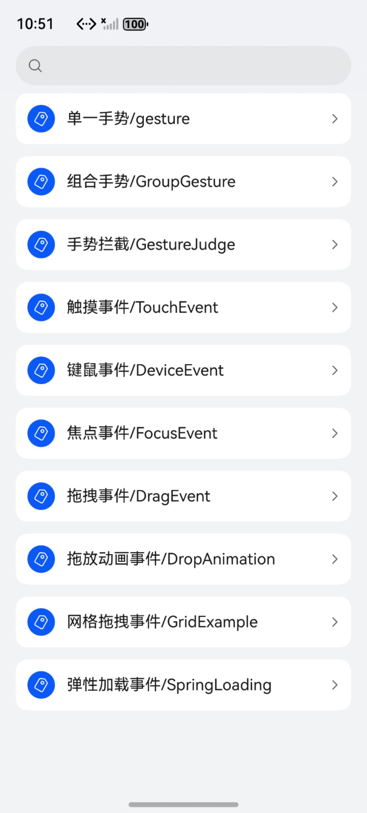
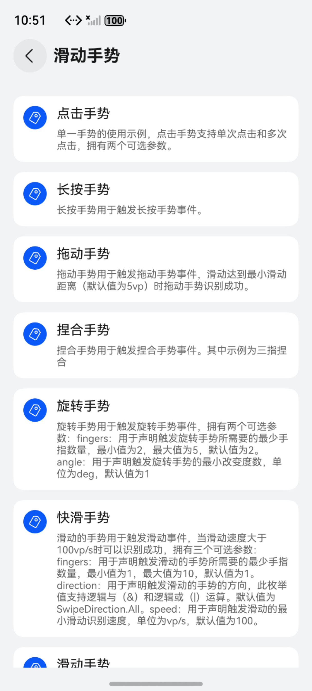
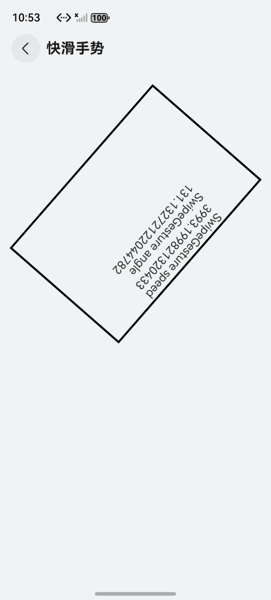

# ArkUI使用支持交互事件指南文档示例

### 介绍

本示例通过使用[ArkUI指南文档](https://gitCode.com/openharmony/docs/tree/master/zh-cn/application-dev/ui)中各场景的开发示例，展示在工程中，帮助开发者更好地理解ArkUI提供的组件及组件属性并合理使用。该工程中展示的代码详细描述可查如下链接：

1. [触屏事件](https://gitcode.com/openharmony/docs/blob/OpenHarmony-5.0.1-Release/zh-cn/application-dev/ui/arkts-common-events-touch-screen-event.md)
2. [键鼠事件](https://gitcode.com/openharmony/docs/blob/OpenHarmony-5.0.1-Release/zh-cn/application-dev/ui/arkts-common-events-device-input-event.md)
3. [支持焦点处理](https://gitcode.com/openharmony/docs/blob/master/zh-cn/application-dev/ui/arkts-common-events-focus-event.md)
4. [支持统一拖拽](https://gitcode.com/openharmony/docs/blob/master/zh-cn/application-dev/ui/arkts-common-events-drag-event.md)
5. [单一手势](https://gitcode.com/openharmony/docs/blob/master/zh-cn/application-dev/ui/arkts-gesture-events-single-gesture.md)
6. [组合手势](https://gitcode.com/openharmony/docs/blob/master/zh-cn/application-dev/ui/arkts-gesture-events-combined-gestures.md)
7. [手势冲突处理](https://gitcode.com/openharmony/docs/blob/master/zh-cn/application-dev/ui/arkts-gesture-events-gesture-judge.md)
8. [支持键盘输入事件](https://gitcode.com/openharmony/docs/blob/master/zh-cn/application-dev/ui/arkts-interaction-development-guide-keyboard.md)
### 效果预览

| 首页                                 | 交互类组件目录                            | 单一手势示例                             |
|------------------------------------|------------------------------------|------------------------------------|
|  |  |  |

### 使用说明

1. 在主界面，可以点击对应卡片，选择需要参考的组件示例。

2. 在组件目录选择详细的示例参考。

3. 进入示例界面，查看参考示例。

4. 通过自动测试框架可进行测试及维护。

### 工程目录

```
entry/src/main/ets/
|---entryability
|---pages
|   |---device                            //键鼠事件     
|   |       |---HoverEffect.ets
|   |       |---OnHover.ets
|   |       |---OnKey.ets
|   |       |---OnKeyPreIme.ets
|   |       |---OnMouse.ets
|   |       |---Index.ets
|   |---focus                              //焦点事件
|   |       |---DefaultFocus.ets
|   |       |---Focusable.ets
|   |       |---FocusActive.ets
|   |       |---FocusAndClick.ets
|   |       |---FocusController.ets
|   |       |---FocusOnClick.ets
|   |       |---FocusPriority.ets
|   |       |---FocusScopeId.ets
|   |       |---FocusScopePriority.ets
|   |       |---FocusScopePriorityPrevious.ets
|   |       |---FocusStyle.ets
|   |       |---FocusTransfer.ets
|   |       |---FocusTraversalGuidelines.ets
|   |       |---FrojectAreaFocusFlex.ets
|   |       |---Index.ets
|   |       |---NextFocus.ets
|   |       |---onFocusBlur.ets
|   |       |---OnFocusOnBlurEvents.ets
|   |       |---ProjectionBasedFocus.ets
|   |       |---RequestFocus.ets
|   |       |---ScopeFocus.ets
|   |       |---TabIndex.ets
|   |       |---TabIndexFocus.ets
|   |       |---TabStop.ets
|   |---drag                                //拖拽事件
|   |       |---DefaultDrag.ets
|   |       |---Index.ets
|   |       |---MoreDrag.ets
|   |---gesturejudge                        //手势拦截
|   |       |---Index.ets  
|   |       |---GestureJudge.ets
|   |---singlegesture                       //单一手势
|   |       |---LongPressGesture.ets
|   |       |---PanGesture.ets
|   |       |---Index.ets
|   |       |---PinchGesture.ets
|   |       |---RotationGesture.ets
|   |       |---SwipeGesture.ets
|   |       |---TapGesture.ets
|   |       |---OnClickGesture.ets
|   |       |---PanCombinationGesture.ets
|   |---Touch                                //触屏事件
|   |       |---ClickEvent.ets
|   |       |---Index.ets
|   |       |---TouchEvent.ets    
|   |---groupgesture                          //组合手势
|   |       |---Exclusive.ets
|   |       |---Index.ets
|   |       |---Parallel.ets
|   |       |---Sequence.ets                    
|---pages
|   |---Index.ets                       // 应用主页面
entry/src/ohosTest/
|---ets
|   |---index.test.ets                       // 示例代码测试代码
```

### 具体实现
1. 触屏事件指当手指/手写笔在组件上按下、滑动、抬起时触发的回调事件。包括点击事件、拖拽事件和触摸事件。
2. 键鼠事件指键盘，鼠标外接设备的输入事件。支持的鼠标事件包含通过外设鼠标、触控板触发的事件。
3. 使用外接键盘的按键走焦（TAB键/Shift+TAB键/方向键）、使用requestFocus申请焦点、clearFocus清除焦点、focusOnTouch点击申请焦点等接口导致的焦点转移。焦点激活态：焦点激活是用来显示当前获焦组件焦点框的视觉样式。 焦点传递规则:焦点传递是指当用户激活应用焦点系统时，焦点如何从根节点逐级向下传递到具体组件的过程。
4. 从一个组件位置拖出（drag）数据并将其拖入（drop）到另一个组件位置，以触发响应。在这一过程中，拖出方提供数据，而拖入方负责接收和处理数据。这一操作使用户能够便捷地移动、复制或删除指定内容。
5. 可以通过在拖动手势的回调函数中修改组件的布局位置信息来实现组件的拖动。
6. Column组件上绑定了translate属性，通过修改该属性可以设置组件的位置移动。然后在该组件上绑定LongPressGesture和PanGesture组合而成的Sequence组合手势。当触发LongPressGesture时，更新显示的数字。当长按后进行拖动时，根据拖动手势的回调函数，实现组件的拖动。
7. 嵌套滚动、通过过滤组件响应手势的范围来优化交互体验。手势拦截主要采用手势触发控制和手势响应控制两种方式实现。
8. 物理按键产生的按键事件为非指向性事件，与触摸等指向性事件不同，其事件并没有坐标位置信息，所以其会按照一定次序向获焦组件进行派发，大多数文字输入场景下，按键事件都会优先派发给输入法进行处理，以便其处理文字的联想和候选词，应用可以通过onKeyPreIme提前感知事件。
### 相关权限

不涉及。

### 依赖

不涉及。

### 约束与限制

1. 本示例仅支持标准系统上运行, 支持设备：华为手机。

2. HarmonyOS系统：HarmonyOS 5.0.5 Release及以上。

3. DevEco Studio版本：6.0.0 Release及以上。

4. HarmonyOS SDK版本：HarmonyOS 6.0.0 Release SDK及以上。

### 下载

如需单独下载本工程，执行如下命令：

````
git init
git config core.sparsecheckout true
echo ArkUISample/EventProject > .git/info/sparse-checkout
git remote add origin https://gitcode.com/harmonyos_samples/guide-snippets.git
git pull origin master
````