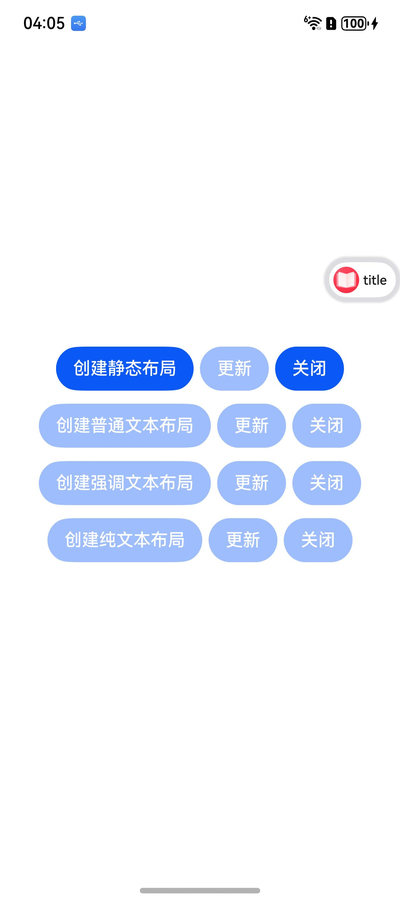
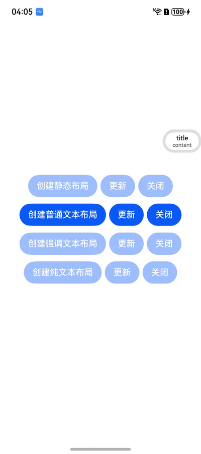
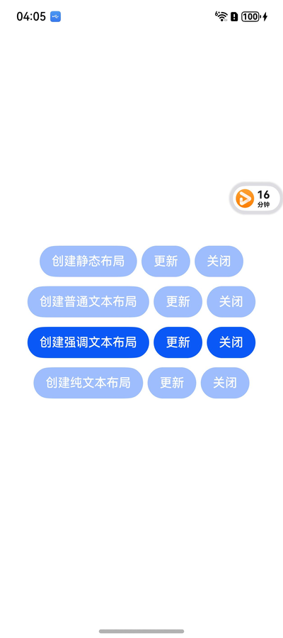
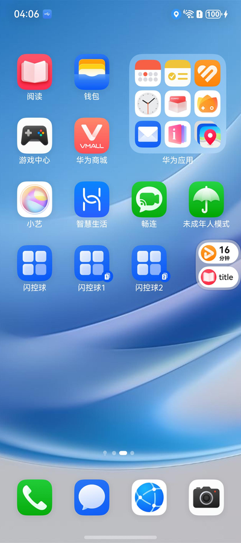

# ArkTS 闪控球（FloatingBall）

### 介绍

[闪控球](https://developer.huawei.com/consumer/cn/doc/harmonyos-guides/floatingball-guide#section667310330439)是一种在设备屏幕上悬浮的非全屏应用窗口，为应用提供临时的全局能力，完成跨应用交互。

应用可以将关键信息（例如：比价、搜题或抢单等）以小窗（闪控球）模式呈现。切换为小窗（闪控球）模式后，用户可以进行其他界面操作，提升使用体验。

从API version 20开始，支持使用闪控球能力。

### 效果预览
1、Demo提供4种闪控球创建布局

2、除了静态布局不支持创建后【更新】，其余布局均支持创建后【更新】

   

### 使用说明

单击闪控球：触发闪控球点击事件。

长按闪控球：长按闪控球震动变为待删除态，可以点击图标单个删除或全部删除。

拖动闪控球：可以手动拖拽闪控球调整位置，拖拽时自动避开状态栏、固定态软键盘（改变软键盘为固定态或者悬浮态方法详细介绍请参见[输入法服务](https://developer.huawei.com/consumer/cn/doc/best-practices/bpta-input-method-framework)）、导航条等其他组件， 设备处于横屏模式时不会自动避让输入法。拖拽松手时闪控球自动吸附在最近的侧边，拖拽到垃圾桶区域（底部中部区域）松手即可移除。
闪控球位置记忆：关闭闪控球会保存当前位置，下一次打开功能时自动展示在上次关闭时的位置。旋转屏幕或重启设备会恢复到默认位置，默认位置位于屏幕右上侧。

同一个应用只能启用一个闪控球，同一个设备最多同时存在两个闪控球，在超出闪控球最大个数限制时，打开新的闪控球会替换最早启动的闪控球。

### 工程目录

```
entry/src/
 ├── main
 │   ├── ets
 │   │   ├── abilities
 |   │       ├── Mainability.ets        
 │   │   ├── pages
 │   │       ├── Index.ets               // 闪控球应用页面
 │   │   ├── util
 │   │       ├── ContextUtil.ts          // 上下文相关类
 │   │       ├── Utils.ts                // 工具类
 │   ├── module.json5
 │   └── resources                       // 静态资源
 ├── ohosTest
 │   ├── ets
 │   │   ├── test
 │   │       ├── Index.test.ets          // 自动化测试代码
```

### 相关权限

基于安全考虑，仅允许应用在前台时启动闪控球，并且需要具有闪控球权限。

权限获取与签名可以参考官方文档：[配置调试签名](https://developer.huawei.com/consumer/cn/doc/harmonyos-guides/ide-signing#section26216104250)

### 依赖

不涉及

### 约束与限制

1.本示例仅支持标准系统上运行, 支持设备：华为手机、平板。

2.本示例为Stage模型，支持API Version 20及以上版本SDK。

3.本示例需要使用DevEco Studio 6.0.0 Release及以上版本才可编译运行。

### 下载

如需单独下载本工程，执行如下命令：

```
git init
git config core.sparsecheckout true
echo ArkUISample/FloatingBall > .git/info/sparse-checkout
git remote add origin https://gitcode.com/harmonyos_samples/guide-snippets.git
git pull origin master
```