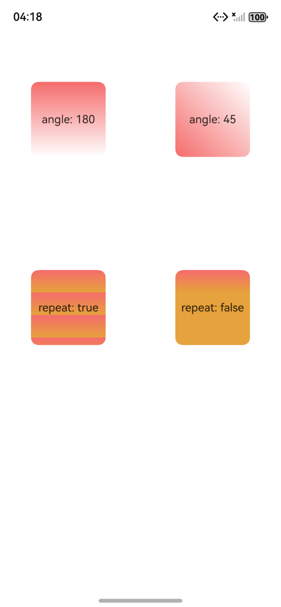
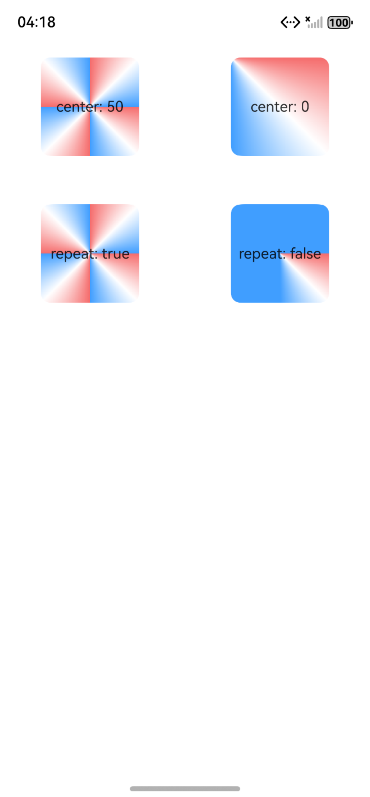
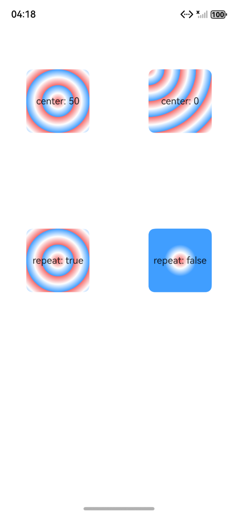

# ArkUI使用颜色渐变指南文档示例

### 介绍

本示例通过使用[ArkUI指南文档](https://gitcode.com/openharmony/docs/tree/master/zh-cn/application-dev/ui)中各场景的开发示例，展示在工程中，帮助开发者更好地理解ArkUI提供的组件及组件属性并合理使用。该工程中展示的代码详细描述可查如下链接：

1. [颜色渐变](https://gitcode.com/openharmony/docs/blob/master/zh-cn/application-dev/ui/arkts-color-effect.md)

### 效果预览

| 线性渐变效果                                 | 角度渐变效果                            | 径向渐变效果                            |
|------------------------------------|------------------------------------|------------------------------------|
|  |  |  |

### 使用说明

1. 在主界面，可以点击对应卡片，选择需要参考的组件示例。

2. 在组件目录选择详细的示例参考。

3. 进入示例界面，查看参考示例。

4. 通过自动测试框架可进行测试及维护。

### 工程目录
```
entry/src/main/ets/
|---entryability
|---homePage
|   |---DirectionGradientEffect.ets     //角度渐变效果  
|   |---LinearGradientEffect.ets       //线性渐变效果
|   |---RadialGradientEffect.ets      //径向渐变效果
|---pages
|   |---Index.ets                       // 应用主页面
entry/src/ohosTest/
|---ets
|   |---index.test.ets                 // 示例代码测试代码
```
### 具体实现

1. 选择需添加渐变的组件（如Column、Button），调用.linearGradient()方法。
2. 配置angle参数（如 180° 表示从上到下，45° 表示从左上到右下），确定渐变方向。
3. 在colors参数中设置两个颜色断点，格式为[[色值1, 比重1], [色值2, 比重2]]（例：[[0xf56c6c, 0.0], [0xffffff, 1.0]]，0.0 为起始点，1.0 为结束点）。
4. 无需设置repeating（默认 false），确保渐变仅在组件内完整显示一次。
5. 在组件的linearGradient配置中，设置repeating: true，启用重复渐变；
6. 定义 2-3 个高对比度颜色（如红0xf56c6c、橙0xE6A23C），并将颜色断点的比重范围缩小（例：[[0xf56c6c, 0.0], [0xE6A23C, 0.3]]）。
7. 调整angle为 0°（水平方向），让渐变沿横向循环。

### 相关权限

不涉及。

### 依赖

不涉及。

### 约束与限制

1. 本示例仅支持标准系统上运行, 支持设备：华为手机。

2. HarmonyOS系统：HarmonyOS 5.0.5 Release及以上。

3. DevEco Studio版本：6.0.0 Release及以上。

4. HarmonyOS SDK版本：HarmonyOS 6.0.0 Release SDK及以上。

### 下载

如需单独下载本工程，执行如下命令：

````
git init
git config core.sparsecheckout true
echo ArkUISample/GradientEffect > .git/info/sparse-checkout
git remote add origin https://gitcode.com/harmonyos_samples/guide-snippets.git
git pull origin master
````