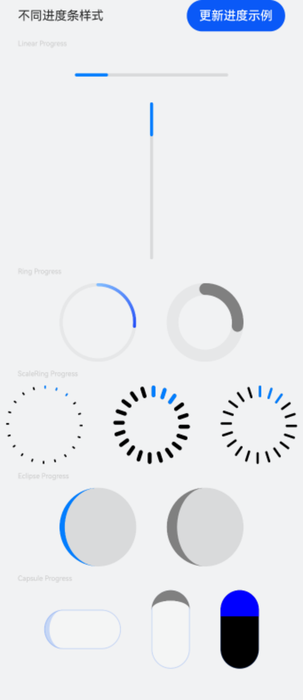

# ArkUI使用文本控件指南文档示例

### 介绍

本示例通过使用[ArkUI指南文档](https://gitcode.com/openharmony/docs/tree/master/zh-cn/application-dev/ui)中各场景的开发示例，展示在工程中，帮助开发者更好地理解ArkUI提供的组件及组件属性并合理使用。该工程中展示的代码详细描述可查如下链接：

1. [进度条 (Progress)](https://gitcode.com/openharmony/docs/blob/OpenHarmony-5.0.0-Release/zh-cn/application-dev/ui/arkts-common-components-progress-indicator.md)。
### 效果预览

| 初始效果             |        进度条更新进度示例页面          | 进度条+5                              |
|------------------------------------|------------------------------------|------------------------------------|
|  |  |  |

### 使用说明

1. 在主界面，查看不同样式进度条。
2. 在主界面点击“更新进度示例”按钮进入进度条更新进度示例页面。
3. 在进度条更新进度示例页面，点击进度条+5的按钮，可见进度增长，当进度满后再点击恢复至0进度。
4. 通过自动测试框架可进行测试及维护。

### 工程目录
```
entry/src/main/ets/
|---entryability          
|---pages
|   |---Index.ets                      // 应用主页面
|   |---ProgressCase1.ets                      // 进度条更新进度示例页面
entry/src/ohosTest/
|---ets
|   |---index.test.ets                 // 示例代码测试代码
```

### 相关权限

不涉及。

### 依赖

不涉及。

### 约束与限制

1. 本示例仅支持标准系统上运行, 支持设备：华为手机。

2. HarmonyOS系统：HarmonyOS 5.0.5 Release及以上。

3. DevEco Studio版本：6.0.0 Release及以上。

4. HarmonyOS SDK版本：HarmonyOS 6.0.0 Release SDK及以上。

### 下载

如需单独下载本工程，执行如下命令：

````
git init
git config core.sparsecheckout true
echo code/DocsSample/ArkUIDocSample/InfoComponent/ProgressProject > .git/info/sparse-checkout
git remote add origin https://gitcode.com/harmonyos_samples/guide-snippets.git
git pull origin master
````