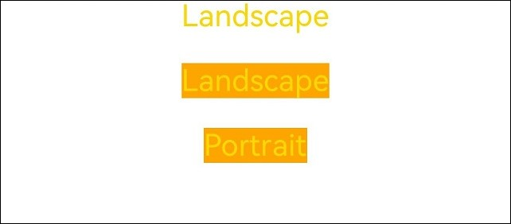
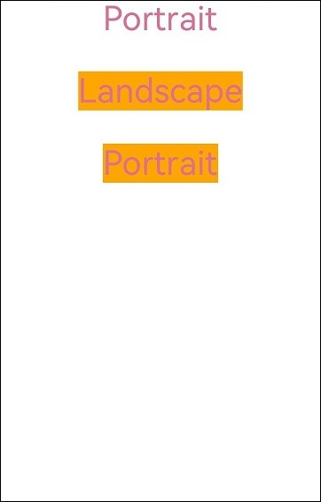

# MediaQuerySample

## 介绍

本示例为使用媒体查询接口构建UI->UI系统场景化能力->[媒体查询](https://gitcode.com/openharmony/docs/blob/master/zh-cn/application-dev/ui/arkts-layout-development-media-query.md)的配套示例工程。 

本示例展示了如何进行横竖屏切换。

## 效果预览

| 预览                                      |

|横屏|竖屏|
|------------------------------|--------------------------------|
|| |

## 使用说明
1. 安装编译生成的hap包，并打开应用；
2. 分别点击Landscape和Portrait进行横竖屏切换；


## 工程目录

```
MediaQuerySample
entry/src/main/ets/
└── pages
    └── Index.ets (应用主页面)
entry/src/main/
└── resources
    ├── base
    │   ├── element
    │   │   ├── color.json
    │   │   ├── float.json
    │   │   └── string.json
    │   └── media
entry/src/ohosTest/
|---ets
    |---test
    │   ├── Ability.test.ets (测试代码实现)
    │   └── List.test.ets

```

## 具体实现
* 横竖屏切换功能接口封装在Index，源码参考:[Index.ets](entry/src/main/ets/pages/Index.ets)
    * 获取监听句柄：通过mediaQuery.matchMediaSync('screen and (min-aspect-ratio: 1.5) or (orientation: landscape)')方法来获取有一个监听横竖屏的句柄，接口参考：[@ohos.mediaquery](https://gitcode.com/openharmony/docs/blob/master/zh-cn/application-dev/reference/apis-arkui/js-apis-mediaquery.md) ；
    * 执行控制横竖屏切换效果的函数：调用this.listener.on('change', this.onLand.bind(this))函数来实现横竖屏下不同的功能或者页面效果；

## 相关权限

不涉及

## 依赖

不涉及

## 约束和限制

1. 本示例仅支持标准系统上运行, 支持设备：华为手机。

2. HarmonyOS系统：HarmonyOS 5.0.5 Release及以上。

3. DevEco Studio版本：6.0.0 Release及以上。

4. HarmonyOS SDK版本：HarmonyOS 6.0.0 Release SDK及以上。

## 下载

如需单独下载本工程，执行如下命令：

```
git init
git config core.sparsecheckout true
echo ArkUISample/MediaquerySample > .git/info/sparse-checkout
git remote add origin https://gitcode.com/harmonyos_samples/guide-snippets.git
git pull origin master
```