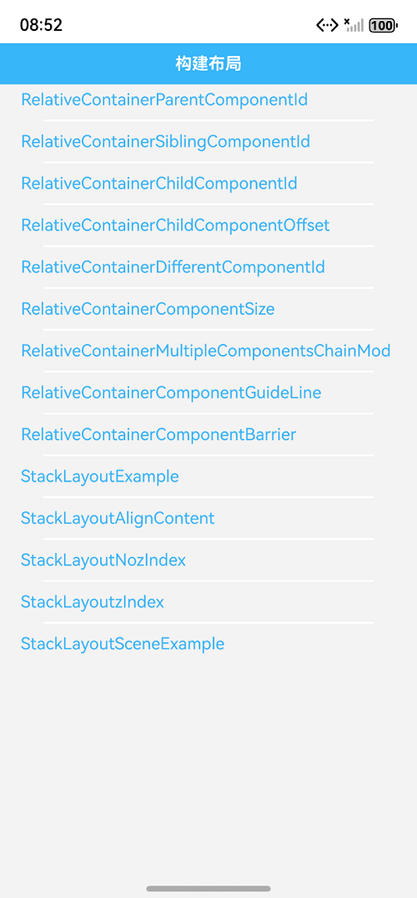
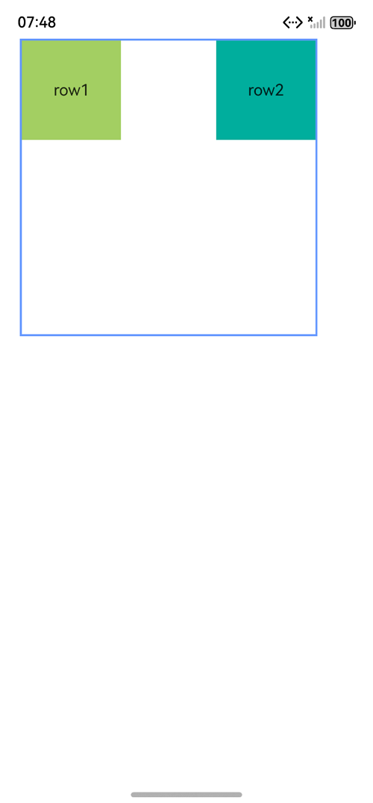
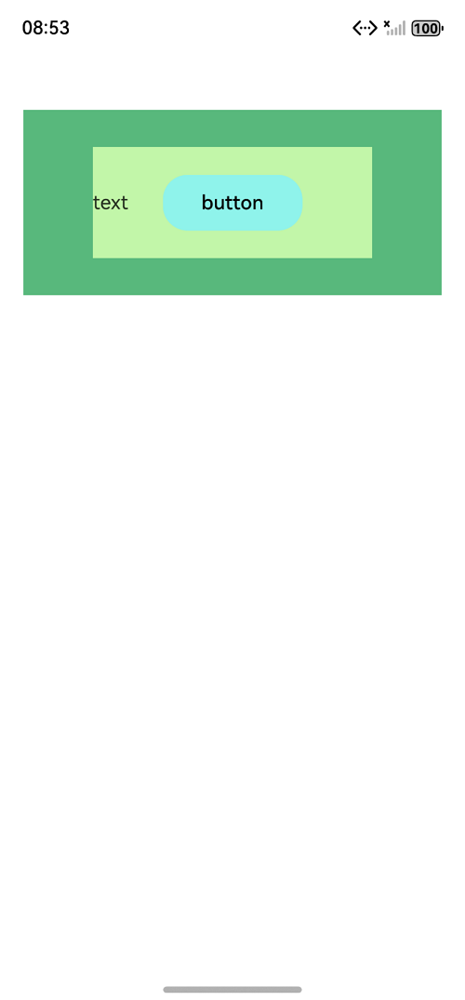
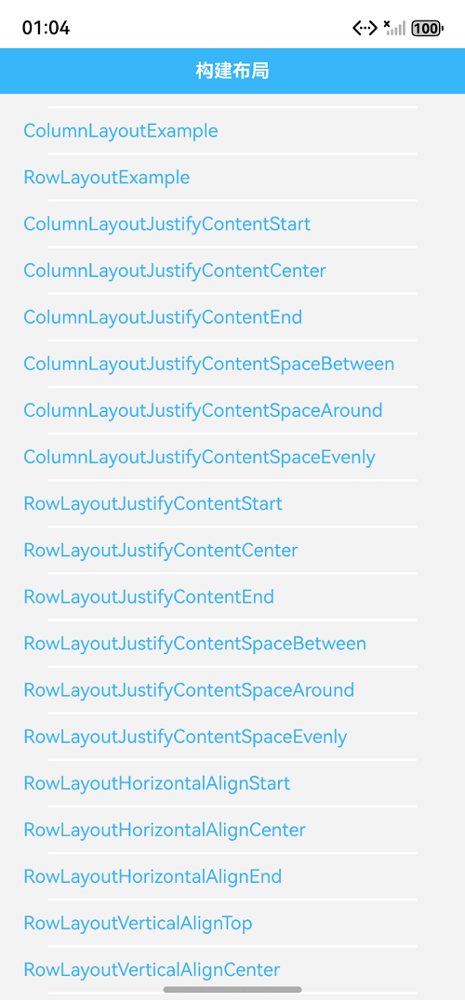
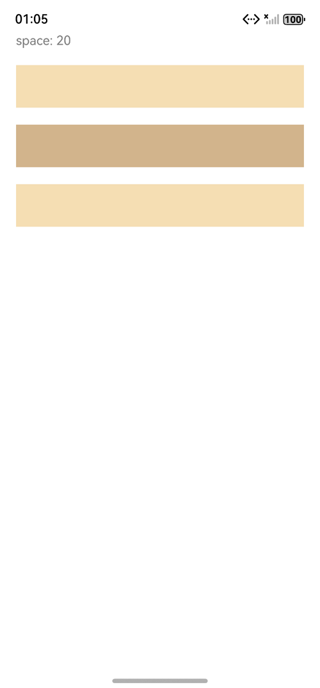
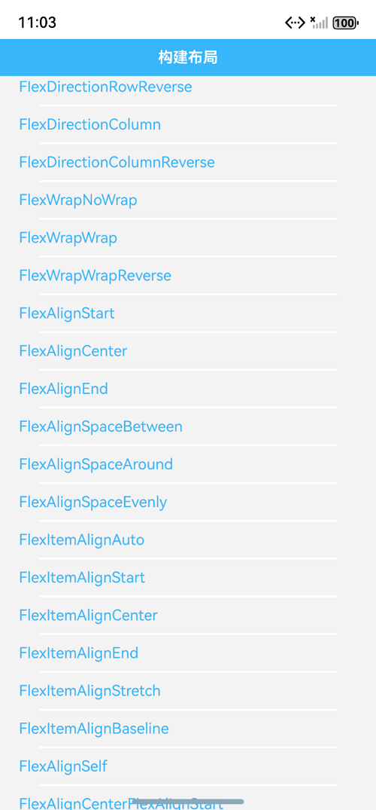
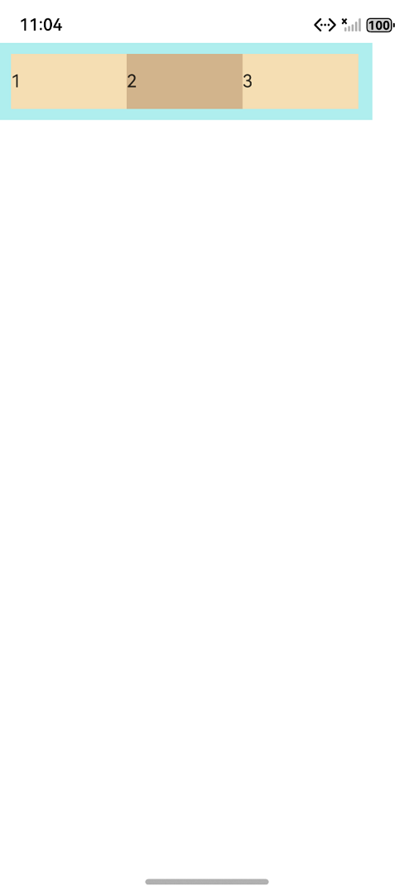
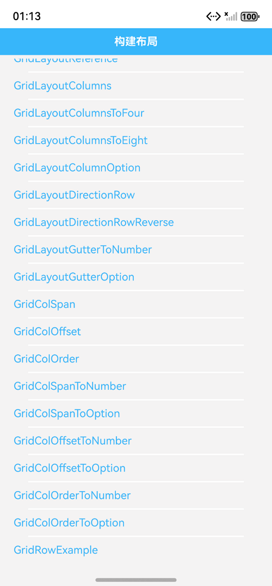
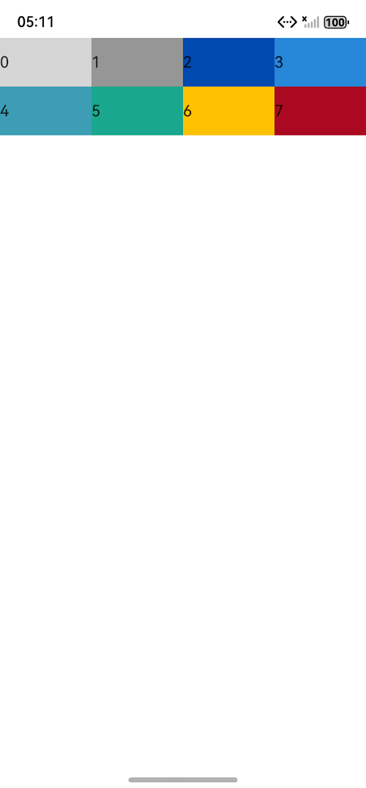

# ArkUI多种布局组件指南文档示例

### 介绍

本示例通过使用[ArkUI指南文档](https://gitcode.com/openharmony/docs/tree/master/zh-cn/application-dev/ui)中各场景的开发示例，展示在工程中，帮助开发者更好地理解ArkUI提供的组件及组件属性并合理使用。该工程中展示的代码详细描述可查如下链接：

1. [相对布局](https://gitcode.com/tianlongdevcode/docs_zh/blob/master/zh-cn/application-dev/ui/arkts-layout-development-relative-layout.md)。
2. [层叠布局](https://gitcode.com/tianlongdevcode/docs_zh/blob/master/zh-cn/application-dev/ui/arkts-layout-development-stack-layout.md)。
3. [线性布局](https://gitcode.com/tianlongdevcode/docs_zh/blob/master/zh-cn/application-dev/ui/arkts-layout-development-linear.md)。
4. [弹性布局](https://gitcode.com/tianlongdevcode/docs_zh/blob/master/zh-cn/application-dev/ui/arkts-layout-development-flex-layout.md)。
5. [栅格布局](https://gitcode.com/tianlongdevcode/docs_zh/blob/master/zh-cn/application-dev/ui/arkts-layout-development-grid-layout.md)。

### 1. [相对布局 (RelativeContainer)]
### 效果预览

| 列表                                 |  示例 
|------------------------------------|--------------------------------------|
|  |    |

### 2. [层叠布局 (Stack)]
### 效果预览

| 列表                                    | 示例               
|---------------------------------------|------------------------------------|
|  |  |

### 3. [线性布局 (Row/Column)]
### 效果预览

| 列表                                 |  示例              
|------------------------------------|------------------------------------|
|  |  |

### 4. [弹性布局 (Flex)]
### 效果预览

| 列表                                 | 示例              
|------------------------------------|------------------------------------|
|  |  |

### 5. [栅格布局 (GridRow/GridCol)]
### 效果预览

| 列表                                 | 示例                 
|------------------------------------|------------------------------------|
|  |  |

### 使用说明

1. 在主界面，可以点击对应卡片，选择需要参考的组件示例。

2. 在组件目录选择详细的示例参考。

3. 进入示例界面，查看参考示例。

4. 通过自动测试框架可进行测试及维护。

### 工程目录
```
entry/src/main/ets/
|---entryability
|---pages
|   |---relativecontainerlayout                  //相对布局 (RelativeContainer
|   |       |---RelativeContainerParentComponentId.ets   //RelativeContainer父组件为锚点布局
|   |       |---RelativeContainerSiblingComponentId.ets  //以兄弟元素为锚点布局
|   |       |---RelativeContainerChildComponentId.ets    //子组件锚点可以任意选择布局
|   |       |---RelativeContainerChildComponentOffset.ets   //子组件位置偏移布局
|   |       |---RelativeContainerDifferentComponentId.ets   //多种组件的对齐布局
|   |       |---RelativeContainerComponentSize.ets          //组件尺寸布局
|   |       |---RelativeContainerMultipleComponentsChainMode.ets  //多个组件形成链布局
|   |       |---RelativeContainerComponentGuideLine.ets   //使用辅助线辅助定位子组件布局
|   |       |---RelativeContainerComponentBarrier.ets  //多个组件的屏障布局
|   |---stacklayout                             //层叠布局 (Stack)
|   |       |---StackLayoutExample.ets  //Stack组件为容器组件布局
|   |       |---StackLayoutAlignContent.ets  //对齐方式布局
|   |       |---StackLayoutNozIndex.ets  //无Z序控制布局
|   |       |---StackLayoutzIndex.ets    //Z序控制布局
|   |       |---StackLayoutSceneExample.ets  //使用层叠布局快速搭建页面
|   |---linearlayout                             //线性布局 (Row/Column)
|   |       |---ColumnLayoutExample.ets //Column容器内排列方向上的间距布局
|   |       |---RowLayoutExample.ets    //Row容器内排列方向上的间距布局
|   |       |---ColumnLayoutJustifyContentStart.ets    //元素在垂直方向首端对齐布局
|   |       |---ColumnLayoutJustifyContentCenter.ets    //元素在垂直方向中心对齐布局
|   |       |---ColumnLayoutJustifyContentEnd.ets    //元素在垂直方向尾部对齐布局
|   |       |---ColumnLayoutJustifyContentSpaceBetween.ets    //垂直方向均匀分配元素布局
|   |       |---ColumnLayoutJustifyContentSpaceAround.ets    //垂直方向均匀分配元素布局
|   |       |---ColumnLayoutJustifyContentSpaceEvenly.ets    //垂直方向均匀分配元素布局
|   |       |---RowLayoutJustifyContentStart.ets    //元素在水平方向首端对齐布局
|   |       |---RowLayoutJustifyContentCenter.ets    //元素在水平方向中心对齐布局
|   |       |---RowLayoutJustifyContentEnd.ets    //元素在水平方向尾部对齐布局
|   |       |---RowLayoutJustifyContentSpaceBetween.ets    //水平方向均匀分配元素布局
|   |       |---RowLayoutJustifyContentSpaceAround.ets    //水平方向均匀分配元素布局
|   |       |---RowLayoutJustifyContentSpaceEvenly.ets    //水平方向均匀分配元素布局
|   |       |---RowLayoutHorizontalAlignStart.ets    //子元素在水平方向左对齐布局
|   |       |---RowLayoutHorizontalAlignCenter.ets    //子元素在水平方向居中对齐布局
|   |       |---RowLayoutHorizontalAlignEnd.ets    //子元素在水平方向右对齐布局
|   |       |---RowLayoutVerticalAlignTop.ets    //子元素在垂直方向顶部对齐布局
|   |       |---RowLayoutVerticalAlignCenter.ets    //子元素在垂直方向居中对齐布局
|   |       |---RowLayoutVerticalAlignBottom.ets    //子元素在垂直方向底部对齐布局
|   |       |---BlankExample.ets    //自适应拉伸布局
|   |       |---LayoutWeightExample.ets    //自适应缩放布局
|   |       |---WidthExample.ets    //自适应缩放布局
|   |       |---ScrollVerticalExample.ets    //自适应延伸布局
|   |       |---ScrollHorizontalExample.ets    //自适应延伸布局
|   |---flexlayout                             //弹性布局 (Flex)
|   |       |---FlexDirectionRow.ets    //主轴为水平方向布局
|   |       |---FlexDirectionRowReverse.ets    //主轴为水平方向布局
|   |       |---FlexDirectionColumn.ets    //主轴为垂直方向布局
|   |       |---FlexDirectionColumnReverse.ets    //主轴为垂直方向布局
|   |       |---FlexWrapNoWrap.ets    //不换行布局
|   |       |---FlexWrapWrap.ets    //换行布局
|   |       |---FlexWrapWrapReverse.ets    //换行布局
|   |       |---FlexAlignStart.ets    //子元素在主轴方向起始端对齐布局
|   |       |---FlexAlignCenter.ets    //子元素在主轴方向居中对齐布局
|   |       |---FlexAlignEnd.ets    //子元素在主轴方向终点端对齐布局
|   |       |---FlexAlignSpaceBetween.ets    //Flex主轴方向均匀分配弹性元素布局
|   |       |---FlexAlignSpaceAround.ets    //Flex主轴方向均匀分配弹性元素布局
|   |       |---FlexAlignSpaceEvenly.ets    //Flex主轴方向元素等间距布局布局
|   |       |---FlexItemAlignAuto.ets    //使用Flex容器中默认配置布局
|   |       |---FlexItemAlignStart.ets    //交叉轴方向首部对齐布局
|   |       |---FlexItemAlignCenter.ets    //交叉轴方向居中对齐布局
|   |       |---FlexItemAlignEnd.ets    //交叉轴方向底部对齐布局
|   |       |---FlexItemAlignStretch.ets    //交叉轴方向拉伸填充布局
|   |       |---FlexItemAlignBaseline.ets    //交叉轴方向文本基线对齐布局
|   |       |---FlexAlignSelf.ets    //子元素设置交叉轴对齐布局
|   |       |---FlexAlignCenterFlexAlignStart.ets    //子元素各行与交叉轴起点对齐布局
|   |       |---FlexAlignCenterFlexAlignCenter.ets    //子元素各行在交叉轴方向居中对齐布局
|   |       |---FlexAlignCenterFlexAlignEnd.ets    //子元素各行与交叉轴终点对齐布局
|   |       |---FlexAlignCenterFlexAlignSpaceBetween.ets    //子元素各行与交叉轴两端对齐布局
|   |       |---FlexAlignCenterFlexAlignSpaceAround.ets    //子元素各行间距相等布局
|   |       |---FlexAlignCenterFlexAlignSpaceEvenly.ets    //子元素各行间距布局
|   |       |---FlexBasis.ets    //设置子元素在父容器主轴方向上的基准尺寸布局
|   |       |---FlexGrow.ets    //设置父容器的剩余空间分配给此属性所在组件的比例布局
|   |       |---FlexShrink.ets    //当父容器空间不足时，子元素的压缩比例布局
|   |       |---FlexExample.ets    //使用弹性布局示例
|   |---gridlayout                             //栅格布局 (GridRow/GridCol)
|   |       |---GridLayoutReference.ets    //栅格容器断点布局
|   |       |---GridLayoutColumns.ets    //布局的总列数布局
|   |       |---GridLayoutColumnsToFour.ets    //columns类型为number时布局
|   |       |---GridLayoutColumnsToEight.ets    //columns类型为number时布局
|   |       |---GridLayoutColumnOption.ets    //columns类型为GridRowColumnOption时布局
|   |       |---GridLayoutDirectionRow.ets    //子组件默认从左往右排列布局
|   |       |---GridLayoutDirectionRowReverse.ets    //子组件从右往左排列布局
|   |       |---GridLayoutGutterToNumber.ets    //gutter类型为number时布局
|   |       |---GridLayoutGutterOption.ets    //gutter类型为GutterOption时布局
|   |       |---GridColSpan.ets    //设置span布局
|   |       |---GridColOffset.ets    //设置offset布局
|   |       |---GridColOrder.ets    //设置order布局
|   |       |---GridColSpanToNumber.ets    //span类型为number时布局
|   |       |---GridColSpanToOption.ets    //span类型为GridColColumnOption时布局
|   |       |---GridColOffsetToNumber.ets    //offset类型为number时布局
|   |       |---GridColOffsetToOption.ets    //offset类型为GridColColumnOption时布局
|   |       |---GridColOrderToNumber.ets    //order类型为number时布局
|   |       |---GridColOrderToOption.ets    //order类型为GridColColumnOption时布局
|   |       |---GridRowExample.ets    //栅格组件的嵌套使用
|---pages
|   |---Index.ets                       // 应用主页面
entry/src/ohosTest/
|---ets
|   |---RelativeContainerLayout.test.ets           // 相对布局示例代码测试代码
|   |---StackLayout.test.ets                       // 层叠布局示例代码测试代码
|   |---LinearLayout.test.ets                      // 线性布局示例代码测试代码
|   |---FlexLayout.test.ets                        // 弹性布局示例代码测试代码
|   |---GridLayout.test.ets                        // 栅格布局示例代码测试代码
```

### 具体实现

1. 启动app进入主界面，选择相对布局列表、层叠布局列表、线性布局列表、弹性布局列表或者栅格布局列表，然后点击选择详细的示例参考

2. 相对布局详细示例参考有设置参考边界、设置锚点、设置相对于锚点的对齐位置、子组件位置偏移、多种组件的对齐布局、组件尺寸、多个组件形成链等示例，源码参考示例场景[https://gitcode.com/openharmony/applications_app_samples/blob/master/code/DocsSample/ArkUISample/MultipleLayoutProject/entry/src/main/ets/pages/relativecontainerlayout/RelativeContainerParentComponentId.ets]

3. 层叠布局详细示例参考有Z序控制、页面层叠、位置定位能力，其使用场景有广告、卡片层叠效果等示例，源码参考示例场景[https://gitcode.com/openharmony/applications_app_samples/blob/master/code/DocsSample/ArkUISample/MultipleLayoutProject/entry/src/main/ets/pages/stacklayout/StackLayoutSceneExample.ets]

4. 线性布局详细示例参考有布局子元素在排列方向上的间距、布局子元素在主轴上的排列方式、布局子元素在交叉轴上的对齐方式、自适应拉伸、自适应缩放、自适应延伸等示例，源码参考示例场景[https://gitcode.com/openharmony/applications_app_samples/blob/master/code/DocsSample/ArkUISample/MultipleLayoutProject/entry/src/main/ets/pages/linearlayout/ColumnLayoutExample.ets]

5. 弹性布局详细示例参考有布局方向、布局换行、主轴对齐方式、交叉轴对齐方、自适应拉伸等示例，源码参考示例场景[https://gitcode.com/openharmony/applications_app_samples/blob/master/code/DocsSample/ArkUISample/MultipleLayoutProject/entry/src/main/ets/pages/flexlayout/FlexExample.ets ]

6. 栅格布局详细示例参考有栅格容器断点、布局的总列数、排列方向、子组件间距、子组件GridCol、栅格组件的嵌套使用等示例，源码参考示例场景[https://gitcode.com/openharmony/applications_app_samples/blob/master/code/DocsSample/ArkUISample/MultipleLayoutProject/entry/src/main/ets/pages/gridlayout/GridRowExample.ets]

### 相关权限

不涉及。

### 依赖

不涉及。

### 约束与限制

1. 本示例仅支持标准系统上运行, 支持设备：华为手机。

2. HarmonyOS系统：HarmonyOS 5.0.5 Release及以上。

3. DevEco Studio版本：6.0.0 Release及以上。

4. HarmonyOS SDK版本：HarmonyOS 6.0.0 Release SDK及以上。

### 下载

如需单独下载本工程，执行如下命令：

````
git init
git config core.sparsecheckout true
echo ArkUISample/MultipleLayoutProject > .git/info/sparse-checkout
git remote add origin https://gitcode.com/harmonyos_samples/guide-snippets.git
git pull origin master
````