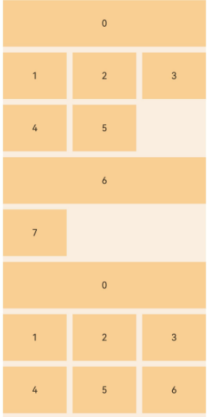

# 使用网格

### 介绍

本工程以`ArkUI (C-API)`的方式实现[使用网格](https://gitcode.com/openharmony/docs/blob/master/zh-cn/application-dev/ui/ndk-grid.md)，演示网格容器组件原生节点的创建、布局、懒加载与ETS侧对接。

### 效果预览

<table>
  <tr>
    <th>固定行列网格</th>
    <th>可滚动网格</th>
  </tr>
  <tr>
    <td></td>
    <td></td>
  </tr>
</table>

### 使用说明

1. 在主界面，可以点击对应卡片，选择需要参考的组件示例。

2. 进入示例界面，查看参考示例。

3. 通过自动测试框架可进行测试及维护。

### 工程目录

``` text
entry/src/main
+--- cpp
|   ├── ArkUIBaseNode.h
|   ├── ArkUIColumnNode.h
|   ├── ArkUIGridItemNode.h
|   ├── ArkUIGridLayoutOptions.h
|   ├── ArkUIGridNode.h (网格组件C API封装)
|   ├── ArkUINode.h
|   ├── ArkUINodeAdapter.h
|   ├── ArkUITextNode.h
|   ├── CMakeLists.txt
|   ├── GridIrregularIndexesExample.cpp (可滚动网格组件示例)
|   ├── GridIrregularIndexesExample.h
|   ├── GridRectByIndexExample.cpp (固定行列网格组件示例)
|   ├── GridRectByIndexExample.h
|   ├── napi_init.cpp
|   ├── NativeEntry.cpp
|   ├── NativeEntry.h
|   ├── NativeModule.h
|   ├── ScrollableUtils.cpp
|   ├── ScrollableUtils.h
|   └── types
|       └── libentry
|           ├── Index.d.ts
|           └── oh-package.json5
├── ets
|   ├── entryability
|   |   └── EntryAbility.ets
|   ├── entrybackupability
|   |   └── EntryBackupAbility.ets
|   └── pages
|       ├── Index.ets
|       ├── PageGridIrregularIndexes.ets
|       └── PageGridRectByIndex.ets   
```

### 具体实现

* 网格组件常用属性接口封装在ArkUIGridNode，源码参考：[ArkUIGridNode.h](entry/src/main/cpp/ArkUIGridNode.h)
    * 通过`createNode(ARKUI_NODE_GRID)`创建网格节点
    * 通过`NODE_GRID_ROW_TEMPLATE`和`NODE_GRID_COLUMN_TEMPLATE`设置网格行列数
    * 通过`NODE_GRID_ROW_GAP`和`NODE_GRID_COLUMN_GAP`设置网格行列间距
    * 通过`NODE_GRID_LAYOUT_OPTIONS`设置网格布局选项

* 可滚动网格组件示例参考：[GridIrregularIndexesExample.cpp](entry/src/main/cpp/GridIrregularIndexesExample.cpp)
  * 通过`OH_ArkUI_GridLayoutOptions_SetIrregularIndexes`设置用于分组的子组件索引
  * 通过[ArkUINodeAdapter](entry/src/main/cpp/ArkUINodeAdapter.h)实现滚动过程中子组件懒加载

* 固定行列网格组件示例参考：[GridRectByIndexExample.cpp](entry/src/main/cpp/GridRectByIndexExample.cpp)
  * 通过`OH_ArkUI_GridLayoutOptions_RegisterGetRectByIndexCallback`设置获取每一个子组件占用行列数的回调，实现自由指定网格子组件的位置和占用的行列数。

### 相关权限

不涉及。

### 依赖

不涉及。

### 约束与限制

1.本示例仅支持标准系统上运行，支持设备：华为手机。

2.HarmonyOS系统：HarmonyOS 6.0.2 Release及以上。

3.本示例需要使用DevEco Studio 6.0.0 Release (Build Version: 6.0.0.858, built on September 24, 2025)及以上版本才可编译运行。

4.HarmonyOS SDK版本：HarmonyOS 6.0.2 Release及以上。

### 下载

如需单独下载本工程，执行如下命令：

```
git init
git config core.sparsecheckout true
echo code/DocsSample/ArkUISample/NdkGridSample > .git/info/sparse-checkout
git remote add origin https://gitcode.com/openharmony/applications_app_samples.git
git pull origin master
```