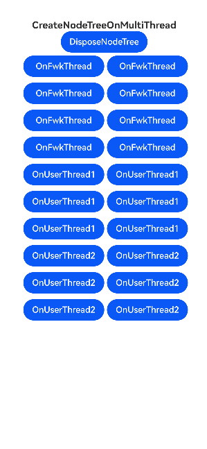

# ArkUI使用NodeUtils指南文档示例

### 介绍

本示例通过使用[ArkUI指南文档](https://gitcode.com/openharmony/docs/tree/master/zh-cn/application-dev/ui)中各场景的开发示例，展示在工程中，帮助开发者更好的理解并合理使用ArkUI提供的通用类型接口。接口详情请参考[native_node.h](https://gitcode.com/openharmony/docs/blob/master/zh-cn/application-dev/reference/apis-arkui/capi-native-node-h.md)。

### 使用说明

1. 在主界面，可以点击不同的按钮，查看不同的示例。

2. 点击多线程创建组件，跳转查看多线程创建组件示例。

3. 点击自定义属性测试，跳转查看组件使用自定义属性的示例。

4. 点击懒加载页面，查看懒加载页面示例。

5. 点击设置capi侧主窗口Context，查看如何将ArkTS的上下文传到capi。

6. 点击“展示绘画页面”，查看绘画效果。

7. 点击：“返回”，返回到主页面。

## 效果预览

| 首页 | 应用页面                                           |
| ---- | -------------------------------------------------------- |
|      |  |
|      |  |

### 具体实现

- 本示例实现了多线程创建组件的能力，通过调用CAPI抛线程创建的接口，将组件创建操作放到其它线程执行，有效提高UI效率。

- 实现了组件存储自定义属性的能力，开发者可以通过该能力，赋予组件一些特殊的字段接口，用以实现即时性的接口调用。

- 实现了CAPI侧懒加载实现列表的能力，可复用已生成的列表项，减少创建/销毁的性能开销。

### 工程目录
```
entry/src/main/cpp
|---CMakeLists.txt                   // 编译脚本
|---napi_init.cpp                      // 实现创建、设置、获取、重置组件属性
|---manager.cpp                        // 管理组件节点
|---NativeEntry.cpp                    // 多线程节点管理与自定义组件实现
|---NativeEntry.h                      // 核心管理类声明
|---types
    |---Index.d.ts                      // napi对外接口定义
entry/src/main/ets/
|---entryability
|---pages
|   |---customproperty.ets             // 自定义属性用例demo
|   |---entry.ets                      // 多线程创建组件demo
|   |---index.ets                      // 应用主页面
|   |---nodeadapter.ets                // 懒加载列表demo
```

### 相关权限

不涉及。

### 依赖

不涉及。

### 约束与限制

1. 本示例仅支持标准系统上运行, 支持设备：华为手机。

2. HarmonyOS系统：HarmonyOS 5.0.5 Release及以上。

3. DevEco Studio版本：6.0.0 Release及以上。

4. HarmonyOS SDK版本：HarmonyOS 6.0.0 Release SDK及以上。

### 下载

如需单独下载本工程，执行如下命令：

````
git init
git config core.sparsecheckout true
echo ArkUISample/NativeNodeSample > .git/info/sparse-checkout
git remote add origin https://gitcode.com/harmonyos_samples/guide-snippets.git
git pull origin master
````