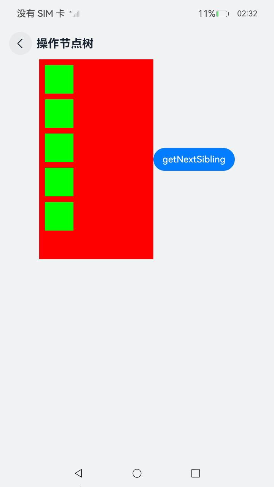
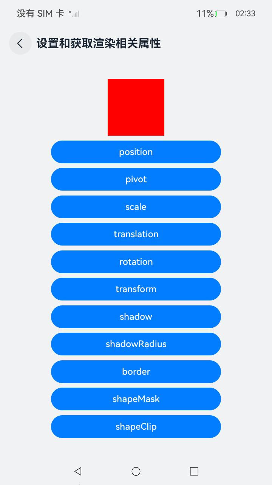
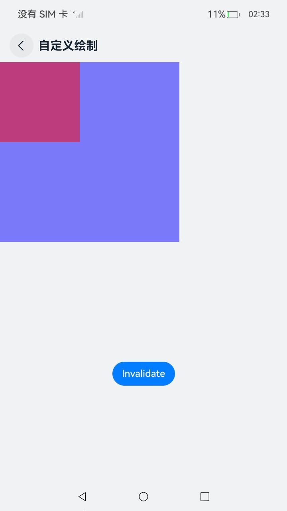
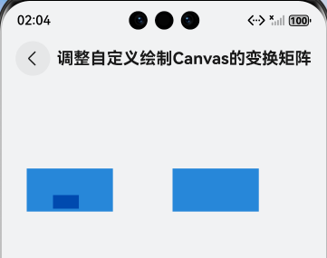
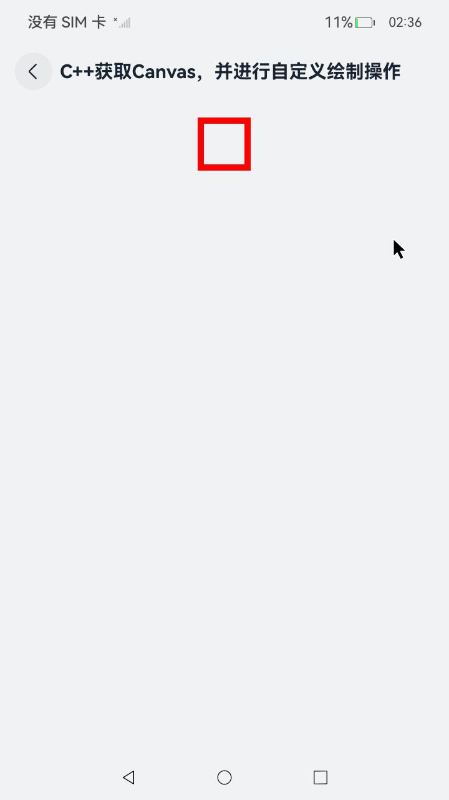
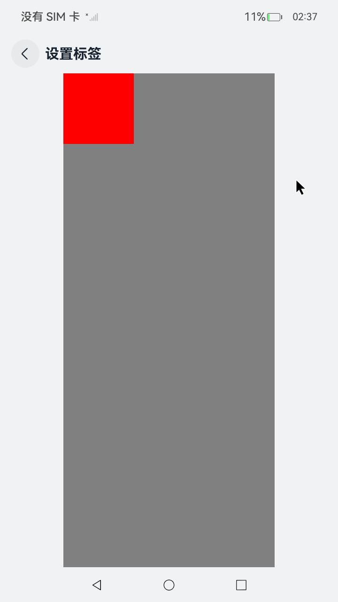
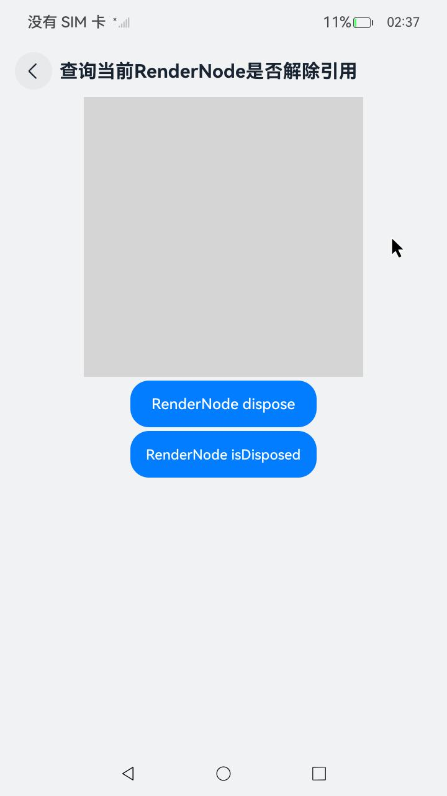

# 自定义渲染节点 (RenderNode)

## 介绍

对于不具备自己的渲染环境的三方框架，尽管已实现前端解析、布局及事件处理等功能，但仍需依赖系统的基础渲染和动画能力。[FrameNode](https://gitcode.com/openharmony/docs/blob/master/zh-cn/application-dev/ui/arkts-user-defined-arktsNode-frameNode.md)上的通用属性与通用事件对这类框架而言是冗余的，会导致多次不必要的操作，涵盖布局、事件处理等逻辑。

自定义渲染节点 (RenderNode)是更加轻量的渲染节点，仅具备与渲染相关的功能它提供了设置基础渲染属性的能力，以及节点的动态添加、删除和自定义绘制的能力。

本示例为 [自定义渲染节点 (RenderNode)](https://gitcode.com/openharmony/docs/blob/master/zh-cn/application-dev/ui/arkts-user-defined-arktsNode-renderNode.md) 的配套示例工程。

## 效果预览

| 首页 | 操作节点树 | 设置和获取渲染相关属性 | 自定义绘制 |
|-----|-----|-----|-----|
|  |  |  |  |
| 调整自定义绘制Canvas的变换矩阵 | C++获取Canvas，并进行自定义绘制操作 | 设置标签 | 查询当前RenderNode是否解除引用 |
|  |  |  |  |

## 使用说明
1. 在主界面，可以点击对应卡片，选择需要参考的示例。
2. 进入示例界面，查看参考示例。
3. 通过自动测试框架可进行测试及维护。


## 工程目录

```
entry/src/main/
├── cpp
│   ├── CMakeLists.txt
│   ├── native_bridge.cpp
│   └── types
│       └── libentry
│           └── Index.d.ts
└── ets
    ├── common
    │   ├── Card.ets
    │   ├── Route.ets
    │   └── resource.ets
    └── pages
        ├── CheckRanderNodeDisposed.ets
        ├── CustomDraw.ets
        ├── CustomDrawCanvas.ets
        ├── CustomDrawCanvasNative.ets
        ├── Index.ets
        ├── OperationNodeTree.ets
        ├── RenderingProperties.ets
        └── SetLabel.ets
```

## 具体实现

1. 创建和删除节点。

   RenderNode提供了节点创建和删除的能力。可以通过RenderNode的构造函数创建自定义的RenderNode节点。通过构造函数创建的节点对应一个实体的节点。同时，可以通过RenderNode中的[dispose](https://gitcode.com/openharmony/docs/blob/master/zh-cn/application-dev/reference/apis-arkui/js-apis-arkui-renderNode.md#dispose12)接口来实现与实体节点的绑定关系的解除。

2. 操作节点树。

   RenderNode提供了节点的增、删、查、改的能力，能够修改节点的子树结构；可以对所有RenderNode的节点的父子节点做出查询操作，并返回查询结果。

3. 设置和获取渲染相关属性。

   RenderNode中可以设置渲染相关的属性，包括：[backgroundColor](https://gitcode.com/openharmony/docs/blob/master/zh-cn/application-dev/reference/apis-arkui/js-apis-arkui-renderNode.md#backgroundcolor)，[clipToFrame](https://gitcode.com/openharmony/docs/blob/master/zh-cn/application-dev/reference/apis-arkui/js-apis-arkui-renderNode.md#cliptoframe)，[opacity](https://gitcode.com/openharmony/docs/blob/master/zh-cn/application-dev/reference/apis-arkui/js-apis-arkui-renderNode.md#opacity)，[size](https://gitcode.com/openharmony/docs/blob/master/zh-cn/application-dev/reference/apis-arkui/js-apis-arkui-renderNode.md#size)，[position](https://gitcode.com/openharmony/docs/blob/master/zh-cn/application-dev/reference/apis-arkui/js-apis-arkui-renderNode.md#position)，[frame](https://gitcode.com/openharmony/docs/blob/master/zh-cn/application-dev/reference/apis-arkui/js-apis-arkui-renderNode.md#frame)，[pivot](https://gitcode.com/openharmony/docs/blob/master/zh-cn/application-dev/reference/apis-arkui/js-apis-arkui-renderNode.md#pivot)，[scale](https://gitcode.com/openharmony/docs/blob/master/zh-cn/application-dev/reference/apis-arkui/js-apis-arkui-renderNode.md#scale)，[translation](https://gitcode.com/openharmony/docs/blob/master/zh-cn/application-dev/reference/apis-arkui/js-apis-arkui-renderNode.md#translation)，[rotation](https://gitcode.com/openharmony/docs/blob/master/zh-cn/application-dev/reference/apis-arkui/js-apis-arkui-renderNode.md#rotation)，[transform](https://gitcode.com/openharmony/docs/blob/master/zh-cn/application-dev/reference/apis-arkui/js-apis-arkui-renderNode.md#transform)，[shadowColor](https://gitcode.com/openharmony/docs/blob/master/zh-cn/application-dev/reference/apis-arkui/js-apis-arkui-renderNode.md#shadowcolor)，[shadowOffset](https://gitcode.com/openharmony/docs/blob/master/zh-cn/application-dev/reference/apis-arkui/js-apis-arkui-renderNode.md#shadowoffset)，[shadowAlpha](https://gitcode.com/openharmony/docs/blob/master/zh-cn/application-dev/reference/apis-arkui/js-apis-arkui-renderNode.md#shadowalpha)，[shadowElevation](https://gitcode.com/openharmony/docs/blob/master/zh-cn/application-dev/reference/apis-arkui/js-apis-arkui-renderNode.md#shadowelevation)，[shadowRadius](https://gitcode.com/openharmony/docs/blob/master/zh-cn/application-dev/reference/apis-arkui/js-apis-arkui-renderNode.md#shadowradius)，[borderStyle](https://gitcode.com/openharmony/docs/blob/master/zh-cn/application-dev/reference/apis-arkui/js-apis-arkui-renderNode.md#borderstyle12)，[borderWidth](https://gitcode.com/openharmony/docs/blob/master/zh-cn/application-dev/reference/apis-arkui/js-apis-arkui-renderNode.md#borderwidth12)，[borderColor](https://gitcode.com/openharmony/docs/blob/master/zh-cn/application-dev/reference/apis-arkui/js-apis-arkui-renderNode.md#bordercolor12)，[borderRadius](https://gitcode.com/openharmony/docs/blob/master/zh-cn/application-dev/reference/apis-arkui/js-apis-arkui-renderNode.md#borderradius12)，[shapeMask](https://gitcode.com/openharmony/docs/blob/master/zh-cn/application-dev/reference/apis-arkui/js-apis-arkui-renderNode.md#shapemask12)，[shapeClip](https://gitcode.com/openharmony/docs/blob/master/zh-cn/application-dev/reference/apis-arkui/js-apis-arkui-renderNode.md#shapeclip12)，[markNodeGroup](https://gitcode.com/openharmony/docs/blob/master/zh-cn/application-dev/reference/apis-arkui/js-apis-arkui-renderNode.md#marknodegroup12)等。具体属性支持范围参考[RenderNode](https://gitcode.com/openharmony/docs/blob/master/zh-cn/application-dev/reference/apis-arkui/js-apis-arkui-renderNode.md)接口说明。

4. 自定义绘制。

   通过重写RenderNode中的[draw](https://gitcode.com/openharmony/docs/blob/master/zh-cn/application-dev/reference/apis-arkui/js-apis-arkui-renderNode.md#draw)方法，可以自定义RenderNode的绘制内容，通过[invalidate](https://gitcode.com/openharmony/docs/blob/master/zh-cn/application-dev/reference/apis-arkui/js-apis-arkui-renderNode.md#invalidate)接口可以主动触发节点的重新绘制。

5. 调整自定义绘制Canvas的变换矩阵。

   从API version 12开始，通过重写RenderNode中的[draw](https://gitcode.com/openharmony/docs/blob/master/zh-cn/application-dev/reference/apis-arkui/js-apis-arkui-renderNode.md#draw)方法，可以自定义RenderNode的绘制内容。

   通过[concatMatrix](https://gitcode.com/arkui-x/docs/blob/master/zh-cn/application-dev/reference/apis/arkts-apis-graphics-drawing-Canvas.md#concatmatrix20)可以调整自定义绘制Canvas的变换矩阵。

## 相关权限

不涉及

## 依赖

不涉及

## 约束和限制

1. 本示例支持标准系统上运行，支持设备：华为手机;

2. 本示例支持API22版本SDK，版本号：6.0.2.54;

3. 本示例已支持使DevEco Studio 5.1.1 Release (构建版本：5.1.1.840，构建 2025年10月20日)编译运行

## 下载

如需单独下载本工程，执行如下命令：

```
git init
git config core.sparsecheckout true
echo ArkUISample/NativeType/CustomRenderNode > .git/info/sparse-checkout
git remote add origin https://gitcode.com/harmonyos_samples/guide-snippets.git
git pull origin master
```