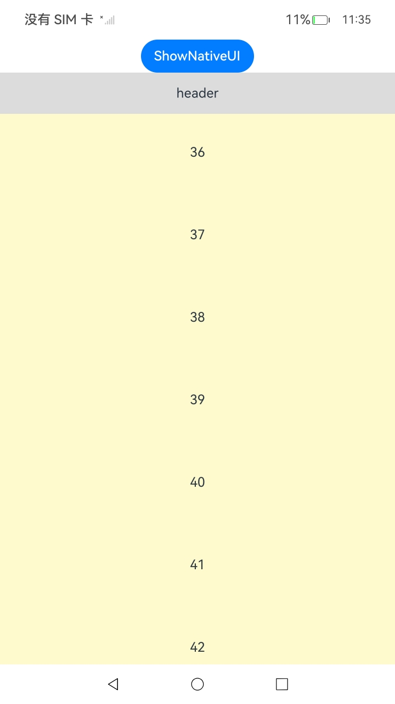

# ArkUI指南文档示例

### 介绍

ArkUI开发框架提供了列表组件，使用列表可以轻松高效地显示结构化、可滚动的信息。列表组件支持控制滚动位置、支持分组显示内容、支持使用NodeAdapter实现懒加载以提升列表创建性能。

该工程中展示的代码详细描述可查如下链接：

1. [使用列表](https://gitcode.com/openharmony/docs/blob/master/zh-cn/application-dev/ui/ndk-loading-long-list.md)。

### 效果预览

| 分组列表测试                      |
|-----------------------------|
|  |

| 懒加载列表测试                      |
|-----------------------------|
|  |

### 使用说明

1. 在首页选择对应的测试界面。

2. 在对应的测试界面点击查看页面。

### 工程目录
```
entry/
└── src
    ├── main
    │   ├── cpp
    │   │   ├── ArkUIBaseNode.h
    │   │   ├── ArkUIListItemAdapter.h
    │   │   ├── ArkUIListItemGroupNode.h
    │   │   ├── ArkUIListItemNode.h
    │   │   ├── ArkUIListNode.h
    │   │   ├── ArkUINode.h
    │   │   ├── ArkUITextNode.h
    │   │   ├── CMakeLists.txt
    │   │   ├── LazyTextListExample.h
    │   │   ├── LazyTextListExample1.h
    │   │   ├── NativeEntry.cpp
    │   │   ├── NativeEntry.h
    │   │   ├── NativeModule.h
    │   │   ├── napi_init.cpp
    │   │   └── types
    │   │       └── libentry
    │   │           ├── Index.d.ts
    │   │           └── oh-package.json5
    │   ├── ets
    │   │   ├── entryability
    │   │   │   └── EntryAbility.ets
    │   │   ├── entrybackupability
    │   │   │   └── EntryBackupAbility.ets
    │   │   └── pages
    │   │       ├── Index.ets
    │   │       └── LazyLoadingExample.ets
    │   │       └── LazyTextListExample.ets
    │   ├── module.json5
    │   ├── resources
```

### 具体实现

1. 实现懒加载适配器。源码参考：[ArkUIListItemAdapter.h](https://gitcode.com/openharmony/applications_app_samples/blob/master/code/DocsSample/ArkUISample/NativeType/NdkCreateList/entry/src/main/cpp/ArkUIListItemAdapter.h)


2. 在列表中应用懒加载适配器。源码参考：[ArkUIListNode.h](https://gitcode.com/openharmony/applications_app_samples/blob/master/code/DocsSample/ArkUISample/NativeType/NdkCreateList/entry/src/main/cpp/ArkUIListNode.h)

    * 在ArkUIListNode中添加SetLazyAdapter函数，给列表节点设置NODE_LIST_NODE_ADAPTER属性，并将NodeAdapter作为属性入参传入

    * 创建List使用懒加载的示例代码，调用List节点的SetLazyAdapter接口设置懒加载适配器

3. 使用分组列表。源码参考：[ArkUIListItemGroupNode.h](https://gitcode.com/openharmony/applications_app_samples/blob/master/code/DocsSample/ArkUISample/NativeType/NdkCreateList/entry/src/main/cpp/ArkUIListItemGroupNode.h)

    * 分组列表使用ListItemGroup组件实现，ListItemGroup支持添加header、footer设置函数，支持使用懒加载

    * List组件设置吸顶

    * List组件下使用ListItemGroup实现分组列表界面


### 相关权限

不涉及。

### 依赖

不涉及。

### 约束与限制

1. 本示例仅支持标准系统上运行, 支持设备：华为手机。

2. HarmonyOS系统：HarmonyOS 5.0.5 Release及以上。

3. DevEco Studio版本：6.0.0 Release及以上。

4. HarmonyOS SDK版本：HarmonyOS 6.0.0 Release SDK及以上。

### 下载

如需单独下载本工程，执行如下命令：

````
git init
git config core.sparsecheckout true
echo ArkUISample/NativeType/NdkCreateList > .git/info/sparse-checkout
git remote add origin https://gitcode.com/harmonyos_samples/guide-snippets.git
git pull origin master
````