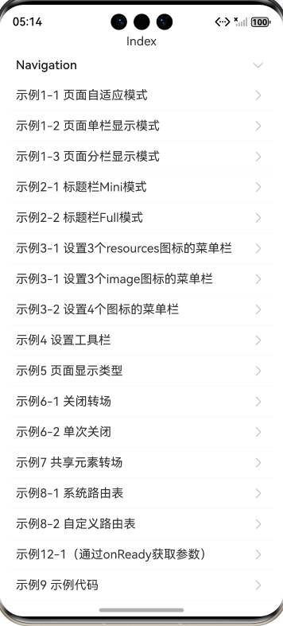

# 组件导航(Navigation) (推荐)指南文档示例

### 介绍

本示例展示了在一个Stage模型中，开发基于ArkTS UI的Navigation的应用,使用组件导航（Navigation）主要用于实现Navigation页面（NavDestination）间的跳转，支持在不同Navigation页面间传递参数，提供灵活的跳转栈操作，从而更便捷地实现对不同页面的访问和复用，具体可参考[组件导航(Navigation) (推荐)指南文档示例](https://gitcode.com/openharmony/docs/blob/master/zh-cn/application-dev/ui/arkts-navigation-navigation.md)。
### 效果预览

| 首页                                 |
|------------------------------------|
|  |

### 使用说明

1. 在主界面，可以点击对应卡片，选择需要参考的组件示例。

2. 在组件目录选择详细的示例参考。

3. 进入示例界面，查看参考示例。

4. 通过自动测试框架可进行测试及维护。

### 工程目录
```
entry/src/main/ets/
|---entryability
|---pages
|   |---navigation                      // Navigation
|   |   |---template1
|   |   |   |---image
|   |   |   |---CustomRoutingTable.ets
|   |   |   |---GeometryTransition.ets
|   |   |   |---MenusFour.ets
|   |   |   |---MenusThreeImage.ets
|   |   |   |---MenusThreeResource.ets
|   |   |   |---NavigationExample.ets
|   |   |   |---NavigationExampleOne.ets
|   |   |   |---NavigationExampleTwo.ets
|   |   |   |---PageDisplayModeAuto.ets
|   |   |   |---PageDisplayModeSplit.ets
|   |   |   |---PageDisplayModeStack.ets
|   |   |   |---PageDisplayType.ets
|   |   |   |---PageOnceClose.ets
|   |   |   |---PageOne.ets
|   |   |   |---TitleModeFull.ets
|   |   |   |---TitleModeMini.ets
|   |   |   |---ToolBar.ets
|   |   |---template2
|   |   |   |---Index.ets    
|   |   |   |---PageOne.ets    
|   |   |   |---PageTwo.ets      
|   |   |---template4
|   |   |   |---Index.ets    
|   |   |   |---PageOne.ets    
|   |   |   |---PageTwo.ets      
|   |   |---template7
|   |   |   |---PageOne.ets    
|   |   |   |---PageTwo.ets      
|   |---observer              // 监听
|   |   |---template1
|   |   |   |---Index.ets
|   |   |---template2
|   |   |   |---Index.ets
|   |   |---template3
|   |   |   |---Index.ets
|---pages
|   |---Index.ets                       // 应用主页面
entry/src/ohosTest/
|---ets
|   |---test
|   |   |---Navigation.test.ets                         // Navigation示例代码测试代码
|   |   |---UiObserver.test.ets                    // 无感监听示例代码测试代码
```

### 具体实现
* Navigation主要用于实现父页面，NavDestination实现子页面；
* Navigation的显示模式、路由操作、子页面管理、跨包跳转以及跳转动效；
* 支持在不同Navigation页面间传递参数，提供灵活的跳转栈操作;

### 相关权限

不涉及。

### 依赖

不涉及。

### 约束与限制

1. 本示例仅支持标准系统上运行, 支持设备：华为手机。

2. HarmonyOS系统：HarmonyOS 5.0.5 Release及以上。

3. DevEco Studio版本：6.0.0 Release及以上。

4. HarmonyOS SDK版本：HarmonyOS 6.0.0 Release SDK及以上。

### 下载

如需单独下载本工程，执行如下命令：

````
git init
git config core.sparsecheckout true
echo ArkUISample/NavigationSample > .git/info/sparse-checkout
git remote add origin https://gitcode.com/harmonyos_samples/guide-snippets.git
git pull origin master
````