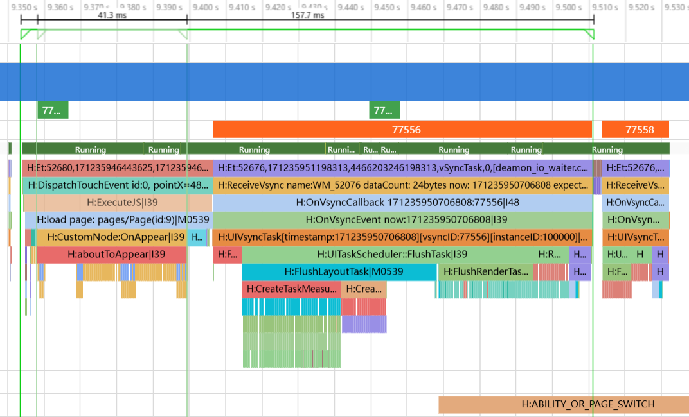
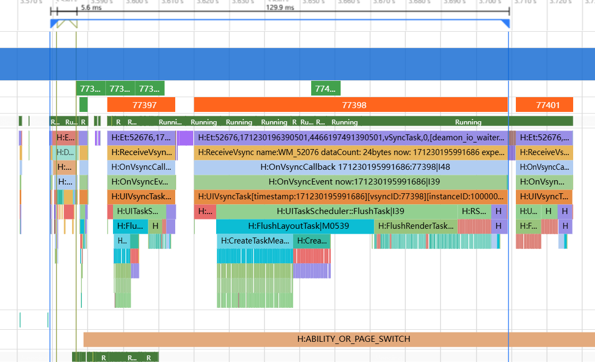

# 使用NDK多线程创建UI组件

### 介绍

本示例介绍如何使用多线程Native接口在非UI线程创建UI组件，从而优化组件创建耗时和响应时延。

### 效果图预览


**使用说明**

1. 点击CreatePageOnMultiThread按钮，多线程创建UI页面；
2. 点击CreatePageOnUIThread按钮，在UI线程创建UI页面作为对比。

### 实现思路

点击CreatePageOnMultiThread按钮，跳转到多线程创建的UI页面，页面内的UI组件在多线程并行创建。

1. CAPIComponent自定义组件用于挂载通过Native接口创建的组件树。源码参考[Page.ets](./entry/src/main/ets/pages/Page.ets)，根据isOnUIThread的状态分别调用CreateNodeTreeOnUIThread在UI线程创建组件和CreateNodeTreeOnMultiThread在多线程创建组件。

```ts
import { NodeContent, router } from '@kit.ArkUI';
import entry from 'libentry.so';

@Component
struct CAPIComponent {
  private rootSlot = new NodeContent();
  @State isOnUIThread: boolean = false;

  aboutToAppear(): void {
    if (this.isOnUIThread) {
      // 调用Native接口在UI线程创建组件。
      entry.CreateNodeTreeOnUIThread(this.rootSlot, this.getUIContext());
    } else {
      // 调用Native接口多线程创建组件。
      entry.CreateNodeTreeOnMultiThread(this.rootSlot, this.getUIContext());
    }
  }

  aboutToDisappear(): void {
    // 释放已创建的Native组件。
    entry.DisposeNodeTree(this.rootSlot);
  }

  build() {
    Column() {
      // Native组件树挂载点。
      ContentSlot(this.rootSlot)
    }
    .width('100%')
  }
}
```

2. CreateNodeTreeOnMultiThread是对ArkTs侧暴露的native接口，此接口负责多线程创建UI组件。示例中把页面中的每个卡片拆分为一个子任务，调用OH_ArkUI_PostAsyncUITask接口在非UI线程创建卡片对应的UI组件树。源码参考[NodeCreator.cpp](./entry/src/main/cpp/node/NodeCreator.cpp)

```cpp
napi_value CreateNodeTreeOnMultiThread(napi_env env, napi_callback_info info) {
    size_t argc = 2;
    napi_value args[2] = { nullptr, nullptr };
    napi_get_cb_info(env, info, &argc, args, nullptr, nullptr);

    // 获取ArkTs侧组件挂载点。
    ArkUI_NodeContentHandle contentHandle;
    int32_t result = OH_ArkUI_GetNodeContentFromNapiValue(env, args[0], &contentHandle);
    if (result != ARKUI_ERROR_CODE_NO_ERROR) {
        OH_LOG_ERROR(LOG_APP, "OH_ArkUI_GetNodeContentFromNapiValue Failed %{public}d", result);
        return nullptr;
    }

    // 获取上下文对象指针。
    ArkUI_ContextHandle contextHandle;
    result = OH_ArkUI_GetContextFromNapiValue(env, args[1], &contextHandle);
    if (result != ARKUI_ERROR_CODE_NO_ERROR) {
        OH_LOG_ERROR(LOG_APP, "OH_ArkUI_GetContextFromNapiValue Failed %{public}d", result);
        delete contextHandle;
        return nullptr;
    }
    
    // 创建native侧组件树根节点。
    auto scrollNode = std::make_shared<ArkUIScrollNode>();
    scrollNode->SetScrollBarDisplayMode(ARKUI_SCROLL_BAR_DISPLAY_MODE_OFF);

    // 将native侧组件树根节点挂载到UI主树上。
    result = OH_ArkUI_NodeContent_AddNode(contentHandle, scrollNode->GetHandle());
    if (result != ARKUI_ERROR_CODE_NO_ERROR) {
        OH_LOG_ERROR(LOG_APP, "OH_ArkUI_NodeContent_AddNode Failed %{public}d", result);
        delete contextHandle;
        return nullptr;
    }
    // 保存native侧组件树。
    g_nodeMap[contentHandle] = scrollNode;
    
    auto columnNode = std::make_shared<ArkUIColumnNode>();
    scrollNode->AddChild(columnNode);
    
    for (int32_t i=0;i<g_cardTypeInfos.size();i++) {
        // UI线程创建子树根节点，保证scroll的子节点顺序。
        auto columnItem = std::make_shared<ArkUIColumnNode>();
        columnItem->SetMargin(NODE_MARGIN, 0, NODE_MARGIN, 0);
        columnNode->AddChild(columnItem);
        AsyncData* asyncData = new AsyncData();
        asyncData->parent = columnItem;
        asyncData->cardInfo = g_cardTypeInfos[i];
        // 在非UI线程创建组件树，创建完成后回到主线程挂载到UI主树上。
        result = OH_ArkUI_PostAsyncUITask(contextHandle, asyncData, CreateCardNodeTree, MountNodeTree);
        if (result != ARKUI_ERROR_CODE_NO_ERROR) {
            OH_LOG_ERROR(LOG_APP, "OH_ArkUI_PostAsyncUITask Failed %{public}d", result);
            delete asyncData;
        }
    }
    delete contextHandle;
    return nullptr;
}
```

3. CreateCardNodeTree会在非UI线程被调用，根据卡片类型创建对应的UI组件树并设置属性。源码参考[NodeCreator.cpp](./entry/src/main/cpp/node/NodeCreator.cpp)

```cpp
void CreateCardNodeTree(void *asyncUITaskData) {
    auto asyncData = static_cast<AsyncData*>(asyncUITaskData);
    if (!asyncData) {
        return;
    }
    
    if (asyncData->cardInfo.type == "App") {
        AppCardInfo info = asyncData->cardInfo.appCardInfo;
        asyncData->child = CreateAppCard(info);
    } else if (asyncData->cardInfo.type == "Service") {
        ServiceCardInfo info = asyncData->cardInfo.serviceCardInfo;
        asyncData->child = CreateServiceCard(info);
    }
}
```

4. CreateCardNodeTree执行完成后，MountNodeTree会在UI线程被调用，将子线程创建好的UI组件树挂载到UI主树上，使其可以在页面上显示出来。源码参考[NodeCreator.cpp](./entry/src/main/cpp/node/NodeCreator.cpp)

```cpp
void MountNodeTree(void *asyncUITaskData) {
    auto asyncData = static_cast<AsyncData*>(asyncUITaskData);
    if (!asyncData) {
        return;
    }
    auto parent = asyncData->parent;
    auto child = asyncData->child;
    // 把组件树挂载到UI主树上。
    parent->AddChild(child);
    delete asyncData;
}
```

### 性能对比

本示例使用了多线程native接口在非UI线程创建UI组件，减少了UI线程组件创建布局耗时，优化了页面跳转响应时延。

参考[使用SmartPerf-Host分析应用性能](https://docs.openharmony.cn/pages/v5.1/zh-cn/application-dev/performance/performance-optimization-using-smartperf-host.md)文档，抓取trace对比分别使用UI线程和多线程创建组件时的性能。

- 使用UI线程创建UI组件



- 使用多线程创建UI组件



trace中aboutToAppear段的耗时为UI线程组件创建的耗时。
从DispatchTouchEvent开始下一帧到OnVsyncEvent结束的耗时为UI线程组件创建布局的耗时。基于上述分析生成如下性能对比表格。

|  | UI线程创建 | 多线程创建 | 优化比例 |
| -------- | -------- | -------- | -------- |
| UI线程组件创建耗时 | 41.3ms | 5.6ms | 86.4% |
| UI线程组件创建布局耗时 | 157.7ms | 129.9ms | 17.5% |
| 响应时延 | 216.4ms | 56.2ms | 74.0% |

### 工程结构&模块类型  

    ```
    |entry/src/main/cpp                  
    |   |---card
    |   |   |---CardCreator.cpp                         // UI卡片创建器实现类         
    |   |   |---CardCreator.h                           // UI卡片创建器声明           
    |   |---common                  
    |   |   |---ArkUIBaseNode.h                         // NativeNode封装类，实现组件树操作
    |   |   |---ArkUINode.h                             // 派生ArkUIBaseNode类，实现属性设置操作
    |   |   |---NativeModule.h                          // native接口集合获取类
    |   |---data                                    
    |   |   |---MockData.h                              // 定义UI卡片内容数据
    |   |---node                         
    |   |   |---NodeCreator.cpp                         // UI组件树创建器实现
    |   |   |---NodeCreator.h                           // UI组件树创建器声明
    |   |   |---TypedArkUINode.h                        // 不同类型UI组件封装类
    |entry/src/main/ets                  
    |   |---entryablity
    |   |   |---EntryAbility.ts                         // 程序入口类             
    |   |---pages                                 
    |   |   |---Index.ets                               // 首页
    |   |   |---Page.ets                                // native组件页面
    ```

### 参考资料

[接入ArkTS页面](https://docs.openharmony.cn/pages/v5.0/zh-cn/application-dev/ui/ndk-access-the-arkts-page.md)

[使用SmartPerf-Host分析应用性能](https://docs.openharmony.cn/pages/v5.1/zh-cn/application-dev/performance/performance-optimization-using-smartperf-host.md)

### 相关权限

不涉及。

### 依赖

不涉及。

### 约束与限制

1. 本示例仅支持标准系统上运行，支持设备：华为手机。
2. 本示例支持API22版本SDK，SDK版本号HarmonyOS 6.0.2(22)。
3. 本示例需要使用DevEco Studio 6.0.2 Release才可编译运行。

### 下载

如需单独下载本工程，执行如下命令：

````
git init
git config core.sparsecheckout true
echo ArkUISample/NdkBuildOnMultiThread > .git/info/sparse-checkout
git remote add origin https://gitcode.com/harmonyos_samples/guide-snippets.git
git pull origin master
````