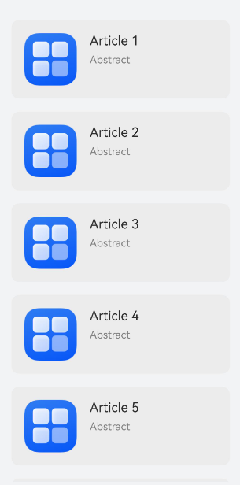
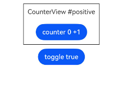
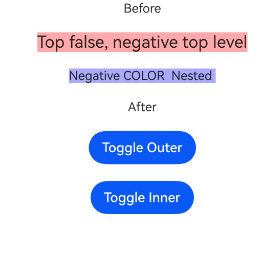
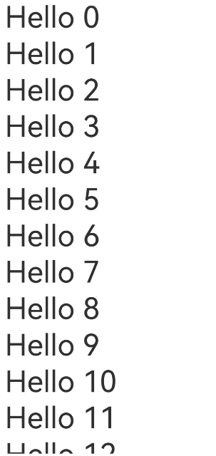
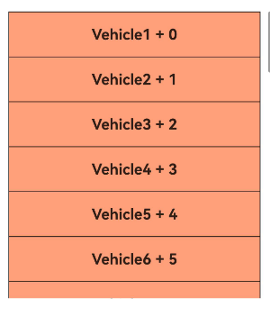
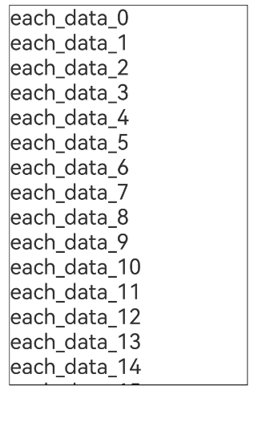
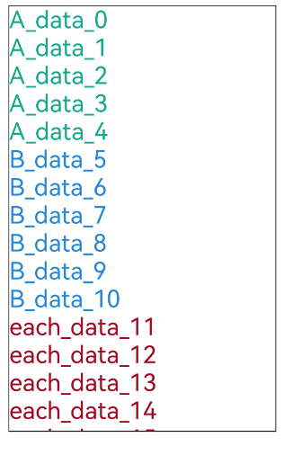
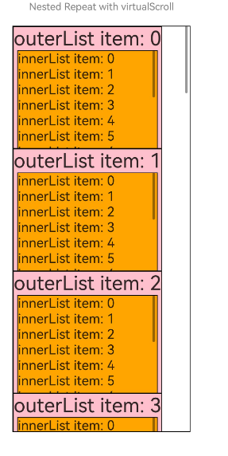

# ArkUI渲染控制指南文档示例

### 介绍

本示例通过使用[ArkUI指南文档](https://gitcode.com/openharmony/docs/tree/master/zh-cn/application-dev/ui)中各场景的开发示例，展示在工程中，帮助开发者更好地理解ArkUI提供的组件及组件属性并合理使用。该工程中展示的代码详细描述可查如下链接：

1. [if/else：条件渲染](https://gitcode.com/openharmony/docs/blob/master/zh-cn/application-dev/ui/rendering-control/arkts-rendering-control-ifelse.md)。
2. [ForEach：循环渲染](https://gitcode.com/openharmony/docs/blob/master/zh-cn/application-dev/ui/rendering-control/arkts-rendering-control-foreach.md)。
3. [Repeat：可复用的循环渲染](https://gitcode.com/openharmony/docs/blob/master/zh-cn/application-dev/ui/rendering-control/arkts-new-rendering-control-repeat.md)。
3. [LazyForEach：数据懒加载](https://gitcode.com/openharmony/docs/blob/master/zh-cn/application-dev/ui/rendering-control/arkts-rendering-control-lazyforeach.md)。

### 效果预览

| Foreach正常渲染运行效果图                                 | 数据源数组项变化案例运行效果图                                    | 骨架屏运行效果图                                            |
| ------------------------------------ | --------------------------------------------- | --------------------------------------------------- |
|  |  |  |

| ifelse语句和子组件状态效果图                                 | 嵌套if语句效果图                                    |
| ------------------------------------ | --------------------------------------------- |
|  |  |

| LazyForeach正常渲染效果图                                 |
| ------------------------------------ |
|  |

| totalCount值大于数据源长度效果                                 | 简单的循环渲染效果                                    | 多个渲染模板效果                                            | Repeat嵌套效果                                            |
| ------------------------------------ | --------------------------------------------- | --------------------------------------------------- | --------------------------------------------------- |
|  |  |  |  |

### 具体实现

1. ArkUI通过自定义组件的build()函数和@Builder装饰器中的声明式UI描述语句构建相应的UI。在声明式描述语句中开发者除了使用系统组件外，还可以使用渲染控制语句来辅助UI的构建，这些渲染控制语句包括控制组件是否显示的条件渲染语句，基于数组数据快速生成组件的循环渲染语句，针对大数据量场景的数据懒加载语句，针对混合模式开发的组件渲染语句。

2. ArkTS提供了渲染控制能力。条件渲染可根据应用状态，使用if、else和else if渲染相应的UI内容。当if、else if后跟随的状态判断中使用的状态变量值变化时，条件渲染语句会进行更新。

3. ForEach接口基于数组循环渲染，需要与容器组件配合使用，且接口返回的组件应当是允许包含在ForEach父容器组件中的子组件。例如，ListItem组件要求ForEach的父容器组件必须为List组件。

4. LazyForEach为开发者提供了基于数据源渲染出一系列子组件的能力。具体而言，LazyForEach从数据源中按需迭代数据，并在每次迭代时创建相应组件。当在滚动容器中使用了LazyForEach，框架会根据滚动容器可视区域按需创建组件，当组件滑出可视区域外时，框架会销毁并回收组件以降低内存占用。

5. Repeat基于数组类型数据来进行循环渲染，一般与容器组件配合使用。Repeat根据容器组件的有效加载范围（屏幕可视区域+预加载区域）加载子组件。当容器滑动/数组改变时，Repeat会根据父容器组件的布局过程重新计算有效加载范围，并管理列表子组件节点的创建与销毁。

### 使用说明

1. 在主界面，可以点击对应页面，选择需要参考的组件示例。

2. 在组件目录选择详细的示例参考。

3. 进入示例界面，查看参考示例。

4. 通过自动测试框架可进行测试及维护。

### 工程目录
```
entry/src/main/ets/
├── common
│   └── Resource.ets
├── entryability
│   └── EntryAbility.ets
├── entrybackupability
│   └── EntryBackupAbility.ets
└── pages
    ├── Index.ets
    ├── RenderingForeach
    │   ├── AbnormalExample.ets
    │   ├── ArticleListView.ets
    │   ├── ArticleListView2.ets
    │   ├── ArticleListView3.ets
    │   ├── ArticleSkeletonView.ets
    │   ├── BadPerformance.ets
    │   ├── CrashNormalExample.ets
    │   ├── ForEach1.ets
    │   ├── ForEach2.ets
    │   ├── ForEach3.ets
    │   ├── ForEachSort.ets
    │   └── NonNecessaryMem.ets
    ├── RenderingIf
    │   ├── IfElseRendering.ets
    │   ├── IfRendering.ets
    │   ├── KeepCounter.ets
    │   └── NestedIf.ets
    ├── RenderingLazyForeach
    │   ├── AddingData.ets
    │   ├── ChangingDataSubproperties.ets
    │   ├── ComponentRerenderingFailure.ets
    │   ├── DataDeletion.ets
    │   ├── DragandDropSorting.ets
    │   ├── ImageFlickeringDuringRerenders.ets
    │   ├── InitialRendering.ets
    │   ├── InitialRendering2.ets
    │   ├── LazyLoadingFailure.ets
    │   ├── ModifyingIndividualDataItems.ets
    │   ├── ModifyingMultipleDataItems.ets
    │   ├── ObservingComponentInternalState.ets
    │   ├── ObservingNestedClassProperties.ets
    │   ├── PreciselyModifyingData.ets
    │   ├── PreciselyModifyingData2.ets
    │   ├── ReceivingExternalInput.ets
    │   ├── ScreenFlickeringInList.ets
    │   ├── SwappingData.ets
    │   ├── UINotRerenderedWhenObjectLinkIsChanged.ets
    │   └── UnexpectedRenderingResults.ets
    ├── RenderingRepeat
    │   ├── DemoGrid.ets
    │   ├── DemoList.ets
    │   ├── DemoSwiper.ets
    │   ├── EntryCompSucc.ets
    │   ├── NestedRepeat.ets
    │   ├── NodeUpdateMechanism.ets
    │   ├── PreInsert.ets
    │   ├── RepeatBuilderPage.ets
    │   ├── RepeatExample.ets
    │   ├── RepeatExample2.ets
    │   ├── RepeatLazyLoading1.ets
    │   ├── RepeatLazyLoading2.ets
    │   ├── RepeatLazyLoading3.ets
    │   ├── RepeatTemplateSingle.ets
    │   ├── RepeatTemplateSingle1.ets
    │   ├── RepeatVirtualScroll2T.ets
    │   └── RepeatVirtualScrollOnMove.ets
    └── common
        └── Index.ets
entry/src/ohosTest/
├── ets
│   └── test
│       ├── Ability.test.ets
│       ├── Index.test.ets
│       └── List.test.ets
└── module.json5
```

### 相关权限

不涉及。

### 依赖

不涉及。

### 约束与限制

1. 本示例仅支持标准系统上运行, 支持设备：华为手机。

2. HarmonyOS系统：HarmonyOS 5.0.5 Release及以上。

3. DevEco Studio版本：6.0.0 Release及以上。

4. HarmonyOS SDK版本：HarmonyOS 6.0.0 Release SDK及以上。

### 下载

如需单独下载本工程，执行如下命令：

````
git init
git config core.sparsecheckout true
echo ArkUISample/RenderingControl > .git/info/sparse-checkout
git remote add origin https://gitcode.com/harmonyos_samples/guide-snippets.git
git pull origin master
````