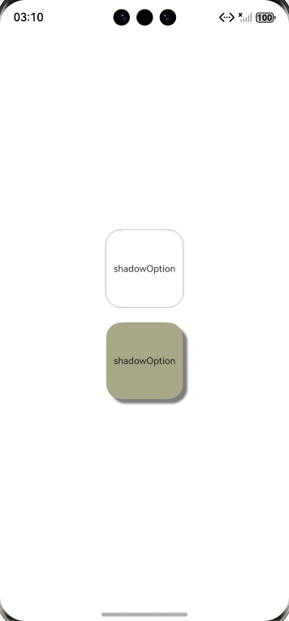

# 阴影指南文档示例

### 介绍

本示例通过使用[ArkUI指南文档](https://gitcode.com/openharmony/docs/tree/master/zh-cn/application-dev/ui)中各场景的开发示例，展示在工程中，帮助开发者更好地理解ArkUI提供的组件及组件属性并合理使用。该工程中展示的代码详细描述可查如下链接：

1. [阴影](https://gitcode.com/openharmony/docs/blob/master/zh-cn/application-dev/ui/arkts-shadow-effect.md)。

### 效果预览

| 当前组件添加阴影效果                   | 
| ------------------------------------ |
|  |

### 使用说明

1. 在主界面，可以点击对应页面，选择需要参考的组件示例。

2. 在组件目录选择详细的示例参考。

3. 进入示例界面，查看参考示例。

4. 通过自动测试框架可进行测试及维护。

### 工程目录
```
entry/src/main/ets/
├── common
│   └── resource.ets
├── entryability
│   └── EntryAbility.ets
├── entrybackupability
│   └── EntryBackupAbility.ets
└── pages
    ├── Shadow.ets                                 // 阴影效果
    └── Index.ets                                  // 页面入口
entry/src/ohosTest/
├── ets
│   └── test
│       ├── Ability.test.ets
│       ├── Index.test.ets                         // 测试用例代码
│       └── List.test.ets
└── module.json5
```

### 具体实现
1. 创建入口组件：使用@Entry装饰器标记的组件是页面的入口组件，也是页面渲染的根节点。

2. 构建组件结构：使用Row和Column构建布局，确保内容在垂直和水平方向上居中。

3. 创建第一个阴影示例：
    创建一个Column组件，设置宽度为100，宽高比为1（即正方形），外边距为10，背景色为白色，圆角为20。
    在Column中添加一个文本组件，设置字体大小为12。
    使用shadow方法添加阴影效果，设置阴影模糊半径为10，阴影颜色为灰色。

4. 创建第二个阴影示例：
    同样创建一个Column组件，设置相同的宽度、宽高比、外边距和圆角，背景色为十六进制颜色#a8a888。
    添加文本组件，设置字体大小为12。
    使用shadow方法添加阴影效果，设置阴影模糊半径为10，阴影颜色为灰色，同时设置X轴和Y轴的偏移量为20。

5. 调整布局：确保两个示例在父容器中居中显示，父容器宽度和高度均为100%。

### 相关权限

不涉及。

### 依赖

不涉及。

### 约束与限制

1. 本示例仅支持标准系统上运行, 支持设备：华为手机。

2. HarmonyOS系统：HarmonyOS 5.0.5 Release及以上。

3. DevEco Studio版本：6.0.0 Release及以上。

4. HarmonyOS SDK版本：HarmonyOS 6.0.0 Release SDK及以上。

### 下载

如需单独下载本工程，执行如下命令：

````
git init
git config core.sparsecheckout true
echo ArkUISample/Shadow > .git/info/sparse-checkout
git remote add origin https://gitcode.com/harmonyos_samples/guide-snippets.git
git pull origin master
````