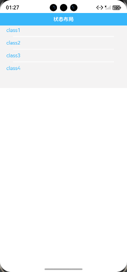
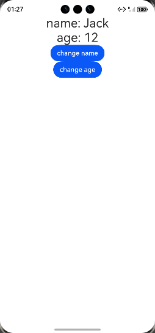

# @Track装饰器：class对象属性级更新

### 介绍

stateTrack
本示例通过使用[ArkUI指南文档](https://gitcode.com/openharmony/docs/tree/master/zh-cn/application-dev/ui)
中各场景的开发示例，展示在工程中，帮助开发者更好地理解@Track装饰器：class对象属性并合理使用。该工程中展示的代码详细描述可查如下链接：

1. [class属性级更新说明](https://gitcode.com/openharmony/docs/blob/master/zh-cn/application-dev/ui/state-management/arkts-track.md)

###  [class属性级更新说明]

### 效果预览

| 首页                                 | stateTrack示例             
|------------------------------------|------------------------------------|
|  |  |

### 使用说明

1. 在主界面，可以点击对应卡片，选择需要参考件示例。

2. 在组件目录选择详细的示例参考。

3. 进入示例界面，查看参考示例。

4. 通过自动测试框架可进行测试及维护。

### 工程目录

```
entry/src/main/ets/
|---entryability
|---pages
|   |---stateTrack                  //状态管理合理使用
|   |       |---StateTrackClass.ets
|   |       |---StateTrackClass2.ets
|   |       |---StateTrackClass3.ets
|---pages
|   |---Index.ets                       // 应用主页面
entry/src/ohosTest/
|---ets
|   |---StateTrackClass.test.ets           // 状态管理合理使用示例代码测试代码
```

### 具体实现

实现状态管理合理使用，以下是详细实现过程：
1、当点击Button('change name')时，即使只修改了info.name，观察日志发现两个Text组件仍会重新渲染
2、点击Button('change age')，也会触发Text(`name: ${this.info.name}`)的刷新

### 相关权限

不涉及。

### 依赖

不涉及。

### 约束与限制

1.本示例仅支持标准系统上运行, 支持设备：华为手机。

2.本示例为Stage模型，支持API21版本SDK，版本号：6.0.0.254，镜像版本号：OpenHarmony_6.0.2.57。

3.本示例需要使用DevEco Studio NEXT Developer Preview2 (Build Version: 6.0.5.306， built on December 12, 2024)及以上版本才可编译运行。

### 下载

如需单独下载本工程，执行如下命令：

````
git init
git config core.sparsecheckout true
echo ArkUISample/StateTrack > .git/info/sparse-checkout
git remote add origin https://gitcode.com/harmonyos_samples/guide-snippets.git
git pull origin master
````