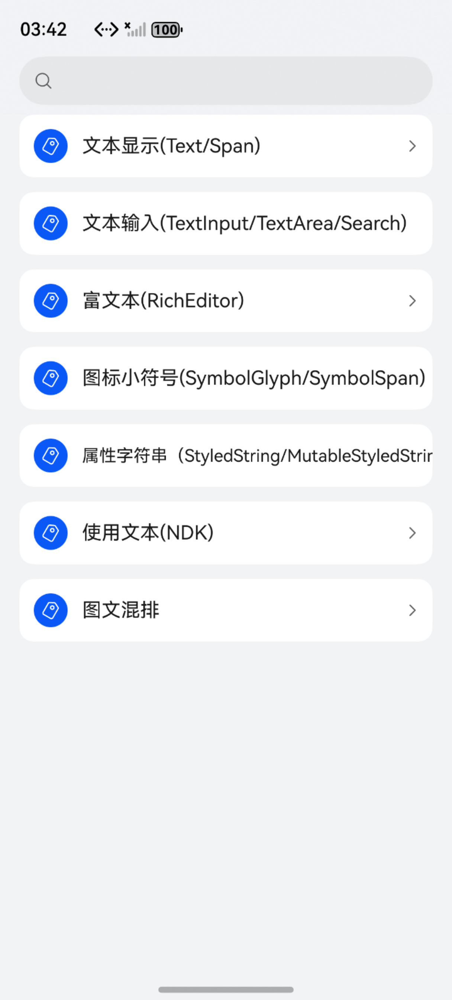
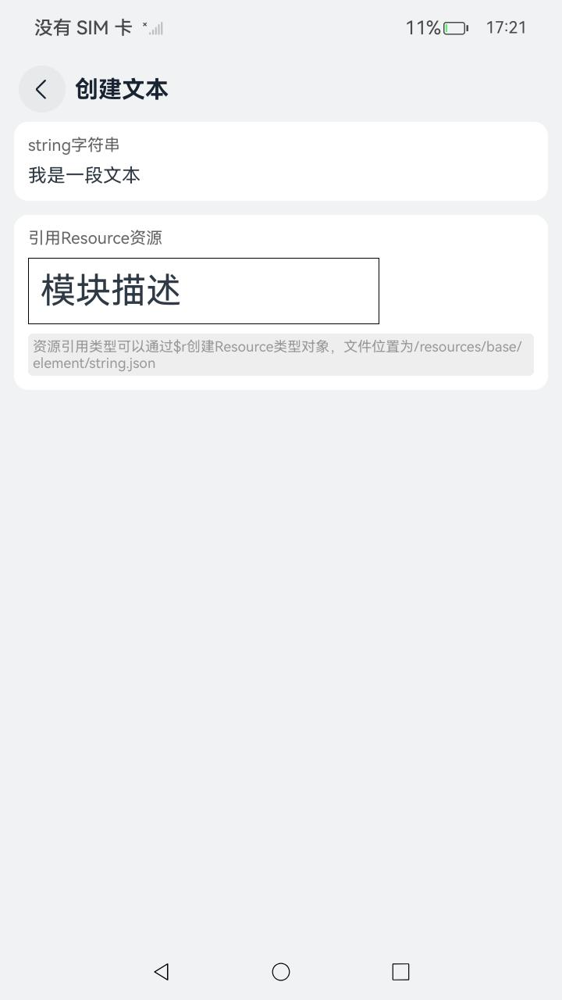

# ArkUI使用文本控件指南文档示例

### 介绍

在工程中包含各场景的开发示例，可帮助开发者更好地理解ArkUI提供的组件及组件属性并合理使用。该工程中展示的代码详细描述可查如下链接：
本示例通过使用[ArkUI指南文档](https://gitcode.com/openharmony/docs/blob/master/zh-cn/application-dev/ui)中各场景的开发示例，展示在工程中，帮助开发者更好地理解ArkUI提供的组件及组件属性并合理使用。该工程中展示的代码详细描述可查如下链接：

1. [文本显示 (Text/Span)](https://gitCode.com/openharmony/docs/blob/master/zh-cn/application-dev/ui/arkts-common-components-text-display.md)。
2. [文本输入 (TextInput/TextArea/Search)](https://gitCode.com/openharmony/docs/blob/master/zh-cn/application-dev/ui/arkts-common-components-text-input.md)。
3. [富文本 (RichEditor)](https://gitCode.com/openharmony/docs/blob/master/zh-cn/application-dev/ui/arkts-common-components-richeditor.md)。
4. [图标小符号 (SymbolGlyph/SymbolSpan)](https://gitCode.com/openharmony/docs/blob/master/zh-cn/application-dev/ui/arkts-common-components-symbol.md)。
5. [属性字符串 (StyledString/MutableStyledString)](https://gitCode.com/openharmony/docs/blob/master/zh-cn/application-dev/ui/arkts-styled-string.md)。
6. [Text组件的文本绘制与显示](https://gitCode.com/openharmony/docs/blob/master/zh-cn/application-dev/ui/ndk-styled-string.md)。
7. [监听输入框事件](https://gitCode.com/openharmony/docs/blob/master/zh-cn/application-dev/ui/ndk-textarea-event.md)。
8. [图文混排](https://gitcode.com/openharmony/docs/blob/master/zh-cn/application-dev/ui/arkts-text-image-layout.md)。

### 效果预览

| 首页                                 | 文本显示组件目录                            | 创建文本示例                              |
|------------------------------------|-------------------------------------|-------------------------------------|
|  |  |  |

### 使用说明

1. 在主界面，可以点击对应卡片，选择需要参考的组件示例。

2. 在组件目录选择详细的示例参考。

3. 进入示例界面，查看参考示例。

4. 通过自动测试框架可进行测试及维护。

### 工程目录

```
entry/src/main/ets/
|---entryability
|---pages
|   |---ndk                                          // ndk接口使用文本
|   |       |---index.ets
|   |       |---TextDrawingDisplay.ets
|   |       |---ListenTextBoxEvents.ets
|   |---propertyString                               // 属性字符串
|   |       |---CreateApply.ets
|   |       |---index.ets
|   |       |---StyledStringBaselineOffsetStyle.ets  //创建及应用文本基线偏移量对象（BaselineOffsetStyle）示例
|   |       |---StyledStringConvertedToParagraph.ets //支持将属性字符串转换成Paragraph示例
|   |       |---StyledStringDecorationStyle.ets      //创建及应用文本装饰线对象（DecorationStyle）示例
|   |       |---StyledStringGestureStyle.ets
|   |       |---StyledStringHtml.ets
|   |       |---StyledStringHtmlOne.ets              //格式转换场景二示例
|   |       |---StyledStringImageAttachment.ets
|   |       |---StyledStringLetterSpacingStyle.ets   //创建及应用文本字符间距对象（LetterSpacingStyle）示例
|   |       |---StyledStringLineHeightStyle.ets      //创建及应用文本行高对象（LineHeightStyle）示例
|   |       |---StyledStringParagraphStyle.ets
|   |       |---StyledStringParagraphStyleOne.ets    //设置段落样式方法一示例
|   |       |---StyledStringReplaceParagraphStyle.ets  //设置段落样式方法二示例
|   |       |---StyledStringSceneExample.ets
|   |       |---StyledStringStyle.ets
|   |       |---StyledStringTextShadowStyle.ets      //创建及应用文本阴影对象（TextShadowStyle）示例
|   |       |---StyledStringTextStyle.ets            //创建及应用文本字体样式对象（TextStyle）示例
|   |---richEditor                                   // 富文本
|   |       |---AddBuilderDecoratorContent.ets
|   |       |---AddEvent.ets
|   |       |---AddImageContent.ets
|   |       |---AddSymbolSpanContent.ets
|   |       |---AddTextContent.ets
|   |       |---BackplaneHighlighting.ets
|   |       |---CreateRichEditor.ets
|   |       |---DisableMenuItem.ets
|   |       |---DisableSystemServiceMenu.ets
|   |       |---GetGraphicInfoInComponent.ets
|   |       |---index.ets
|   |       |---SetAttributes.ets
|   |       |---SetUserPresetTextStyles.ets
|   |---symbol                                       // 图标小符号
|   |       |---CreatSymbolGlyph.ets
|   |       |---index.ets
|   |       |---SymbolAddEvent.ets
|   |       |---SymbolAddToText.ets
|   |       |---SymbolCustomIconAnimation.ets
|   |       |---SymbolSceneExample.ets
|   |       |---SymbolShadowAndColor.ets
|   |---text                                         // 文本显示     
|   |       |---AIMenu.ets
|   |       |---BindSelectionMenu.ets
|   |       |---ContentTransition.ets
|   |       |---CreatText.ets
|   |       |---CustomTextStyle.ets
|   |       |---DisableMenuItems.ets
|   |       |---EnableAutoSpacing.ets
|   |       |---GeneralEvents.ets
|   |       |---HeightAdaptivePolicy.ets
|   |       |---index.ets
|   |       |---LengthMetric.ets
|   |       |---LineSpacing.ets
|   |       |---PrepareMenu.ets
|   |       |---SelectionChange.ets
|   |       |---SelectMenu.ets
|   |       |---ServiceMenuItems.ets
|   |       |---ShaderStyle.ets
|   |       |---TextAddEvent.ets
|   |       |---TextHotSearch.ets
|   |       |---TextLayout.ets
|   |       |---TextSpan.ets
|   |---textImageMixedLayout                       // 图文混排
|   |       |---index.ets
|   |       |---TextImageAttribute.ets
|   |       |---TextImageComponent.ets
|   |       |---TextSpanOnHover.ets
|   |       |---WordBreakd.ets
|   |---testInput                                    // 文本输入
|   |       |---ProhibitSelectMenu
|   |       |   |---DisableMenuItems.ets
|   |       |   |---DisableSystemServiceMenuItems.ets
|   |       |   |---index.ets
|   |       |---AutoFill.ets
|   |       |---CreatTextInput.ets
|   |       |---CursorAvoidance.ets
|   |       |---CustomTextInputStyle.ets
|   |       |---index.ets
|   |       |---KeyboardAvoidance.ets
|   |       |---SelectMenu.ets
|   |       |---SetProperty.ets
|   |       |---SetTextInputType.ets
|   |       |---SetTextMargin.ets
|   |       |---TextInputAddEvent.ets
|---pages
|   |---Index.ets                                    // 应用主页面
entry/src/ohosTest/
|---ets
|   |---index.test.ets                               // 示例代码测试代码
```

## 具体实现
1. 文本显示 (Text/Span)，源码参考[text](entry/src/main/ets/pages/text)
   * 点击事件：Span('点击查看').onClick(() => { router.pushUrl(...) })，实现文本点击跳转。
   * 复制功能：Text('验证码：123456').copyOption(CopyOptions.InApp)，允许用户长按文本复制内容（CopyOptions.InApp表示仅应用内可复制）。
   * 文本选择：Text('可选择文本').textSelectable(true)，支持用户长按选择部分文本（配合自定义选择菜单可扩展功能）。
   * 悬浮反馈：Span('hover效果').onHover((isHover) => { this.isHover = isHover; })，根据悬浮状态动态修改样式（如变色、加粗）。
   * 字体大小自适应：同时设置minFontSize(12)、maxFontSize(20)+maxLines(1)+width(200)，文本会根据容器宽度自动调整字号（确保在 1 行内显示完整）。
   * 截断不处理：设置textOverflow({ overflow: TextOverflow.None })+maxLines(1)，超出容器的文本直接截断（仅显示可见部分）。
   * 显示省略号：textOverflow({ overflow: TextOverflow.Ellipsis })+maxLines(1)，超出部分用 “...” 表示（适合标题、短描述）。
   * 跑马灯滚动：文本自动横向滚动显示完整内容，可通过.marqueeOptions({ loop: -1, step: 5 })配置循环次数（-1 为无限循环）、滚动速度等。
   * 多行限制：设置maxLines(2)（最多 2 行），配合textOverflow，实现多行文本溢出处理（如 “...” 显示在最后一行末尾）。
   * 为每个Span配置独立样式：通过.fontStyle(FontStyle.Italic)（斜体）、.decoration({ type: TextDecorationType.Underline })（下划线）等区分文本。
2. 文本输入 (TextInput/TextArea/Search)，源码参考[textInput](entry/src/main/ets/pages/textInput)
   * 实现不同用途不同类型的输入框，如：基本输入模式、密码模式、邮箱地址输入模式等。
   * 实现不同样式的输入框，分别是默认风格和内联模式，或者自定义样式。
3. 富文本(RichEditor)/禁用系统服务菜单：richEditor组件长按后调出的菜单，通过设置屏蔽所有系统服务菜单。源码参考[DisableSystemServiceMenu.ets](entry/src/main/ets/pages/richEditor/DisableSystemServiceMenu.ets)
    
   * 定义一个组件，在组件的aboutToAppear方法中设置TextMenuController组件禁用系统服务菜单。

   * 在组件的aboutToDisappear方法中设置TextMenuController组件恢复系统服务菜单。

4. 富文本(RichEditor)/禁用搜索和翻译菜单：richEditor组件长按后调出的菜单，通过设置屏蔽禁用搜索和翻译菜单。源码参考[DisableMenuItem.ets](entry/src/main/ets/pages/richEditor/DisableMenuItem.ets)

   * 定义一个组件，在组件的aboutToAppear方法中设置TextMenuController组件禁用搜索和翻译两项菜单。

   * 在组件的aboutToDisappear方法中设置TextMenuController组件恢复搜索和翻译两项菜单。
    
5. 图标小符号 (SymbolGlyph/SymbolSpan)，源码参考[symbol](entry/src/main/ets/pages/symbol)

   * SymbolGlyph是图标小符号组件，便于使用精美的图标，如渲染多色图标和使用动效图标。
    
   * SymbolSpan作为Text组件的子组件，可在文本中穿插显示图标小符号。
    
6. 属性字符串（StyledString/MutableStyledString），源码参考[propertyString](entry/src/main/ets/pages/propertyString)
   
   * 属性字符串StyledString/MutableStyledString（其中MutableStyledString继承自StyledString，下文统称为StyledString），可用于在字符或段落级别上设置文本样式。将StyledString应用到文本组件上，可以采用多种方式修改文本，包括调整字号、添加字体颜色、使文本具备可点击性，以及通过自定义方式绘制文本等。
   
   * 属性字符串提供多种类型样式对象，涵盖各种常见的文本样式格式，例如文本装饰线样式、文本行高样式、文本阴影样式等。也可以自行创建CustomSpan，以应用自定义样式。
    
7. Text组件的文本绘制与显示，源码参考[ndk](entry/src/main/ets/pages/ndk)

   * 部分框架或应用具备自研的文字排版能力，在移植时，这些能力会被对接到方舟2D图形服务的文本引擎。
    
   * 为了避免开发者重复开发文本组件，Text组件提供了接口NODE_TEXT_CONTENT_WITH_STYLED_STRING，可以直接渲染方舟文本引擎生成的文本。
    
8. 监听输入框事件，源码参考[TextInputAddEvent.ets](entry/src/main/ets/pages/textInput/TextInputAddEvent.ets)

   * 要实现实时搜索功能，可注册NODE_TEXT_AREA_ON_CHANGE事件，输入框文本发生变化时会收到通知，并能获取当前文本内容。

   * 要实现文字过滤功能，可注册NODE_TEXT_AREA_ON_WILL_INSERT事件，在文字即将插入前会收到通知，通过返回值控制文字是否插入。
    
   * 要实现用户编辑文字前后页面布局的不同，可注册NODE_TEXT_AREA_ON_EDIT_CHANGE事件，输入框编辑状态切换时会收到通知。
    
9. 图文混排，源码参考[textImageMixedLayout](entry/src/main/ets/pages/textImageMixedLayout)

   * 使用Span和ImageSpan实现图文混排。
   
   * 使用属性字符串实现图文混排。

### 相关权限

不涉及。

### 依赖

不涉及。

### 约束与限制

1.本示例仅支持标准系统上运行, 支持设备：华为手机。

2.本示例为Stage模型，支持API22版本SDK，版本号：6.0.2.55，镜像版本号：OpenHarmony_6.0.2.55。

3.本示例需要使用DevEco Studio 6.0.0及以上版本才可编译运行。

### 下载

如需单独下载本工程，执行如下命令：

````
git init
git config core.sparsecheckout true
echo ArkUISample/TextComponent > .git/info/sparse-checkout
git remote add origin https://gitcode.com/harmonyos_samples/guide-snippets.git
git pull origin master
````