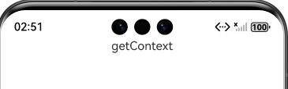

# 使用UI上下文接口操作界面（UIContext）指南文档示例

### 介绍

本示例通过使用[ArkUI指南文档](https://gitcode.com/openharmony/docs/blob/master/zh-cn/application-dev/ui)中各场景的开发示例，
展示在工程中，帮助开发者更好地理解ArkUI提供的组件及组件属性并合理使用。该工程中展示的代码详细描述可查如下链接：

1. [使用UI上下文接口操作界面（UIContext）](https://gitcode.com/openharmony/docs/blob/master/zh-cn/application-dev/ui/arkts-global-interface.md)。

### 效果预览

| ContextPage.ets                 |      LocalStoragePage.ets                 |
|---------------------------|---------------------------|
|  |  |

### 使用说明

1. 通过运行index.test.ets测试用例，使页面从Index页面跳到ContextPage页面，页面上显示getContext字样。

2. 通过运行LocalStoragePage.test.ets测试用例，使页面从Index页面跳到LocalStoragePage页面，页面上显示LocalStoragePageHelloWorld字样。

### 工程目录
```
entry/src/main/ets/
|---Common
|   |---ContextUtils.ets                    // 定义UIContext接口
|   |---UIContext.ets                      //通过UIContext接口使用像素单位转换接口
|   |---Utils.ets                    
|   |---WindowUtils.ets                      
|---entryability
|---pages
|   |---ContextPage.ets                           // 传入UIContext调用getHostContext     
|   |---LocalStoragePage.ets                  // 使用UIContext接口替换全局接口
|   |---Index.ets                             
|   |---CalendarPickerDialogPage.ets                
|   |---NewGlobal.ets                           
|   |---VpPage.ets          
|   |---WindowTestPage.ets             
entry/src/ohosTest/
|---ets
|   |---Index.test.ets                      // 对应页面测试代码
|   |---LocalStoragePage.test.ets              // 对应页面测试代码
|   |---CalendarPickerDialogPage.test.ets      // 对应页面测试代码
|   |---NewGlobal.test.ets              // 对应页面测试代码
|   |---VpPage.test.ets                      // 对应页面测试代码
|   |---WindowTestPage.test.ets              // 对应页面测试代码
```

### 具体实现

一、像素单位转换接口的UIContext替换（支持多实例适配）
1. 定义静态成员uiContext存储全局UIContext，通过setUIContext方法在UI实例就绪后赋值（如Ability的loadContent回调中）；
2. 实现vp2px/fp2px/lpx2px方法：优先使用传入的uiContext或全局uiContext，若无效则vp2px通过display.getDefaultDisplaySync获取默认屏幕密度计算，fp2px/lpx2px返回undefined以保持行为一致；
3. 调用uiContext.isAvailable()验证UIContext有效性，避免异常。

二、Ability的Context获取（基于UIContext绑定）
1. 定义静态成员context存储默认Ability Context，通过setContext方法在Ability onCreate时赋值（直接使用Ability的this.context）；
2. 实现getContext方法：优先通过传入的uiContext.getHostContext()获取当前UI实例所属Ability的Context，无传入时返回默认context。

三、LocalStorage的UIContext替换（页面级共享存储）
1. 页面组件通过@Entry({useSharedStorage: true})启用共享LocalStorage，替代全局LocalStorage.getShared()；
2. 通过uiContext.getSharedLocalStorage()获取当前UI实例关联的共享存储，支持setOrCreate/读取操作；
3. 在Ability的onWindowStageCreate中，创建LocalStorage实例并传入windowStage.loadContent，确保页面初始化时获取到存储实例。

四、多窗口UIContext管理（基于窗口获焦状态）
1. 实现registerWindowCallback方法：为窗口注册windowEvent监听，当窗口触发WINDOW_ACTIVE（获焦）时，调用window.getUIContext()记录为activeUIContext；
2. 实现vp2px方法：优先使用传入的uiContext或activeUIContext，无效时通过display.getDefaultDisplaySync获取密度计算；
3. 提供unregisterWindowCallback方法，在窗口销毁前注销监听，避免内存泄漏。

### 相关权限

不涉及。

### 依赖

不涉及。

### 约束与限制

1. 本示例仅支持标准系统上运行, 支持设备：华为手机。

2. HarmonyOS系统：HarmonyOS 5.0.5 Release及以上。

3. DevEco Studio版本：6.0.0 Release及以上。

4. HarmonyOS SDK版本：HarmonyOS 6.0.0 Release SDK及以上。

### 下载

如需单独下载本工程，执行如下命令：

````
git init
git config core.sparsecheckout true
echo ArkUISample/UIContext > .git/info/sparse-checkout
git remote add origin https://gitcode.com/harmonyos_samples/guide-snippets.git
git pull origin master
````