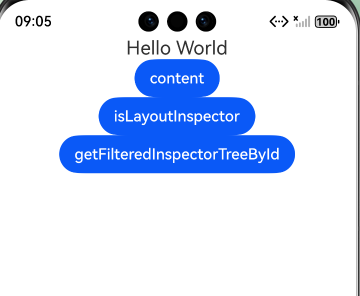
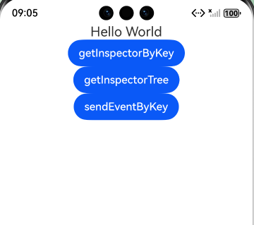
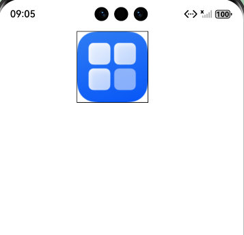

# 检查页面布局示例工程

## 介绍

本示例通过使用[检查页面布局](https://gitcode.com/openharmony/docs/blob/master/zh-cn/application-dev/ui/arkts-inspector-overview.md)
中各场景的开发示例，展示在工程中，帮助开发者更好的理解并合理使用inspector双向定位能力，在DevEco
Studio中快速定位组件、修改属性和调试组件，以提高开发效率。

### 效果预览

|  |

|  |

|  |

## 使用说明

1. 安装编译生成的hap包，并打开应用；
2. 进入首页，可选择不同模块页面；
3. 点击按钮(UIContext查询组件树和组件信息能力)进入ComponentPage，通过点击不同的按钮来触发不同的事件，具体结果在log中查看；
4. 点击按钮(布局回调的基本用法)进入ComponentPage1,通过点击不同的按钮来触发不同的事件，具体结果在log中查看；
5. 点击按钮(组件标识属性的扩展能力)进入ImagePage，显示图片；

## 工程目录

```

entry/src/main/ets/
└── pages
    └── ComponentPage.ets (显示UIContext查询组件树和组件信息能力页面)
    └── ComponentPage1.ets (显示布局回调页面)
    └── ImagePage.ets (显示组件标识属性的扩展能力页面)
    └── Index.ets (显示主页面)
└── resources
    ├── base
    │   ├── element
    │   │   ├── color.json
    │   │   ├── float.json
    │   │   └── string.json
    │   └── media
    
```

## 具体实现

1. 在 ArkTS 页面中，可借助 UIContext 与 inspector 接口实现组件树查询与布局监听。例如，先通过 getUIContext() 获取上下文，点击按钮调用
   getFilteredInspectorTree 筛选组件属性，或用 getFilteredInspectorTreeById 精准查询指定 ID 组件（如示例中 “TEXT”
   文本组件），并通过循环打印组件类型、ID 及子组件结构。
2. 也能注册布局回调，像为图片组件创建 ComponentObserver，在 aboutToAppear 中监听
   layout（布局完成）、draw（绘制完成）等事件，触发时执行自定义逻辑，同时支持通过 off 方法取消监听，快速实现组件调试与布局验证。

## 相关权限

不涉及

## 依赖

不涉及

## 约束和限制

1. 本示例仅支持标准系统上运行, 支持设备：华为手机。

2. HarmonyOS系统：HarmonyOS 5.0.5 Release及以上。

3. DevEco Studio版本：6.0.0 Release及以上。

4. HarmonyOS SDK版本：HarmonyOS 6.0.0 Release SDK及以上。

## 下载

如需单独下载本工程，执行如下命令：

```
git init
git config core.sparsecheckout true
echo ArkUISample/Checkpage > .git/info/sparse-checkout
git remote add origin https://gitcode.com/harmonyos_samples/guide-snippets.git
git pull origin master
```