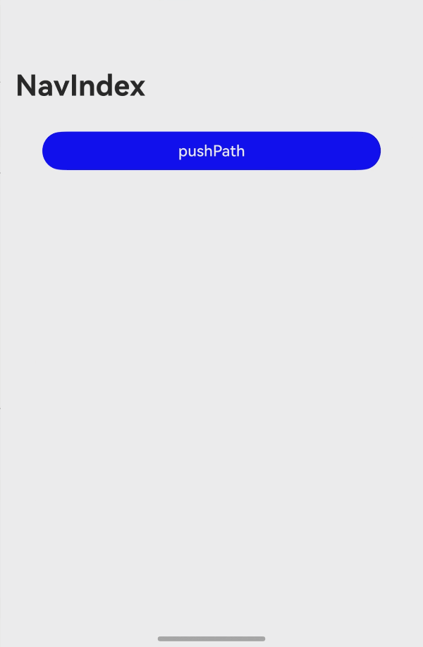

# 实现画中画效果

## 介绍

本示例基于媒体服务和ArkUI的基本能力，通过XComponent、typeNode和NDK几种不同的方式来实现视频播放、手动和自动拉起画中画、画中画窗口控制视频播放和暂停等功能。

## 效果预览



## 使用说明

1. 在主界面，点击不同的画中画实现方式查看对应效果；
2. 进入详情页面点击**startPip**，应用**拉起画中画**，点击**stopPip**，**关闭画中画**，点击**updateSize**，**改变画中画样式大小**；
3. 如果进入NDK接口实现的详情页面，先点击**更换模板**，选择画中画的样式，然后点击**创建画中画**，最后点击**开启画中画**即可查看具体样式效果。

## 工程目录

```
├──entry/src/main
│  ├──cpp
│  │  ├──types/libentry
│  │  │  ├──index.d.ts                      // 提供JS侧的接口方法
│  │  │  └──oh-package.json5                // 将index.d.ts与cpp文件关联
│  │  ├──CMakeLists.txt                     // 配置CMake打包参数
│  │  └──napi_ini.cpp                       // 实现Native侧的接口
│  ├──ets
│  │  ├──ability
│  │  │  ├──PipManager.ets                  // 使用单页面Ability实现时的画中画控制器
│  │  │  └──XCNodeController.ets            // 使用单页面Ability实现时的自定义节点
│  │  ├──entryability
│  │  │  └──EntryAbility.ets                // 程序入口类
│  │  ├──entryabackupbility
│  │  │  └──EntryBackupAbility.ets          // 数据备份、恢复入口类
│  │  ├──model
│  │  │  ├──AVPlayer.ets                    // 公共简易播放器
│  │  │  └──NDKAVPlayer.ets                 // NDK实现的简易播放器
│  │  ├──navigation
│  │  │  ├──Page1.ets                       // 使用Navigation导航时通过typeNode实现的画中画页面
│  │  │  ├──PipManager.ets                  // 使用Navigation导航时通过typeNode实现的画中画控制器
│  │  │  └──XCNodeController.ets            // 使用Navigation导航时通过typeNode实现的自定义节点
│  │  ├──nodeFree
│  │  │  └──PipManager.ets                  // 使用typeNode自由节点实现时的画中画控制器
│  │  ├──pages
│  │  │  ├──AbilityImplementPage.ets        // 使用单页面Ability实现时的主页面
│  │  │  ├──Index.ets                       // 应用首页
│  │  │  ├──NavigationImplementPage.ets     // 使用Navigation导航时通过typeNode实现的主页面
│  │  │  ├──NDKImplementPage.ets            // 主页面，使用NDK接口实现
│  │  │  ├──RouterImplementPage.ets         // 使用Router导航时通过typeNode实现的主页面
│  │  │  ├──TypeNodeFreePage.ets            // 使用typeNode自由节点实现时的主页面
│  │  │  └──XComponentImplementPage.ets     // 使用XComponent实现时的主页面
│  │  ├──route
│  │  │  ├──Page1.ets                       // 使用Router导航时通过typeNode实现的画中画页面
│  │  │  ├──PipManager.ets                  // 使用Router导航时通过typeNode实现的画中画控制器
│  │  │  └──XCNodeController.ets            // 使用Router导航时通过typeNode实现的自定义节点
│  │  ├──util
│  │  │  └──LogUtil.ets                     // 日志工具类
│  │  ├──xcomponent
│  │  │  ├──AVPlayer.ets                    // 使用XComponent实现时的简易播放器
│  │  │  └──Page1.ets                       // 使用XComponent实现时的画中画页面
│  └────resources                           // 应用资源目录
```
## 具体实现
1. 创建画中画控制器，注册生命周期事件以及控制事件回调。
   * 通过create(config: PiPConfiguration)接口创建画中画控制器实例。
   * 通过画中画控制器实例的setAutoStartEnabled接口设置是否需要在应用返回桌面时自动启动画中画。
   * 通过画中画控制器实例的on('stateChange')接口注册生命周期事件回调。
   * 通过画中画控制器实例的on('controlPanelActionEvent')接口注册控制事件回调。

2. 启动画中画。

   创建画中画控制器实例后，通过startPiP接口启动画中画。

3. 更新媒体源尺寸信息。

   画中画媒体源更新后（如切换视频），通过画中画控制器实例的updateContentSize接口更新媒体源尺寸信息，以调整画中画窗口比例。

4. 关闭画中画。

   当不再需要显示画中画时，可根据业务需要，通过画中画控制器实例的stopPiP接口关闭画中画。

## 相关权限

不涉及

## 依赖

不涉及

## 约束与限制

1. 在API version 20之前，支持在Phone、Tablet设备使用XComponent实现画中画功能开发；从API version 20开始，支持在Phone、PC/2in1、Tablet设备使用XComponent实现画中画功能开发；

2. 在API version 20之前，支持在Phone、Tablet设备使用typeNode实现画中画功能开发；从API version 20开始，支持在Phone、PC/2in1、Tablet设备使用typeNode实现画中画功能开发；

3. 从API version 20开始，支持在Phone、PC/2in1、Tablet设备使用NDK接口实现画中画功能开发。

## 下载
如需单独下载本工程，执行如下命令：
```
git init
git config core.sparsecheckout true
echo ArkUIWindowPipSamples/WindowPip > .git/info/sparse-checkout
git remote add origin https://gitcode.com/harmonyos_samples/guide-snippets.git
git pull origin master
```