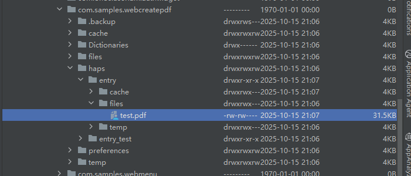

## 使用Web组件保存前端页面为PDF

### 介绍

1. 本示例通过Web组件的createPdf方法，为应用提供了保存前端页面为PDF的功能。
2. 本工程主要实现了对以下指南文档中[使用Web组件保存前端页面为PDF](https://gitcode.com/openharmony/docs/blob/master/zh-cn/application-dev/web/web-createpdf.md)示例代码片段的工程化，主要目标是实现指南中示例代码需要与sample工程文件同源。

### callback方式保存PDF

#### 介绍

1. 通过callback方式调用createPdf接口，获取到的result通过pdfArrayBuffer接口取得PDF二进制数据流，最后使用fileIo方法将二进制数据流保存为PDF文件。

#### 效果预览

| callback方式保存PDF                                                      |
|-----------------------------------------------------------|
|  |

##### 使用说明

1. 当网页加载完成后，可以在Ark侧页上调用createPdf接口，最后把网页保存成pdf文件。


##### 保存结果

|                       保存结果                        |
|:-------------------------------------------------:|
|  |


### Promise方式保存PDF

#### 介绍

1. 通过Promise方式调用createPdf接口，获取到的result通过pdfArrayBuffer接口取得PDF二进制数据流，最后使用fileIo方法将二进制数据流保存为PDF文件。

#### 效果预览

| Promise方式保存PDF                                           |
|----------------------------------------------------------|
|  |

##### 使用说明

1. 当网页加载完成后，可以在Ark侧页上调用createPdf接口，最后把网页保存成pdf文件。


##### 保存结果

|                       保存结果                        |
|:-------------------------------------------------:|
|  |


### 工程目录

```
├── entry
│   └── src
│       └── main
│           ├── ets                                 // ArkTS代码区
│           │   ├── entryability
│           │   │   └── EntryAbility.ets            // 入口类
│           │   ├── entrybackupability
│           │   │   └── EntryBackupAbility.ets      // 备份恢复框架
│           │   └── pages
│           │       └── Index.ets                   // 主页
|           |       |── WebCreatePdfCallback.ets    //callback方式保存网页
|           |       |── WebCreatePdfPromise.ets     //Promise方式保存网页
│           └── resources                           // 应用资源文件
```

### 具体实现
* 使用Web组件保存前端页面为PDF
* callback方式保存PDF
  * 通过callback方式调用[createPdf](https://gitcode.com/openharmony/docs/blob/master/zh-cn/application-dev/reference/apis-arkweb/arkts-apis-webview-WebviewController.md#createpdf14)接口，获取到的result通过pdfArrayBuffer接口取得PDF二进制数据流。
  * 再使用fileIo方法将二进制数据流保存为PDF文件。
* Promise方式保存PDF
  * 通过Promise方式调用[createPdf](https://gitcode.com/openharmony/docs/blob/master/zh-cn/application-dev/reference/apis-arkweb/arkts-apis-webview-WebviewController.md#createpdf14-1)接口，获取到的result通过pdfArrayBuffer接口取得PDF二进制数据流。
  * 再使用fileIo方法将二进制数据流保存为PDF文件。
  
### 相关权限

[ohos.permission.INTERNET](https://docs.openharmony.cn/pages/v6.0/zh-cn/application-dev/security/AccessToken/permissions-for-all.md#ohospermissioninternet)

### 依赖

不涉及。

### 约束与限制

1. 本示例仅支持标准系统上运行, 支持设备：华为手机。

2. HarmonyOS系统：HarmonyOS 5.0.5 Release及以上。

3. DevEco Studio版本：6.0.0 Release及以上。

4. HarmonyOS SDK版本：HarmonyOS 6.0.0 Release SDK及以上。

### 下载

如需单独下载本工程，执行如下命令：

```
git init
git config core.sparsecheckout true
echo ArkWebKit/ArkWebCreatePdf > .git/info/sparse-checkout
git remote add origin https://gitee.com/harmonyos_samples/guide-snippets.git
git pull origin master
```