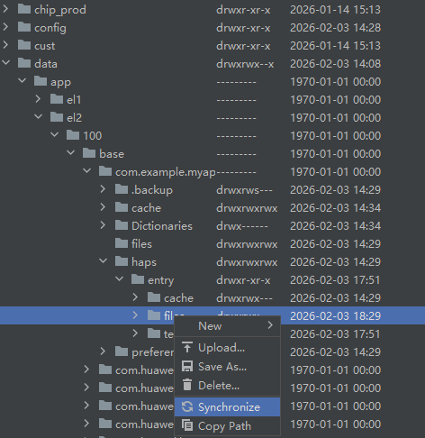

# Web组件渲染进程崩溃时获取dmp文件
## 介绍
本工程展示了当Web组件的渲染进程崩溃时，获取dmp文件的场景。该工程可以帮助开发者获取dmp文件。
## demo预览
| 获取dmp文件                                         |
|-------------------------------------------------|
|  |

## 使用说明
使用时点击左上角的file按钮，然后在Deveco Studio的设备文件浏览器中刷新下如图的路径，这样就可以看到此路径下已经获取到了所有的dmp文件。



## 工程目录
```
├─entry
│  └─src
│      ├─main
│      │  ├─ets
│      │  │  ├─entryability
│      │  │  ├─entrybackupability
│      │  │  └─pages
│      │  │     └─Index.ets          // 主页
│      │  └─resources
```

# 具体实现
* 利用Web组件跳转谷歌的debug网址触发渲染进程的crash

  ```typescript
  Web({src:'chrome://memory-exhaust/', controller:this.controller})
  ```
  
* 生成dmp文件后，将沙箱路径的dmp文件复制到可以访问到的路径

  ```typescript
  let pathDir: string = context.filesDir;
  fs.copyDir("/data/storage/el2/log/crashpad/pending/", pathDir, 0)
  ```

## 相关权限
[ohos.permission.INTERNET](https://docs.openharmony.cn/pages/v6.0/zh-cn/application-dev/security/AccessToken/permissions-for-all.md#ohospermissioninternet)

## 依赖
不涉及

## 约束与限制
1. 本示例仅支持标准系统上运行, 支持设备：华为手机。

2. HarmonyOS系统：HarmonyOS 5.0.5 Release及以上。

3. DevEco Studio版本：6.0.0 Release及以上。

4. HarmonyOS SDK版本：HarmonyOS 6.0.0 Release SDK及以上。

## 下载
如需单独下载本工程，执行如下命令：
```
git init
git config core.sparsecheckout true
echo ArkWebKit/ArkWebGetDmpFiles > .git/info/sparse-checkout
git remote add origin https://gitee.com/harmonyos_samples/guide-snippets.git
git pull origin master
```