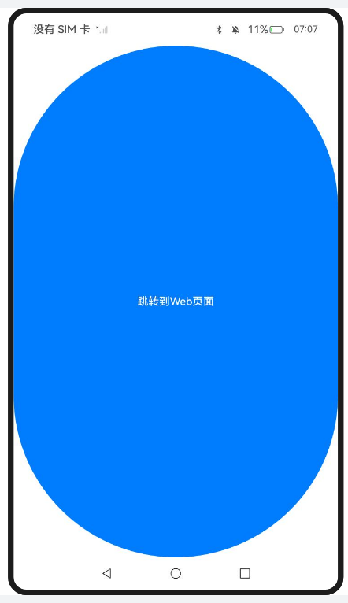
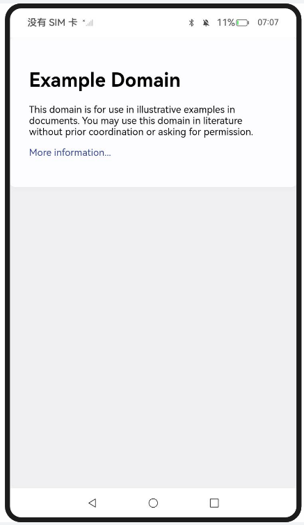
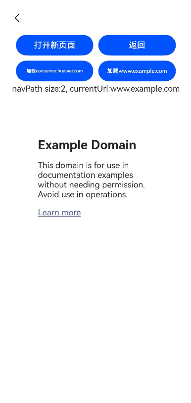

# 使用离线Web组件

### 介绍

1. 本工程主要实现了对以下指南文档中 https://docs.openharmony.cn/pages/v5.0/zh-cn/application-dev/web/web-offline-mode.md 示例代码片段的工程化，主要目标是实现指南中示例代码需要与sample工程文件同源。

### Entry:

####  CreatingOfflineWebComponents

##### 介绍

1. 本示例主要介绍使用离线Web组件加载显示页面。在需要离屏创建Web组件时，定义一个自定义组件以封装Web组件，此Web组件在离线状态下被创建，封装于无状态的NodeContainer节点中，并与相应的NodeController组件绑定。Web组件在后台预渲染完毕后，当需要展示时，通过NodeController将其挂载到ViewTree的NodeContainer中，即与对应的NodeContainer组件绑定，即可挂载上树并显示。

##### 效果预览

| 主页                                                         |
| ------------------------------------------------------------ |
|  |

使用说明

1. Index.ets通过getNWeb从NodeMap获取myNodeController，将其传入NodeContainer，实现动态组件在页面的显示。

### Entry1: 

#### PreLaunchingRenderingProcess_one

##### 介绍

1. 本示例主要介绍预启动ArkWeb渲染进程。在后台预先创建一个Web组件，以启动用于渲染的Web渲染进程，这样可以节省后续Web组件加载时启动Web渲染进程所需的时间。

##### 效果预览

| 主页                                                         | 跳转页                                                       |
| ------------------------------------------------------------ | ------------------------------------------------------------ |
|  |  |

使用说明

1. 在onWindowStageCreate时期预创建了一个Web组件加载blank页面，从而提前启动了Render进程，从index跳转到index2时，优化了Web的Render进程启动和初始化的耗时。
1. 点击跳转到web页面按钮跳转到Web页面。

### Entry2: 

#### PreLaunchingRenderingProcess_two

##### 介绍

1. 本示例主要介绍使用预渲染Web页面。预渲染Web页面优化方案适用于Web页面启动和跳转场景，例如，进入首页后，跳转到子页。建议在高命中率的页面使用该方案。渲染Web页面的实现方案是提前创建离线Web组件，并设置Web为Active状态来开启渲染引擎，进行后台渲染。

##### 效果预览

| 主页                                                         | 跳转页面                                                     |
| ------------------------------------------------------------ | ------------------------------------------------------------ |
|  |  |

使用说明

1. 点击跳转到web页面按钮跳转到Web页面。

### Entry3: 

#### ReuseAndRecycleOfflineWebComponents

##### 介绍

1. 本示例主要介绍使用复用和释放离线Web组件。
2. 复用离线Web组件适用于应用有多个UI页面都需要显示Web内容的场景。可以减少组件创建和销毁的性能消耗；减少创建多个Web组件导致的内存消耗；降低应用因内存占用过高被系统查杀的概率。
3. 当应用退至后台，明确在特定时间段内不再需要使用离线Web组件时，建议释放该组件以减少应用的内存占用。可以优化内存占用，降低应用被系统查杀的概率。

##### 效果预览

| 主页                                                         | Home页面                                                     |
| ------------------------------------------------------------ | ------------------------------------------------------------ |
|  |  |

| 测试页Page1                                                         | 测试页Page2                                                     |
| ------------------------------------------------------------ | ------------------------------------------------------------ |
|  |  |

使用说明

1. Index页面作为入口页面，演示页面跳转、离线Web组件的释放，恢复及统计信息展示。
   * 点击跳转至Home页面的按钮，跳转打开Home页面；
   * 点击释放离线Web组件按钮，仅释放没有被绑定的离线Web组件。
   * 点击强制释放离线Web组件按钮，演示强制释放所有离线Web组件，包括已绑定和未绑定的组件，会导致对应的NodeContainer白屏。
   * 点击恢复离线Web组件按钮，可以恢复被释放的离线web组件。
   * 页面下面会显示离线Web组件的数量、状态及URL等详细信息。
2. Home页面为UI主页，演示离线Web组件的创建，预渲染的执行方法和时机。
   * 页面在创建时会创建3个离线组件，其中一个加载指定网页并进行预渲染，另外两个为空白离线Web组件。
   * 页面提供导航按钮用于跳转至Page1或Page2页面，点击可进入不同的测试页面。
3. Page1页面同时显示了两个Web页面，每个页面使用了一个离线Web组件，加载并显示相同URL的内容。该页面用于演示预渲染与不预渲染的效果对比，以及如何复用离线组件。
   * 第一个离线Web组件执行了预渲染，可以直接显示页面。 
   * 第二个离线Web组件复用空闲的离线Web组件，并在aboutToAppear的生命周期中动态加载这个url。
4. Page2页面显示单个Web页面，使用复用空闲离线Web组件的方式加载指定url。
   * Page2页面可以通过传入参数加载指定url，也提供按钮供用户在加载后跳转到其他url。
   * Page2会在NavDestination的onWillHide回调中，让当前Web组件加载空白页并取消与当前UI的关联，为下次复用做准备。
   * Page2页面支持嵌套，即使有多层UI页面嵌套，点击打开新页面按钮，可以嵌套打开一个新的Page2页面。由于采用复用离线Web组件的方式，Web组件数量不会增加。

### 工程目录

```
entry/src/main/
|---ets
|---|---entryability
|---|---|---EntryAbility.ets
|---|---pages
|---|---|---common.ets
|---|---|---Index.ets						// 首页
|---resources								// 静态资源
|---ohosTest
|---|---ets
|---|---|---tests
|---|---|---|---Ability.test.ets            // 自动化测试用例

entry1/src/main/
|---ets
|---|---entry1ability
|---|---|---Entry1Ability.ets
|---|---pages
|---|---|---common.ets
|---|---|---Index.ets						// 首页
|---|---|---index2.ets
|---resources								// 静态资源
|---ohosTest
|---|---ets
|---|---|---tests
|---|---|---|---Ability.test.ets            // 自动化测试用例

entry2/src/main/
|---ets
|---|---entry2ability
|---|---|---Entry2Ability.ets
|---|---pages
|---|---|---common.ets
|---|---|---Index.ets						// 首页
|---|---|---index2.ets
|---resources								// 静态资源
|---ohosTest
|---|---ets
|---|---|---tests
|---|---|---|---Ability.test.ets            // 自动化测试用例

entry3/src/main/
|---ets
|---|---entry3ability
|---|---|---Entry3Ability.ets
|---|---pages
|---|---|---common.ets
|---|---|---Index.ets						// 入口页
|---|---|---Home.ets                        // 首页
|---|---|---Page1.ets
|---|---|---Page2.ets
|---resources								// 静态资源
|---ohosTest
|---|---ets
|---|---|---tests
|---|---|---|---Ability.test.ets            // 自动化测试用例
```

### 具体实现
* Entry中实现基础离线组件加载显示页面功能。
  * 在Common.ets文件中封装了离线组件管理工具，功能如下。
    * 实现继承自NodeController的MyNodeController类，用于控制和反馈对应NodeContainer上节点的行为，需要与NodeContainer一起使用。
    * 实现initWeb，用于初始化MyNodeController实例。
    * 重写makeNode函数，用于构建节点树、返回节点并挂载到对应NodeContainer中。该函数在对应NodeContainer创建时调用，或通过rebuild方法调用刷新。
    * 实现createNWeb方法，用于创建MyNodeController，并用nodeMap进行统一存放管理。
    * 实现getNWeb方法，用于获取MyNodeController实例。
  * 在EntryAbility中，使用createNWeb函数创建离线组件并关联到自定义key值。
  * 在Index.ets中创建一个NodeContainer组件，并通过getNWeb函数从Common.ets中按key值获取关联的离线组件，传入NodeContainer组件进行显示。
* Entry1中实现预启动ArkWeb渲染进程功能。
  * 在Common.ets文件中封装了离线组件管理工具，功能如下。
    * 实现继承自NodeController的MyNodeController类，用于控制和反馈对应NodeContainer上节点的行为，需要与NodeContainer一起使用。
    * 实现initWeb，用于初始化MyNodeController实例。
    * 重写makeNode函数，用于构建节点树、返回节点并挂载到对应NodeContainer中。该函数在对应NodeContainer创建时调用，或通过rebuild方法调用刷新。
    * 实现createNWeb方法，用于创建MyNodeController，并用nodeMap进行统一存放管理。
    * 实现getNWeb方法，用于获取MyNodeController实例。
  * 在EntryAbility中，使用createNWeb函数并以'about:blank'作为key值创建离线组件。
  * 显示Index.ets的Index1页面时预启动Render进程。在Index.ets中创建一个Button组件，在按钮的onClick回调中跳转到页面index2。
  * 在index2.ets中创建一个Web组件，加载示例网页。
* Entry2中实现预渲染Web页面功能。
  * 在Common.ets文件中封装了离线组件管理工具，功能如下。
    * 实现继承自NodeController的MyNodeController类，用于控制和反馈对应NodeContainer上节点的行为，需要与NodeContainer一起使用。
    * 实现initWeb，用于初始化MyNodeController实例。
    * 重写makeNode函数，用于构建节点树、返回节点并挂载到对应NodeContainer中。该函数在对应NodeContainer创建时调用，或通过rebuild方法调用刷新。
    * 实现createNWeb方法，用于创建MyNodeController，并用nodeMap进行统一存放管理。
    * 实现getNWeb方法，用于获取MyNodeController实例。
    * 实现webBuilder方法，使用@Builder进行修饰。在此Builder方法中创建Web组件，并在onPageBegin回调中调用onActive开启渲染；在onFirstMeaningfulPaint回调中调用onInactive，在预渲染完成时触发停止渲染。
  * 在Index.ets中创建一个Button组件，在按钮的onClick回调中跳转到页面index2。显示Index.ets的Index1页面时预启动Render进程。
  * 在index2.ets中创建一个Web组件，加载示例网页。
* Entry3中实现离线Web组件的使用、复用和释放功能。
  * 在Common.ets文件中封装了离线组件管理工具，功能如下。
    * 实现继承自NodeController的MyNodeController类，用于控制和反馈对应NodeContainer上节点的行为，需要与NodeContainer一起使用。
    * 实现initWeb，用于初始化MyNodeController实例。
    * 重写makeNode函数，用于构建节点树、返回节点并挂载到对应NodeContainer中。该函数在对应NodeContainer创建时调用，或通过rebuild方法调用刷新。
    * 实现createNWeb方法，用于创建MyNodeController，并用nodeMap进行统一存放管理；实现recycleNWeb方法，用于当离线组件没有被NodeContainer绑定时安全释放，否则节点在不重绘时会显示空白。
    * 实现getNWeb方法，用于获取MyNodeController实例。
    * 实现recycleNWebs方法，用于释放所有离线Web组件；实现restoreNWebs方法，恢复之前释放的离线Web组件。
    * 实现getFreeWebNode方法，用于获取空闲的NWebNode接口。
    * 实现getOfflineNWebsInfo方法，用于获取离线组件统计信息的调试接口。
    * 实现startPreLoad和stopPreload方法，用于启动和停止离线Web组件预加载网页，通过设置webController为Active和Inactive状态进行控制。
    * 实现webBuilder方法，使用@Builder进行修饰。方法中加载一个Web组件，在组件的onFirstMeaningfulPaint回调中调用stopPreload。
  * 在Entry3Ability的生命周期onForeground和onBackground分别使用restoreNWebs、recycleNWebs方法进行离线Web组件的释放和恢复。
  * 在Index.ets中创建多个按钮，分别用于跳转到Home页、释放离线Web组件、强制释放离线Web组件、恢复离线Web组件。
  * 在Home.ets中，通过在生命周期方法aboutToAppear中调用createNWeb创建3个离线Web组件，并使用startPreLoad进行预加载。在Home页面上创建5个按钮，分别用于：返回Index页、跳转到Page1页面、跳转Page2（加载about:blank）、跳转Page2（加载示例网页1）、跳转Page2（加载示例网页2）。
  * 在Page1.ets中构造两个MyNodeController实例，分别为node1、node2，其中node1设置加载示例网页。创建一个NavDestination组件，在组件的onWillHide回调中使node2加载'about:blank'页面；在NavDestination组件内创建两个NodeContainer，分别传入node1、node2进行显示。
  * 在Page2.ets中创建一个NavDestination组件，在组件的onWillHide回调中加载空页面，并结束离线Web组件与页面的绑定；在组件的onWillShow回调中触发加载网页。在NavDestination组件内创建4个按钮，分别用于：重新打开Page2并打开'about:blank'网页、返回Home页面、打开示例网页1、打开示例网页2。

### 相关权限

[ohos.permission.INTERNET](https://docs.openharmony.cn/pages/v5.0/zh-cn/application-dev/security/AccessToken/permissions-for-all.md#ohospermissioninternet)

### 依赖

不涉及。

### 约束与限制

1. 本示例仅支持标准系统上运行，支持设备：RK3568。
2. 本示例支持API14版本SDK，SDK版本号(API Version 14 Release)。
3. 本示例需要使用DevEco Studio 版本号(5.0.1Release)才可编译运行。

### 下载

如需单独下载本工程，执行如下命令：

```
git init
git config core.sparsecheckout true
echo code/DocsSample/ArkWeb/UseOfflineWebComp > .git/info/sparse-checkout
git remote add origin https://gitee.com/openharmony/applications_app_samples.git
git pull origin master
```