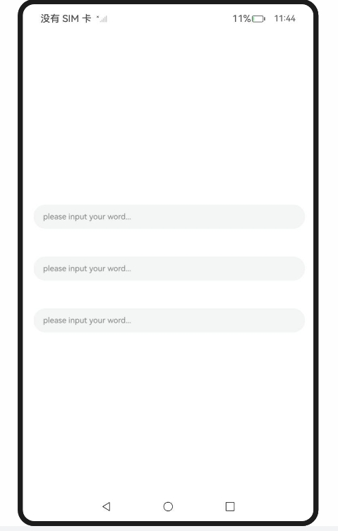
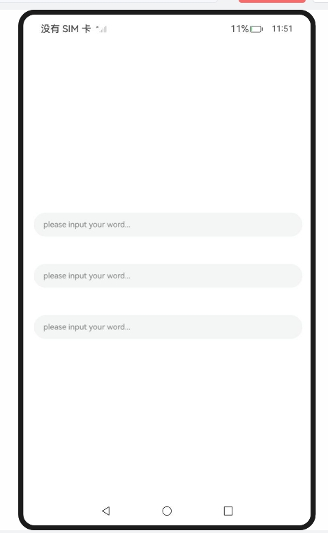
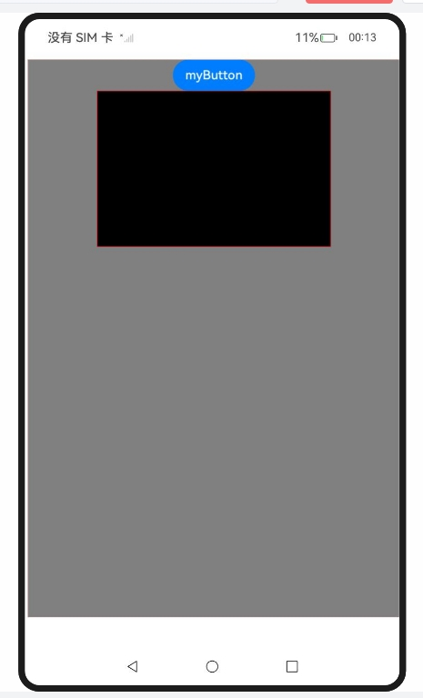

# 同层渲染

## 介绍

1. 本工程主要实现指南文档[同层渲染](https://developer.huawei.com/consumer/cn/doc/harmonyos-guides/web-same-layer)中示例代码片段的工程化，主要目标是实现指南中示例代码需要与sample工程文件同源。

## RenderTxtBoxSameLayer_one

### 介绍

1. 本示例主要介绍Web页面中同层渲染输入框，在Web页面中，可以使用ArkUI原生的TextInput组件进行同层渲染。同层渲染支持<embed>/<object>两种标签。type类型可任意指定，两个字符串参数均不区分大小写，ArkWeb内核将会统一转换为小写。其中，tag字符串使用全字符串匹配，type使用字符串前缀匹配。

### 效果预览

| 主页                                                         |
| ------------------------------------------------------------ |
|  |

使用说明

1. 在应用侧通过enableNativeEmbedMode来开启同层渲染功能，展示在对应区域的原生组件。
2. 调用onNativeEmbedLifecycleChange来监听同层渲染的生命周期变化。
3. 调用onNativeEmbedGestureEvent来监听同层渲染区域的手势事件。
4. 调用onNativeEmbedMouseEvent来监听同层渲染区域的鼠标事件。

### 具体实现

* 通过ArkUI系统的TextInput组件进行同层渲染，示例参考：[RenderTxtBoxSameLayer_one.ets](https://gitcode.com/HarmonyOS_Samples/guide-snippets/blob/master/ArkWeb/UseSameLayerRender/entry/src/main/ets/pages/RenderTxtBoxSameLayer_one.ets)
   * 创建系统组件TextInputComponent。
   * 通过enableNativeEmbedMode来开启同层渲染功能，展示在对应区域的原生组件。
   * 创建节点控制器，用于控制和反馈对应NodeContainer上的节点行为。
   * 通过调用onNativeEmbedLifecycleChange来监听同层渲染的生命周期变化。
   * 通过调用onNativeEmbedGestureEvent来监听同层渲染区域的手势事件。
   * 通过调用onNativeEmbedMouseEvent来监听同层渲染区域的鼠标事件。

## RenderTxtBoxSameLayer_two

### 介绍

1. 本示例主要介绍Web页面中同层渲染输入框，在Web页面中，可以使用ArkUI原生的TextInput组件进行同层渲染。同层渲染支持<embed>/<object>两种标签。type类型可任意指定，两个字符串参数均不区分大小写，ArkWeb内核将会统一转换为小写。其中，tag字符串使用全字符串匹配，type使用字符串前缀匹配。

### 效果预览

| 主页                                                         |
| ------------------------------------------------------------ |
|  |

使用说明

1. 在应用侧通过enableNativeEmbedMode来开启同层渲染功能，展示在对应区域的原生组件。
2. 调用onNativeEmbedLifecycleChange来监听同层渲染的生命周期变化。
3. 调用onNativeEmbedGestureEvent来监听同层渲染区域的手势事件。
4. 调用onNativeEmbedMouseEvent来监听同层渲染区域的鼠标事件。

### 具体实现

* 通过ArkUI系统的TextInput组件进行同层渲染，示例参考：[RenderTxtBoxSameLayer_two.ets](https://gitcode.com/HarmonyOS_Samples/guide-snippets/blob/master/ArkWeb/UseSameLayerRender/entry/src/main/ets/pages/RenderTxtBoxSameLayer_two.ets)
   * 创建系统组件TextInputComponent。
   * 通过enableNativeEmbedMode来开启同层渲染功能，展示在对应区域的原生组件。
   * 创建节点控制器，用于控制和反馈对应NodeContainer上的节点行为。
   * 通过调用onNativeEmbedLifecycleChange来监听同层渲染的生命周期变化。
   * 通过调用onNativeEmbedGestureEvent来监听同层渲染区域的手势事件。
   * 通过调用onNativeEmbedMouseEvent来监听同层渲染区域的鼠标事件。

## DrawXCompAVPBtn

### 介绍

1. 本示例主要介绍同层渲染。通过enableNativeEmbedMode()控制同层渲染开关。Html文件中需要显式使用embed标签，并且embed标签内type必须以“native/”开头。同层标签对应的元素区域的背景为透明。

### 效果预览

| 主页                                                         |
| ------------------------------------------------------------ |
|  |

使用说明

1. 绘制 XComponent、AVPlayer 和 Button 组件。

### 具体实现

* 绘制 XComponent、AVPlayer 和 Button 组件，参考源码[DrawXCompAVPBtn.ets](https://gitcode.com/HarmonyOS_Samples/guide-snippets/blob/master/ArkWeb/UseSameLayerRender/entry/src/main/ets/pages/DrawXCompAVPBtn.ets)、[PlayerDemo.ets](https://gitcode.com/HarmonyOS_Samples/guide-snippets/blob/master/ArkWeb/UseSameLayerRender/entry/src/main/ets/pages/PlayerDemo.ets)。
   * 创建节点控制器NodeController，用于控制和反馈对应NodeContainer上的节点行为。
   * 通过enableNativeEmbedMode来开启同层渲染功能，展示在对应区域的原生组件。
   * 通过调用onNativeEmbedLifecycleChange来监听同层渲染的生命周期变化。
   * 通过调用onNativeEmbedGestureEvent来监听同层渲染区域的手势事件。
   * AVPlayerDemo通过AVPlayer实现了鸿蒙系统下网络音视频的播放，区分直播（禁用 seek）和点播（启用 seek）两种模式。
   * 获取 XComponent 的 surfaceID、替换实际播放地址，才能正常运行。

## 工程目录

```
entry/src/main/
|---ets
|---|---entryability
|---|---|---EntryAbility.ets
|---|---pages
|---|---|---DrawXCompAVPBtn.ets
|---|---|---Index.ets						// 首页
|---|---|---PlayerDemo.ets
|---|---|---RenderTxtBoxSameLayer_one.ets
|---|---|---RenderTxtBoxSameLayer_two.ets
|---resources								// 静态资源
|---ohosTest
|---|---ets
|---|---|---tests
|---|---|---|---Ability.test.ets            // 自动化测试用例
```


## 相关权限

[ohos.permission.INTERNET](https://developer.huawei.com/consumer/cn/doc/harmonyos-guides/permissions-for-all#ohospermissioninternet)

## 依赖

不涉及。

## 约束与限制

1. 本示例仅支持标准系统上运行，支持设备：RK3568。
2. 本示例支持API14版本SDK，SDK版本号(API Version 14 Release)。
3. 本示例需要使用DevEco Studio 版本号(5.0.1Release)才可编译运行。

## 下载

如需单独下载本工程，执行如下命令：

```
git init
git config core.sparsecheckout true
echo ArkWeb/UseSameLayerRender > .git/info/sparse-checkout
git remote add origin https://gitcode.com/openharmony/guide-snippets.git
git pull origin master
```