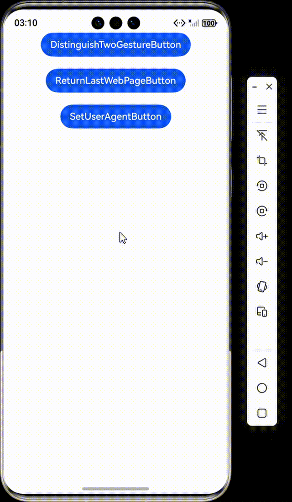

# 使用Web组件的手势与应用交互

### 介绍

本工程主要实现了对以下指南文档中 [使用Web组件的手势与应用交互](https://gitcode.com/openharmony/docs/blob/master/zh-cn/application-dev/web/web-gesture.md) 示例代码片段的工程化，主要目标是帮助开发者快速了解在移动端或支持触控的Web应用中，如何通过触摸屏与页面交互。

### ArkWeb手势与ArkUI手势

#### 介绍

1. 使用三指捏合，Web组件本身会进行缩放。这是因为ArkWeb接收到ArkUI识别出的PinchGesture，执行绑定的回调函数。同时，ArkWeb支持scale方法，能够调整Web组件的缩放比例。

#### 预览效果



#### 使用说明

1. 通过三指捏合手势实现网页内容的缩放控制，实时更新缩放比例并在手势结束时保存当前缩放状态。

### Web组件中如何通过手势滑动返回上一个Web页面

#### 介绍

1. 通过重写onBackPress函数来自定义返回逻辑，使用WebviewController判断是否返回上一个Web页面。

#### 使用说明

1. 重写返回键处理逻辑，优先在网页历史记录中后退，只有在无法后退时才执行默认的页面返回操作，实现了网页内导航与页面导航的无缝衔接。

### 为什么Web加载后网页无法交互？

#### 介绍

1. 网页可能基于其它平台的User-Agent进行判断。为解决此问题，可以在Web组件中设置自定义User-Agent。

#### 使用说明

1. 在控制器附加时设置自定义的移动端用户代理字符串，用于模拟特定浏览器环境或适配移动端网页显示。

### 工程目录

```
entry/src/main/
|---ets
|---|---entryability
|---|---|---EntryAbility.ets
|---|---pages
|---|---|---DistinguishTwoGesture.ets
|---|---|---Index.ets					// 首页
|---|---|---ReturnLastWebPage.ets
|---|---|---SetUserAgent.ets
|---resources								// 静态资源
|---ohosTest
|---|---ets
|---|---|---tests
|---|---|---|---Ability.test.ets            // 自动化测试用例
```
### 具体实现

1. 导入必要的模块。
2. 创建一个包含Web组件的页面。
3. 为Web组件添加三指捏合手势，用于缩放整个Web组件（ArkUI手势）。
4. 设置Web组件的zoomAccess为true，允许网页内容缩放（ArkWeb手势）。
5. 重写onBackPress方法，实现Web页面的后退。
6. 设置自定义User-Agent。

### 相关权限

不涉及。

### 依赖

不涉及。

### 约束与限制

1. 本示例仅支持标准系统上运行, 支持设备：华为手机。

2. HarmonyOS系统：HarmonyOS 5.0.5 Release及以上。

3. DevEco Studio版本：6.0.0 Release及以上。

4. HarmonyOS SDK版本：HarmonyOS 6.0.0 Release SDK及以上。

### 下载

如需单独下载本工程，执行如下命令：

```
git init
git config core.sparsecheckout true
echo ArkWebKit/WebGestureInteraction > .git/info/sparse-checkout
git remote add origin https://gitee.com/harmonyos_samples/guide-snippets.git
git pull origin master
```