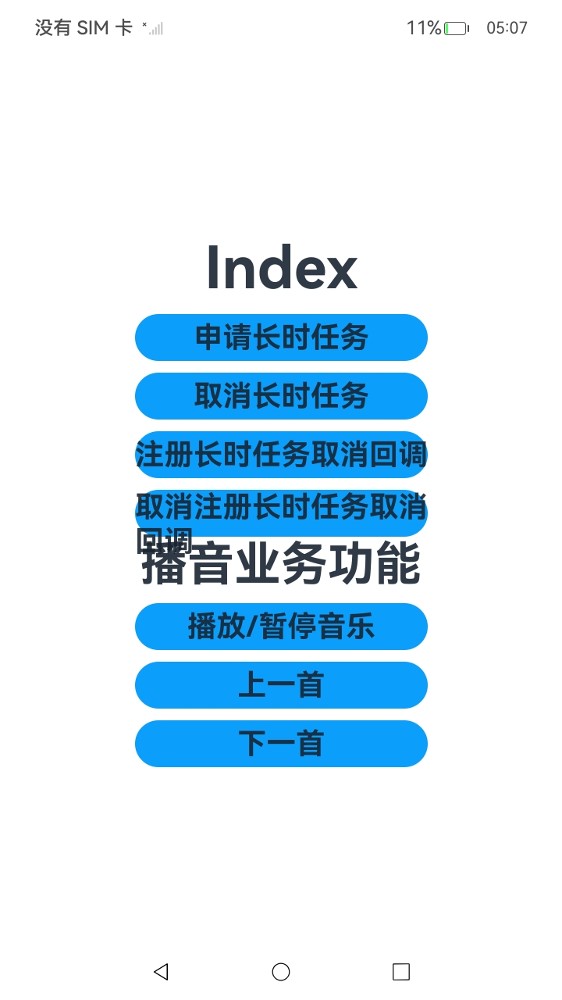

# 长时任务

### 介绍

本示例展示后台任务的长时任务。通过使用[@ohos.resourceschedule.backgroundTaskManager](https://gitcode.com/openharmony/docs/blob/master/zh-cn/application-dev/reference/apis-backgroundtasks-kit/js-apis-resourceschedule-backgroundTaskManager.md)实现后台播放音乐时避免进入挂起（Suspend）状态。

### 效果预览

| 首页                                     |
|----------------------------------------|
|  |

使用说明

场景一：后台播放音乐

1.进入应用，点击播放/暂停音乐，申请长时任务，退出音乐界面推送至后台执行，音乐继续播放；

2.再次进入应用，点击播放/暂停音乐，取消长时任务，音乐停止；

### 工程目录
```
entry/src/main/ets/
|---Application
|   |---MyAbilityStage.ets                    
|---feature
|   |---BackgroundPlayerFeature.ts                 // 后台播放
|---MainAbility
|   |---MainAbility.ts                   
|---mock
|   |---BackgroundPlayerData.ts                    // 数据定义
|---pages
|   |---Index.ets                                  // 首页
|---util
|   |---Logger.ts                                  // 日志打印
```
### 具体实现

* 该示例使用startBackgroundRunning方法向系统申请长时任务，stopBackgroundRunning方法向系统申请取消长时任务，getWantAgent方法创建一个WantAgent，createAudioPlayer方法创建一个视频播放实例，createAVSession方法创建一个会话对象，fileIo.open方法打开文件等接口实现后台音乐播放。
* 源码链接：[BackgroundPlayerFeature.ts](entry/src/main/ets/feature/BackgroundPlayerFeature.ts)，[BackgroundPlayerData.ts](entry/src/main/ets/mock/BackgroundPlayerData.ts)
* 接口参考：[@ohos.resourceschedule.backgroundTaskManager](https://gitcode.com/openharmony/docs/blob/master/zh-cn/application-dev/reference/apis-backgroundtasks-kit/js-apis-resourceschedule-backgroundTaskManager.md)，[@ohos.multimedia.media](https://gitcode.com/openharmony/docs/blob/master/zh-cn/application-dev/reference/apis-media-kit/arkts-apis-media.md)，[@ohos.multimedia.avsession](https://gitcode.com/openharmony/docs/blob/master/zh-cn/application-dev/reference/apis-avsession-kit/arkts-apis-avsession.md)，[@ohos.fileio](https://gitcode.com/openharmony/docs/blob/master/zh-cn/application-dev/reference/apis-core-file-kit/js-apis-fileio.md)，[@ohos.app.ability.wantAgent](https://gitcode.com/openharmony/docs/blob/master/zh-cn/application-dev/reference/apis-ability-kit/js-apis-app-ability-wantAgent.md)

### 相关权限

[ohos.permission.KEEP_BACKGROUND_RUNNING](https://gitcode.com/openharmony/docs/blob/master/zh-cn/application-dev/security/AccessToken/permissions-for-all.md#ohospermissionkeep_background_running)

### 依赖

不涉及。

### 约束与限制

1.本示例仅支持标准系统上运行,支持设备：RK3568；

2.本示例已适配API version 20版本SDK，版本号：6.0 Release；

3.本示例需要使用DevEco Studio 版本号(6.0 Release)及以上版本才可编译运行。

### 下载

如需单独下载本工程，执行如下命令：
```
git init
git config core.sparsecheckout true
echo code/DocsSample/BackGroundTasksKit/ContinuousTask/ > .git/info/sparse-checkout
git remote add origin https://gitcode.com/openharmony/applications_app_samples.git
git pull origin master

```