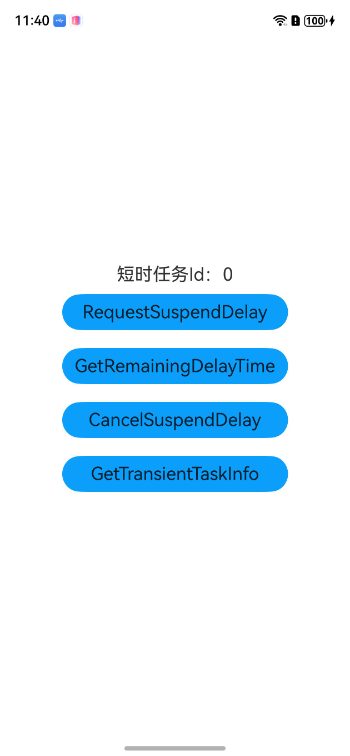
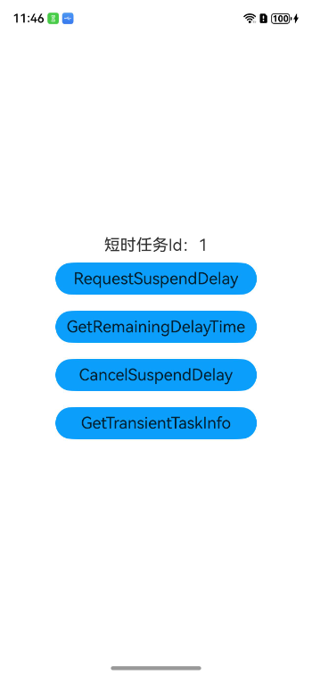

# 短时任务

### 介绍

本示例主要展示后台任务中的短时任务。

通过[transient_task_api](https://gitcode.com/openharmony/docs/blob/master/zh-cn/application-dev/reference/apis-backgroundtasks-kit/capi-transient-task-api-h.md)接口，实现应用申请短时任务的功能。

### 效果预览

|退后台前                                   |退后台一段时间在进前台                                |
|---------------------------------------|-------------------------------------|
| ||

使用说明

1.进入应用，点击申请短时任务按钮；

2.短时任务Id有变化；

### 工程目录
```
entry/src/main
|---cpp
|   |---CMakeLists.txt                   // 配置库依赖
|   |---napi_init.cpp                    // 封装接口并注册模块
|---ets/page
|   |---Index.ets                        // 首页
```
### 具体实现

* 该示例使用[OH_BackgroundTaskManager_RequestSuspendDelay](https://gitcode.com/openharmony/docs/blob/master/zh-cn/application-dev/reference/apis-backgroundtasks-kit/capi-transient-task-api-h.md#oh_backgroundtaskmanager_requestsuspenddelay)申请短时任务，使用[OH_BackgroundTaskManager_GetRemainingDelayTime](https://gitcode.com/openharmony/docs/blob/master/zh-cn/application-dev/reference/apis-backgroundtasks-kit/capi-transient-task-api-h.md#oh_backgroundtaskmanager_getremainingdelaytime)获取短时任务剩余时间，使用[OH_BackgroundTaskManager_CancelSuspendDelay](https://gitcode.com/openharmony/docs/blob/master/zh-cn/application-dev/reference/apis-backgroundtasks-kit/capi-transient-task-api-h.md#oh_backgroundtaskmanager_cancelsuspenddelay)取消短时任务。
* 源码链接：[CMakeLists.txt](entry/src/main/cpp/CMakeLists.txt)，[napi_init.cpp](entry/src/main/cpp/napi_init.cpp),
* 接口参考：[transient_task_api](https://gitcode.com/openharmony/docs/blob/master/zh-cn/application-dev/reference/apis-backgroundtasks-kit/capi-transient-task-api-h.md)

### 相关权限

不涉及

### 依赖

不涉及。

### 约束与限制

1.本示例仅支持标准系统上运行,支持设备：华为手机；

2.本示例已适配API version 20版本SDK，版本号：6.0 Release；

3.本示例需要使用DevEco Studio 版本号(6.0 Release)及以上版本才可编译运行。

### 下载

如需单独下载本工程，执行如下命令：
```
git init
git config core.sparsecheckout true
echo code/BasicFeature/TaskManagement/NativeTransientTask > .git/info/sparse-checkout
git remote add origin https://gitcode.com/openharmony/applications_app_samples.git
git pull origin master

```