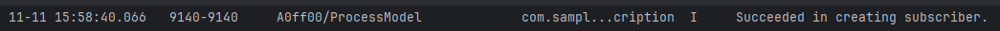
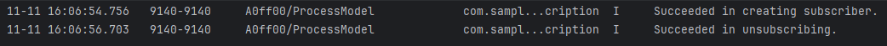
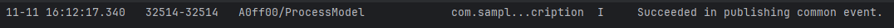

# 使用公共事件进行进程间通信

### 介绍

本工程主要实现了对以下三个指南文档[动态订阅公共事件](https://gitcode.com/openharmony/docs/blob/master/zh-cn/application-dev/basic-services/common-event/common-event-subscription.md)、
[取消动态订阅公共事件](https://gitcode.com/openharmony/docs/blob/master/zh-cn/application-dev/basic-services/common-event/common-event-unsubscription.md)、
[发布公共事件](https://gitcode.com/openharmony/docs/blob/master/zh-cn/application-dev/basic-services/common-event/common-event-publish.md)中示例代码片段的工程化，
主要目标是帮助开发者快速了解如何使用公共事件进行进程间通信。

### 动态订阅公共事件

#### 介绍

1. 动态订阅是指当应用在运行状态时对某个公共事件进行订阅，在运行期间如果有订阅的事件发布那么订阅了这个事件的应用将会收到该事件及其传递的参数。
2. 订阅者对象的生命周期需要接入方管理，不再使用时需主动销毁释放，避免内存泄漏。
3. 动态订阅的公共事件回调受应用状态影响。当应用处于后台时，无法接收到动态订阅公共事件。当应用从后台切换到前台时，最多可以回调切回前30s内监听的公共事件。

#### 效果预览



#### 使用说明

1. 动态订阅公共事件允许应用在运行时监听系统事件，通过创建订阅者对象并设置回调函数，在指定事件发生时接收通知并执行相应操作。使用时需注意订阅者生命周期管理和后台事件接收限制。

### 取消动态订阅公共事件

#### 介绍

1. 动态订阅者完成业务需求后，应主动取消订阅。通过调用[unsubscribe()](https://gitcode.com/openharmony/docs/blob/master/zh-cn/application-dev/reference/apis-basic-services-kit/js-apis-commonEventManager.md#commoneventmanagerunsubscribe)方法，取消订阅事件。

#### 效果预览



#### 使用说明

1. 取消动态订阅公共事件通过调用[unsubscribe()](https://gitcode.com/openharmony/docs/blob/master/zh-cn/application-dev/reference/apis-basic-services-kit/js-apis-commonEventManager.md#commoneventmanagerunsubscribe)方法实现，在完成事件监听需求后应及时取消订阅以释放资源，避免内存泄漏。

### 发布公共事件

#### 介绍

1. 当需要发布某个公共事件时，可以通过[publish()](https://gitcode.com/openharmony/docs/blob/master/zh-cn/application-dev/reference/apis-basic-services-kit/js-apis-commonEventManager.md#commoneventmanagerpublish)方法发布事件。发布的公共事件可以携带数据，供订阅者解析并进行下一步处理。

#### 效果预览




#### 使用说明

1. 发布公共事件允许应用向系统发送事件通知，可以选择不携带信息或携带自定义数据。对于携带信息的事件，还可以设置事件为有序或粘性事件。发布后，订阅该事件的应用将能接收到通知。


### 工程目录

```
entry/src/main/
|---ets
|---|---entryability
|---|---|---EntryAbility.ets
|---|---entrybackupability
|---|---|---EntryBackupAbility.ets
|---|---filemanager
|---|---|---CreatSubscribeInfo.ets          // 公共事件订阅
|---|---pages
|---|---|---Index.ets                       // 首页
|---resources								// 静态资源
|---ohosTest
|---|---ets
|---|---|---tests
|---|---|---|---Ability.test.ets            // 自动化测试用例
|---|---|---|---List.test.ets               // 测试套执行列表
```

### 具体实现

1. 导入模块。
2. 创建订阅者信息，详细的订阅者信息数据类型及包含的参数请见[CommonEventSubscribeInfo文档](https://gitcode.com/openharmony/docs/blob/master/zh-cn/application-dev/reference/apis-basic-services-kit/js-apis-inner-commonEvent-commonEventSubscribeInfo.md)介绍。
3. 创建订阅者，保存返回的订阅者对象subscriber，用于执行后续的订阅、退订、接收事件回调等操作。
4. 创建订阅回调函数，订阅回调函数会在接收到事件时触发。订阅回调函数返回的data内包含了公共事件的名称、发布者携带的数据等信息，公共事件数据的详细参数和数据类型请见[CommonEventData文档](https://gitcode.com/openharmony/docs/blob/master/zh-cn/application-dev/reference/apis-basic-services-kit/js-apis-inner-commonEvent-commonEventData.md)介绍。
5. 调用CommonEvent中的[unsubscribe()](https://gitcode.com/openharmony/docs/blob/master/zh-cn/application-dev/reference/apis-basic-services-kit/js-apis-commonEventManager.md#commoneventmanagerunsubscribe)方法取消订阅某事件。
6. 发布不携带信息的公共事件，传入需要发布的事件名称和回调函数，发布事件。
7. 发布携带信息的公共事件，携带信息的公共事件，可以发布为无序公共事件、有序公共事件和粘性事件，可以通过参数[CommonEventPublishData](https://gitcode.com/openharmony/docs/blob/master/zh-cn/application-dev/reference/apis-basic-services-kit/js-apis-inner-commonEvent-commonEventPublishData.md)的isOrdered、isSticky的字段进行设置。

### 相关权限

订阅部分系统公共事件需要先[申请权限](https://gitcode.com/openharmony/docs/blob/master/zh-cn/application-dev/security/AccessToken/determine-application-mode.md)，订阅这些事件所需要的权限请见[公共事件权限列表](https://gitcode.com/openharmony/docs/blob/master/zh-cn/application-dev/reference/apis-basic-services-kit/common_event/commonEventManager-definitions.md)。

### 依赖

不涉及。

### 约束与限制

1. 本示例仅支持标准系统上运行。
2. 本示例支持API version 20及以上版本的SDK。
3. 本示例已支持使DevEco Studio 6.0.0 Release (构建版本：6.0.0.878，构建 2025年12月24日)编译运行。

### 下载

如需单独下载本工程，执行如下命令：

```
git init
git config core.sparsecheckout true
echo Basic-Services-Kit/common_event/CommonEvent > .git/info/sparse-checkout
git remote add origin https://gitcode.com/harmonyos_samples/guide-snippets.git
git pull origin master
```