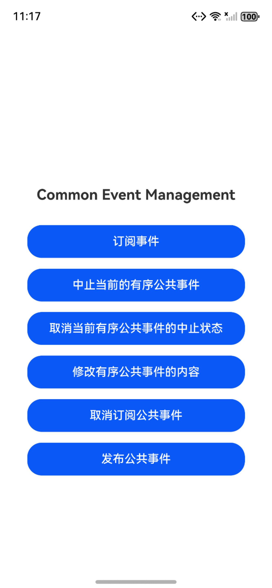
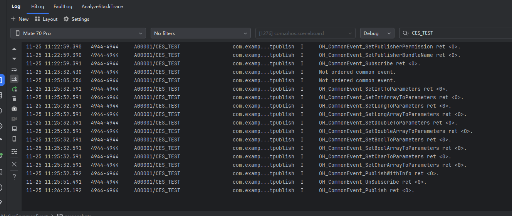

# 使用公共事件进行进程间通信（C/C++）

### 介绍

本工程主要实现了对以下三个指南文档[订阅公共事件（C/C++）](https://gitcode.com/openharmony/docs/blob/master/zh-cn/application-dev/basic-services/common-event/native-common-event-subscription.md)、
[取消订阅公共事件（C/C++）](https://gitcode.com/openharmony/docs/blob/master/zh-cn/application-dev/basic-services/common-event/native-common-event-unsubscription.md)、
[发布公共事件（C/C++）](https://gitcode.com/openharmony/docs/blob/master/zh-cn/application-dev/basic-services/common-event/native-common-event-publish.md)中示例代码片段的工程化，
主要目标是帮助开发者快速了解如何使用公共事件进行进程间通信。

### 效果预览

| 主界面                            | 输出日志                                         | 
|--------------------------------|----------------------------------------------|
|  |  | 


### 使用说明

1. 在主界面点击 “订阅事件” 按钮，可以订阅事件；
2. 在主界面点击 “中止当前的有序公共事件” 按钮，可以中止当前的有序公共事件；
3. 在主界面点击 “取消当前的有序公共事件的中止状态” 按钮，可以取消公共事件的中止状态，重新开启；
4. 在主界面点击 “修改有序公共事件的内容” 按钮，可以对有序公共事件的内容进行修改；
5. 在主界面点击 “取消订阅公共事件” ，可以取消已经订阅的公共事件；
6. 在主界面点击 “发布公共事件”，可以将公共事件发布出去。

### 公共事件分类
1. 公共事件从系统角度可分为：系统公共事件和自定义公共事件。
- 系统公共事件：CES内部定义的公共事件，当前仅支持系统应用和系统服务发布，例如HAP安装、更新、卸载等公共事件。
- 自定义公共事件：应用定义的公共事件，可用于实现跨进程的事件通信能力。
2. 公共事件按发送方式可分为：无序公共事件、有序公共事件和粘性公共事件。
- 无序公共事件：CES在转发公共事件时，不考虑订阅者是否接收到该事件，也不保证订阅者接收到该事件的顺序与其订阅顺序一致。
- 有序公共事件：CES在转发公共事件时，根据订阅者设置的优先级，优先将公共事件发送给优先级较高的订阅者，等待其成功接收到该公共事件之后，再将事件发送给优先级较低的订阅者。如果多个订阅者具有相同的优先级，则这些订阅者接收到事件的顺序不确定。
- 粘性公共事件：能够让订阅者收到在订阅前已经发送的公共事件就是粘性公共事件。普通的公共事件只能在订阅后发送才能收到，而粘性公共事件的特殊性就是可以先发送后订阅，同时也支持先订阅后发送。发送粘性事件必须是系统应用或系统服务，粘性事件发送后会一直存在系统中，且发送者需要申请`ohos.permission.COMMONEVENT_STICKY`权限。

### 工程目录

```
entry/src/
├── main
│   ├── cpp
│   │   ├── types
│   │   │   └── libentry
│   │   │       ├── Index.d.ts
│   │   │       └── oh-package.json5
│   │   ├── CMakeLists.txt
│   │   ├── common_event_publish.cpp        //发布公共事件
│   │   ├── common_event_publisher.h
│   │   ├── common_event_subscriber.cpp     //订阅公共事件
│   │   ├── common_event_subscriber.h
│   │   ├── common_event_unsubscriber.cpp   //取消订阅公共事件
│   │   ├── common_event_unsubscriber.h
│   │   └── napi_init.cpp                   //公共事件测试用例代码
│   ├── ets
│   │   ├── entryability
│   │   │   └── EntryAbility.ets
│   │   ├── entrybackupability
│   │   │   └── EntryBackupAbility.ets
│   │   ├── pages
│   │   │   └── Index.ets                   //主界面
│   ├── module.json5
│   └── resources
└── ohosTest
    └── ets
        └── test
            ├── Ability.test.ets            // 自动化测试代码
            ├── EventUITest.test.ets        // 自动化测试代码
            └── List.test.ets               // 测试套执行列表
```

### 具体实现

* 设置公共事件信息并订阅公共事件的功能封装在common_event_subscribe，源码参考[common_event_subscribe.cpp](https://gitcode.com/openharmony/applications_app_samples/blob/master/code/DocsSample/Basic-Services-Kit/common_event/NativeCommonEvent/entry/src/main/cpp/common_event_subscribe.cpp)
  * 订阅信息 / 订阅者：CreateSubscriber()/DestroySubscriber()封装 API，管理资源生命周期；
  * 事件订阅：Subscribe()调用[OH_CommonEvent_Subscribe](https://gitcode.com/openharmony/docs/blob/master/zh-cn/application-dev/reference/apis-basic-services-kit/capi-oh-commonevent-h.md#oh_commonevent_subscribe)完成订阅；
  * 销毁订阅：DestroySubscriber()调用[OH_CommonEvent_DestroySubscriber](https://gitcode.com/openharmony/docs/blob/master/zh-cn/application-dev/reference/apis-basic-services-kit/capi-oh-commonevent-h.md#OH_CommonEvent_DestroySubscriber)销毁订阅；
  * 事件解析：OnReceive()回调解析基础信息，调用[OH_CommonEvent_GetEventFromRcvData](https://gitcode.com/openharmony/docs/blob/master/zh-cn/application-dev/reference/apis-basic-services-kit/capi-oh-commonevent-h.md#OH_CommonEvent_GetEventFromRcvData)获取回调公共事件名称；
  * 有序事件：AbortCommonEvent()调用[OH_CommonEvent_IsOrderedCommonEvent](https://gitcode.com/openharmony/docs/blob/master/zh-cn/application-dev/reference/apis-basic-services-kit/capi-oh-commonevent-h.md#OH_CommonEvent_IsOrderedCommonEvent)判断是否为有序公共事件；
    ClearAbortCommonEvent调用[OH_CommonEvent_AbortCommonEvent](https://gitcode.com/openharmony/docs/blob/master/zh-cn/application-dev/reference/apis-basic-services-kit/capi-oh-commonevent-h.md#OH_CommonEvent_AbortCommonEvent)处理中止逻辑，接口参考:[oh_commonevent.h](https://gitcode.com/openharmony/docs/blob/master/zh-cn/application-dev/reference/apis-basic-services-kit/capi-oh-commonevent-h.md)

* 设置发布公共事件信息并发布公共事件的功能封装在common_event_publish，源码参考[common_event_publish.cpp](https://gitcode.com/openharmony/applications_app_samples/blob/master/code/DocsSample/Basic-Services-Kit/common_event/NativeCommonEvent/entry/src/main/cpp/common_event_publish.cpp)
  * 基础事件发布：Publish()调用[OH_CommonEvent_Publish](https://gitcode.com/openharmony/docs/blob/master/zh-cn/application-dev/reference/apis-basic-services-kit/capi-oh-commonevent-h.md#oh_commonevent_publish)发布无属性公共事件；
  * 带属性事件发布：PublishWithInfo()调用[OH_CommonEvent_PublishWithInfo](https://gitcode.com/openharmony/docs/blob/master/zh-cn/application-dev/reference/apis-basic-services-kit/capi-oh-commonevent-h.md#OH_CommonEvent_PublishWithInfo)发布含自定义属性的事件；
  * 附加参数创建：CreateParameters()封装 API，调用[OH_CommonEvent_CreateParameters](https://gitcode.com/openharmony/docs/blob/master/zh-cn/application-dev/reference/apis-basic-services-kit/capi-oh-commonevent-h.md#OH_CommonEvent_CreateParameters)设置 int/long/double 等基础类型及数组类型附加参数；
  * 发布属性配置：SetPublishInfo()创建PublishInfo，调用[OH_CommonEvent_CreatePublishInfo](https://gitcode.com/openharmony/docs/blob/master/zh-cn/application-dev/reference/apis-basic-services-kit/capi-oh-commonevent-h.md#OH_CommonEvent_CreatePublishInfo)等配置有序事件、包名、权限、结果码、数据及附加参数；
  * 资源销毁：DestroyPublishInfo()释放Parameters和PublishInfo资源，调用[OH_CommonEvent_DestroyParameters](https://gitcode.com/openharmony/docs/blob/master/zh-cn/application-dev/reference/apis-basic-services-kit/capi-oh-commonevent-h.md#OH_CommonEvent_DestroyParameters)和[OH_CommonEvent_DestroyPublishInfo](https://gitcode.com/openharmony/docs/blob/master/zh-cn/application-dev/reference/apis-basic-services-kit/capi-oh-commonevent-h.md#OH_CommonEvent_DestroyPublishInfo)避免内存泄漏。接口参考:[oh_commonevent.h](https://gitcode.com/openharmony/docs/blob/master/zh-cn/application-dev/reference/apis-basic-services-kit/capi-oh-commonevent-h.md)

* 取消订阅公共事件的功能封装在common_event_unsubscribe，源码参考[common_event_unsubscribe.cpp](https://gitcode.com/openharmony/applications_app_samples/blob/master/code/DocsSample/Basic-Services-Kit/common_event/NativeCommonEvent/entry/src/main/cpp/common_event_unsubscribe.cpp)
  * 事件退订：Unsubscribe()封装 API [OH_CommonEvent_UnSubscribe](https://gitcode.com/openharmony/docs/blob/master/zh-cn/application-dev/reference/apis-basic-services-kit/capi-oh-commonevent-h.md#oh_commonevent_unsubscribe)，传入已创建的订阅者对象即可完成事件退订，返回值标识退订操作结果。接口参考:[oh_commonevent.h](https://gitcode.com/openharmony/docs/blob/master/zh-cn/application-dev/reference/apis-basic-services-kit/capi-oh-commonevent-h.md)


### 相关权限

不涉及。

### 依赖

不涉及。

### 约束与限制

1. 本示例仅支持标准系统上运行。
2. 本示例支持API version 18及以上版本的SDK。
3. 本示例已支持使DevEco Studio 6.0.0 Release (构建版本：6.0.0.878，构建 2025年12月24日)编译运行。

### 下载

如需单独下载本工程，执行如下命令：

```
git init
git config core.sparsecheckout true
echo Basic-Services-Kit/common_event/NativeCommonEvent > .git/info/sparse-checkout
git remote add origin https://gitcode.com/harmonyos_samples/guide-snippets.git
git pull origin master
```