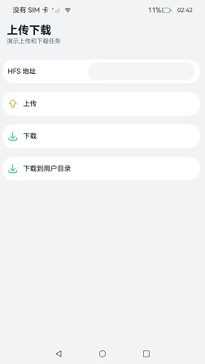
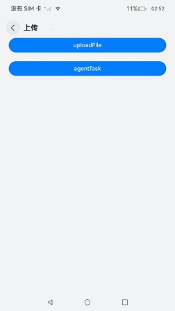
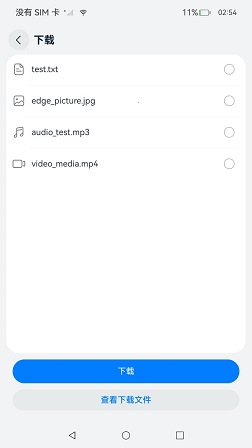
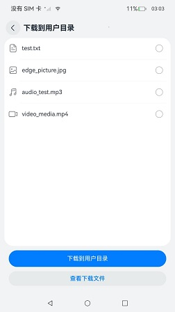

# 上传和下载

### 介绍
本示例使用[@ohos.request](https://gitcode.com/openharmony/docs/blob/master/zh-cn/application-dev/reference/apis-basic-services-kit/js-apis-request.md)接口创建上传和下载任务，实现上传、下载功能，hfs作为服务器，实现了文件的上传和下载和任务的查询功能。

### 效果预览

|                    主页                     |                     上传                      |                         下载                          |                         下载到用户目录                          |
|:-----------------------------------------:|:-------------------------------------------:|:---------------------------------------------------:|:--------------------------------------------------------:|
|  |  |  |  |

使用说明

1.本示例功能需要先配置服务器环境后使用，具体配置见[上传下载服务配置](./environment)。

2.首页展示上传、下载、下载到用户目录三个入口组件，点击进入对应的页面。

3.上传页面：

点击 **uploadFile**，使用**request.uploadFile**进行上传。

点击**agentTask**，使用**request.agent.create**创建上传任务进行上传。

4.下载页面：

点击选择文件列表中的**test.txt**，点击**下载**使用**request.downloadFile**进行下载。

点击选择文件列表中的**edge_picture.jpg**，点击**下载**使用**request.agent.create**创建下载任务进行下载。

点击选择文件列表中的**audio_test.mp3**，点击**下载**使用**request.agent.create**创建限速任务进行下载。

点击选择文件列表中的**video_media.mp4**，点击**下载**使用**request.agent.create**创建通知栏任务进行下载。

点击**查看下载文件**进入**下载文件**页面，点击文件夹查看文件夹内的文件。

通知栏任务下载完成后，可通过点击任务通知跳转至应用页面。

5.下载到用户目录页面：

点击选择文件列表中的**test.txt**，点击**下载**，选择保存目录后，下载文档类型文件到用户目录。

点击选择文件列表中的**edge_picture.jpg**，点击**下载**，下载图片类型文件到用户目录。

点击选择文件列表中的**audio_test.mp3**，点击**下载**，选择保存目录后，下载音频类型文件到用户目录。

点击选择文件列表中的**video_media.mp4**，点击**下载**，下载视频类型文件到用户目录。

点击**查看下载文件**进入用户文件页面，点击文件夹查看文件夹内的文件。

### 工程目录

```
UploadAndDownloadGuide
├── AppScope                                    
│   └── app.json5                               //APP信息配置文件
├── entry/src/main                              //应用首页
│   ├── ets
│   │   ├── entryability
│   │   ├── components                          //自定义组件
│   │   ├── pages
│   │       ├── Index.ets                       //主页入口
│   │       ├── Download.ets                    //下载页面                     
│   │       ├── DownloadFiles.ets               //查看下载文件页面
│   │       ├── Upload.ets                      //上传页面 
│   └── module.json5
│
├── features/uploadanddownload/src/main         //上传和下载
    ├── ets     
    │   ├── components
    │   │    └── FileBrowse.ets                 //查看下载文件组件  
    │   ├── download                            //下载任务相关
    │   ├── upload                              //上传任务相关
    │   ├── utils                               //相关工具类
    └── module.json5
```

### 具体实现

* 该示例分为三个模块：
  * 上传模块
    * 使用[@ohos.request](https://gitcode.com/openharmony/docs/blob/master/zh-cn/application-dev/reference/apis-basic-services-kit/js-apis-request.md)中API 9 接口request.uploadFile和API 12接口agent.create创建上传任务。
    * 源码链接：[RequestUpload.ets](./features/uploadanddownload/src/main/ets/upload/RequestUpload.ets)，[Upload.ets](./entry/src/main/ets/pages/Upload.ets)
    * 参考接口：[@ohos.request](https://gitcode.com/openharmony/docs/blob/master/zh-cn/application-dev/reference/apis-basic-services-kit/js-apis-request.md)
    
  * 下载模块
    * 使用[@ohos.request](https://gitcode.com/openharmony/docs/blob/master/zh-cn/application-dev/reference/apis-basic-services-kit/js-apis-request.md)中API 9接口request.downloadFile和API 12接口agent.create创建下载任务。使用[@ohos.file.picker](https://gitcode.com/openharmony/docs/blob/master/zh-cn/application-dev/reference/apis-core-file-kit/js-apis-file-picker.md)进行用户文件的目录路径选择和查看。
    * 源码链接：[RequestDownload.ets](./features/uploadanddownload/src/main/ets/download/RequestDownload.ets)，[Download.ets](./entry/src/main/ets/pages/Download.ets)，[FileUtils.ets](./features/uploadanddownload/src/main/ets/utils/FileUtils.ets)，[FileBrowse.ets](./features/uploadanddownload/src/main/ets/components/FileBrowse.ets)
    * 参考接口：[@ohos.request](https://gitcode.com/openharmony/docs/blob/master/zh-cn/application-dev/reference/apis-basic-services-kit/js-apis-request.md)，[@ohos.file.fs](https://gitcode.com/openharmony/docs/blob/master/zh-cn/application-dev/reference/apis-core-file-kit/js-apis-file-fs.md)，[@ohos.file.picker](https://gitcode.com/openharmony/docs/blob/master/zh-cn/application-dev/reference/apis-core-file-kit/js-apis-file-picker.md)
    
      

  

### 相关权限

[ohos.permission.INTERNET](https://gitcode.com/openharmony/docs/blob/master/zh-cn/application-dev/security/AccessToken/permissions-for-all.md#ohospermissioninternet)

[ohos.permission.WRITE_IMAGEVIDEO](https://gitcode.com/openharmony/docs/blob/master/zh-cn/application-dev/security/AccessToken/restricted-permissions.md#ohospermissionwrite_imagevideo)

### 依赖

[上传下载服务配置](./environment)。

### 约束与限制

1.本示例仅支持标准系统上运行，支持设备：RK3568。

2.本示例为Stage模型，支持API22版本SDK，SDK版本号(API Version 22),镜像版本号(6.0)

3.本示例需要使用DevEco Studio 版本号(5.0.5 Release)及以上版本才可编译运行。

4.运行本示例需全程联网。

###  下载

如需单独下载本工程，执行如下命令：

```bash
git init
git config core.sparsecheckout true
echo code/BasicFeature/Connectivity/UploadDownloadGuide/ > .git/info/sparse-checkout
git remote add origin https://gitcode.com/openharmony/applications_app_samples.git
git pull origin master
```