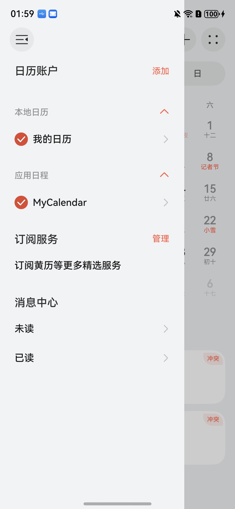
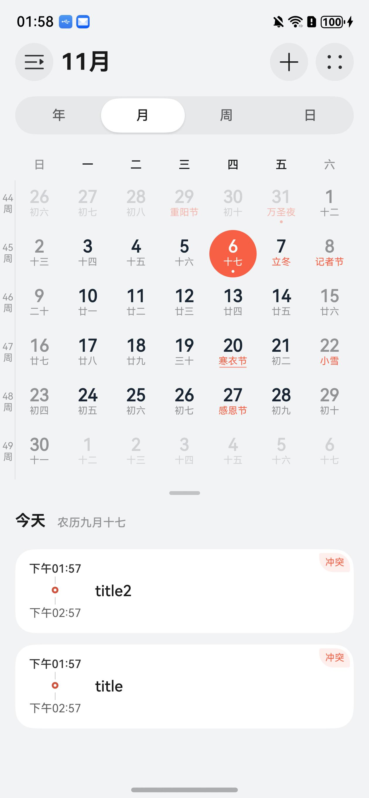
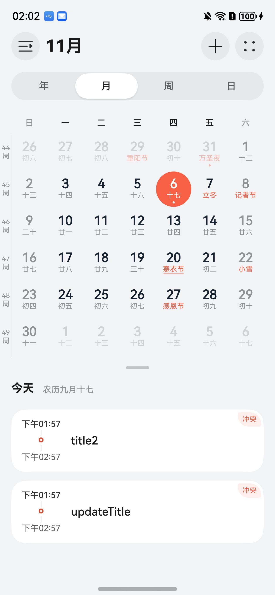

# CalendarEvent 测试用例归档

## 用例表

| 测试功能                                  | 预置条件                | 输入          | 预期输出                                                                                         | 是否自动 | 测试结果 |
|---------------------------------------|---------------------|-------------|----------------------------------------------------------------------------------------------| -------- | -------- |
| 拉起应用                                  | 设备正常运行              |             | 成功拉起应用                                                                                       | 是       | Pass     |
| 弹出 允许“CalendarManager”读取和修改你的日程？ 权限申请弹框 | 位于CalendarEvent页面 | 点击‘允许’      |                                                                                              | 是       | Pass     |
| 1，创建日历账户                              | 位于CalendarEvent页面   | 点击‘1，创建日历账户’ | 成功创建日历账户。 日历应用打开侧边栏，新增了‘MyCalendar’账户   | 是       | Pass     |
| 2，创建日程                            | 位于CalendarEvent页面 | 点击‘2，创建日程 ’ | 成功创建日程。                                    | 是       | Pass     |
| 3，修改日程                            | 位于CalendarEvent页面 | 点击‘3，修改日程’ | 成功修改日程。                                    | 是       | Pass     |
| 4，查询所有日程                            | 位于CalendarEvent页面 | 点击‘4，查询所有日程’ | 成功查询所有日程。 观察日志打印 Succeeded in getting events, data -> [xxx]                              | 是       | Pass     |
| 5，查询指定日程                            | 位于CalendarEvent页面 | 点击‘5，查询指定日程’ | 成功查询指定日程。 观察日志打印 Succeeded in getting events filter by time/eventId/title, data -> [xxx] | 是       | Pass     |
| 6，删除指定日程                            | 位于CalendarEvent页面 | 点击‘6，删除指定日程’ | 成功删除指定日程。 观察日志打印 Succeeded in deleting event                                          | 是       | Pass     |